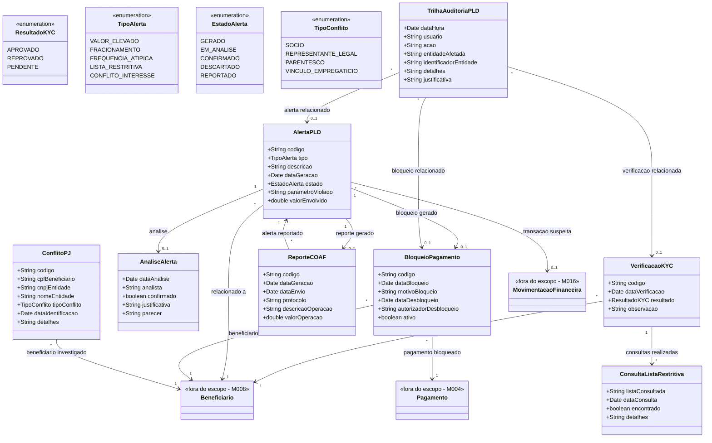

# Modelo Estrutural

Dominio e regras de negocio: ver [README.md](README.md)

### Diagrama de Classes

## Dicionario de Dados

| Classe | Atributo | Definicao | Obrig. | Tipo | Dominio | Tamanho | Unico |
|--------|----------|-----------|--------|------|---------|---------|-------|
| **VerificacaoKYC** | codigo | Codigo de identificacao unica da verificacao | Gerado | String | Ex: KYC-2026-001 | | Sim |
| | dataVerificacao | Data em que a verificacao foi realizada | Gerado | Date | | | |
| | resultado | Resultado da verificacao KYC | Sim | ResultadoKYC | Aprovado, Reprovado, Pendente | | |
| | observacao | Observacoes sobre a verificacao | Nao | String | | 1000 | |
| **ConsultaListaRestritiva** | listaConsultada | Nome da lista restritiva consultada | Sim | String | Ex: Lista de Sancoes, PEPs, Lista de Impedidos | 200 | |
| | dataConsulta | Data e hora da consulta | Gerado | Date | | | |
| | encontrado | Indica se o beneficiario foi encontrado na lista | Sim | Boolean | true/false | | |
| | detalhes | Detalhes do resultado da consulta | Cond. | String | Obrigatorio se encontrado=true | 1000 | |
| **AlertaPLD** | codigo | Codigo de identificacao unica do alerta | Gerado | String | Ex: APLD-2026-001 | | Sim |
| | tipo | Tipo de alerta identificado | Sim | TipoAlerta | Valor Elevado, Fracionamento, Frequencia Atipica, Lista Restritiva, Conflito Interesse | | |
| | descricao | Descricao detalhada do motivo do alerta | Sim | String | | 2000 | |
| | dataGeracao | Data e hora em que o alerta foi gerado | Gerado | Date | | | |
| | estado | Estado atual do alerta no ciclo de vida | Gerado | EstadoAlerta | Ver enumeracao | | |
| | parametroViolado | Parametro de monitoramento que foi violado | Sim | String | Ex: Valor acima de R$ 50.000 | 500 | |
| | valorEnvolvido | Valor total das transacoes envolvidas no alerta | Sim | Double | | | |
| **AnaliseAlerta** | dataAnalise | Data em que a analise foi realizada | Gerado | Date | | | |
| | analista | Nome do oficial de compliance que analisou | Gerado | String | | 200 | |
| | confirmado | Indica se a suspeita foi confirmada | Sim | Boolean | true/false | | |
| | justificativa | Justificativa da decisao (obrigatoria para descarte) | Sim | String | | 2000 | |
| | parecer | Parecer tecnico detalhado | Sim | String | | 5000 | |
| **BloqueioPagamento** | codigo | Codigo de identificacao do bloqueio | Gerado | String | Ex: BLQ-2026-001 | | Sim |
| | dataBloqueio | Data e hora do bloqueio | Gerado | Date | | | |
| | motivoBloqueio | Motivo que originou o bloqueio | Sim | String | | 1000 | |
| | dataDesbloqueio | Data e hora do desbloqueio | Cond. | Date | Preenchida ao desbloquear | | |
| | autorizadorDesbloqueio | Diretor que autorizou o desbloqueio | Cond. | String | Obrigatorio ao desbloquear | 200 | |
| | ativo | Indica se o bloqueio esta ativo | Sim | Boolean | true/false | | |
| **ReporteCOAF** | codigo | Codigo de identificacao do reporte | Gerado | String | Ex: RCOAF-2026-001 | | Sim |
| | dataGeracao | Data em que o reporte foi gerado | Gerado | Date | | | |
| | dataEnvio | Data de envio ao COAF | Cond. | Date | Preenchida ao enviar | | |
| | protocolo | Numero de protocolo do COAF | Cond. | String | Preenchido apos confirmacao do COAF | 50 | |
| | descricaoOperacao | Descricao da operacao suspeita reportada | Sim | String | | 5000 | |
| | valorOperacao | Valor total da operacao reportada | Sim | Double | | | |
| **ConflitoPJ** | codigo | Codigo de identificacao do conflito | Gerado | String | Ex: CPJ-2026-001 | | Sim |
| | cpfBeneficiario | CPF do beneficiario investigado | Sim | String | | 14 | |
| | cnpjEntidade | CNPJ da entidade contratada | Sim | String | | 18 | |
| | nomeEntidade | Nome da entidade contratada | Sim | String | | 300 | |
| | tipoConflito | Tipo de vinculo identificado | Sim | TipoConflito | Socio, Representante Legal, Parentesco, Vinculo Empregaticio | | |
| | dataIdentificacao | Data da identificacao do conflito | Gerado | Date | | | |
| | detalhes | Detalhes do conflito identificado | Sim | String | | 2000 | |
| **TrilhaAuditoriaPLD** | dataHora | Data e hora do registro de auditoria | Gerado | Date | | | |
| | usuario | Usuario que realizou a acao | Gerado | String | | 200 | |
| | acao | Acao realizada | Sim | String | Ex: Verificacao KYC, Analise Alerta, Bloqueio | 100 | |
| | entidadeAfetada | Tipo de entidade afetada pela acao | Sim | String | Ex: VerificacaoKYC, AlertaPLD, BloqueioPagamento | 100 | |
| | identificadorEntidade | Codigo da entidade afetada | Sim | String | | 50 | |
| | detalhes | Detalhes da acao realizada | Sim | String | | 2000 | |
| | justificativa | Justificativa da acao (quando aplicavel) | Nao | String | | 1000 | |

## Notas de Implementacao

**Entidades externas:**
- Beneficiario: gerenciado por M008 (Cadastros Corporativos)
- Pagamento: gerenciado por M004 (Pagamento Bolsista)
- MovimentacaoFinanceira: gerenciado por M016 (Contabilidade e Financeiro)

**Navegabilidade:**
- Cardinalidade 1: atributo do tipo da classe destino (ex: AlertaPLD.beneficiario: Beneficiario)
- Cardinalidade N: atributo lista do tipo da classe destino (ex: VerificacaoKYC.consultas: List&lt;ConsultaListaRestritiva&gt;)
