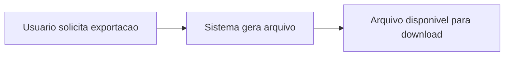

# Modelo Comportamental

Dominio e regras de negocio: ver [README.md](README.md)

### Nota sobre Maquina de Estados

Este modulo e composto predominantemente por paineis de consulta (read-only). As entidades PainelAnalitico, Indicador e FiltroConsulta nao possuem ciclo de vida com transicoes de estado -- sao objetos de leitura atualizados por processos batch diarios.

A unica transicao relevante e a geracao de exportacoes (RelatorioExportado), que segue um fluxo linear sem necessidade de maquina de estados formal:

Nao ha maquina de estados formal para este modulo.
