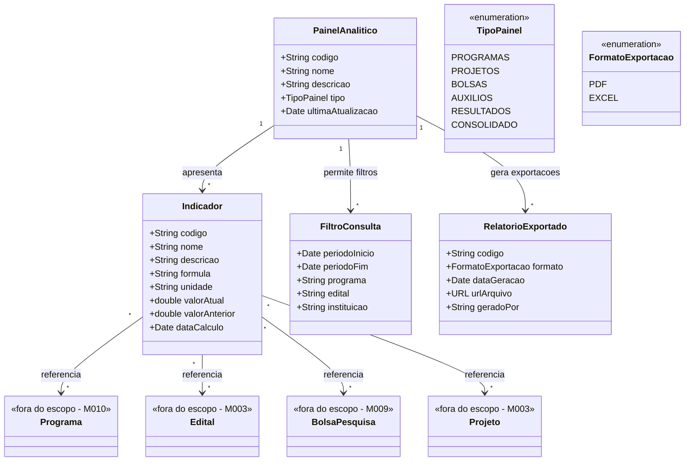

# Modelo Estrutural

Dominio e regras de negocio: ver [README.md](README.md)

### Diagrama de Classes

## Dicionario de Dados

| Classe | Atributo | Definicao | Obrig. | Tipo | Dominio | Tamanho | Unico |
|--------|----------|-----------|--------|------|---------|---------|-------|
| **PainelAnalitico** | codigo | Codigo de identificacao unica do painel | Gerado | String | Ex: PN-PROG-001 | | Sim |
| | nome | Nome do painel analitico | Sim | String | Ex: Dashboard de Programas | 200 | Sim |
| | descricao | Descricao do objetivo e conteudo do painel | Sim | String | | 500 | |
| | tipo | Tipo de painel analitico | Sim | TipoPainel | Programas, Projetos, Bolsas, Auxilios, Resultados, Consolidado | | |
| | ultimaAtualizacao | Data e hora da ultima atualizacao dos dados | Gerado | Date | | | |
| **Indicador** | codigo | Codigo de identificacao do indicador | Gerado | String | Ex: IND-001 | | Sim |
| | nome | Nome do indicador | Sim | String | Ex: Taxa de Execucao Financeira | 200 | |
| | descricao | Descricao do que o indicador mede | Sim | String | | 500 | |
| | formula | Formula de calculo do indicador | Sim | String | Ex: (valor_executado / valor_planejado) * 100 | 500 | |
| | unidade | Unidade de medida do indicador | Sim | String | Ex: %, R$, quantidade | 50 | |
| | valorAtual | Valor calculado para o periodo atual | Gerado | Double | | | |
| | valorAnterior | Valor calculado para o periodo anterior (comparativo) | Gerado | Double | | | |
| | dataCalculo | Data do ultimo calculo do indicador | Gerado | Date | | | |
| **FiltroConsulta** | periodoInicio | Data de inicio do periodo consultado | Sim | Date | | | |
| | periodoFim | Data de fim do periodo consultado | Sim | Date | | | |
| | programa | Programa selecionado no filtro | Nao | String | Todos se nao informado | | |
| | edital | Edital selecionado no filtro | Nao | String | Todos se nao informado | | |
| | instituicao | Instituicao selecionada no filtro | Nao | String | Todas se nao informado | | |
| **RelatorioExportado** | codigo | Codigo de identificacao da exportacao | Gerado | String | Ex: EXP-2025-001 | | Sim |
| | formato | Formato do arquivo exportado | Sim | FormatoExportacao | PDF, Excel | | |
| | dataGeracao | Data e hora da geracao do relatorio | Gerado | Date | | | |
| | urlArquivo | URL para download do arquivo gerado | Gerado | URL | | | |
| | geradoPor | Identificacao do usuario que solicitou a exportacao | Gerado | String | | 200 | |

## Notas de Implementacao

**Entidades externas:**
- Programa: gerenciado por M010 (Planejamento e Estrategia)
- Edital, Projeto: gerenciados por M003 (Gerenciar Editais)
- BolsaPesquisa: gerenciado por M009 (Gestao Bolsa Pesquisa)

**Navegabilidade:**
- Cardinalidade 1: atributo do tipo da classe destino (ex: RelatorioExportado.painel: PainelAnalitico)
- Cardinalidade N: atributo lista do tipo da classe destino (ex: PainelAnalitico.indicadores: List&lt;Indicador&gt;)
