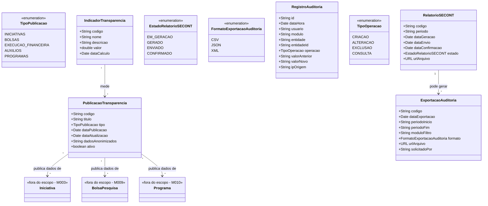

# Modelo Estrutural

Dominio e regras de negocio: ver [README.md](README.md)

### Diagrama de Classes

## Dicionario de Dados

| Classe | Atributo | Definicao | Obrig. | Tipo | Dominio | Tamanho | Unico |
|--------|----------|-----------|--------|------|---------|---------|-------|
| **PublicacaoTransparencia** | codigo | Codigo de identificacao da publicacao | Gerado | String | Ex: PT-2025-001 | | Sim |
| | titulo | Titulo descritivo da publicacao de transparencia | Sim | String | Ex: Iniciativas Financiadas 2024 | 300 | |
| | tipo | Tipo de dado publicado | Sim | TipoPublicacao | Iniciativas, Bolsas, Execucao Financeira, Auxilios, Programas | | |
| | dataPublicacao | Data da primeira publicacao | Gerado | Date | | | |
| | dataAtualizacao | Data da ultima atualizacao dos dados | Gerado | Date | | | |
| | dadosAnonimizados | Indicacao de que dados pessoais foram anonimizados | Gerado | String | Descricao do tratamento LGPD aplicado | 500 | |
| | ativo | Indica se a publicacao esta visivel no portal | Sim | Boolean | true/false | | |
| **RelatorioSECONT** | codigo | Codigo de identificacao do relatorio | Gerado | String | Ex: SECONT-2025-01 | | Sim |
| | periodo | Periodo de referencia do relatorio | Sim | String | Ex: 2025-01, 2025-Q1 | 20 | |
| | dataGeracao | Data e hora da geracao do relatorio | Gerado | Date | | | |
| | dataEnvio | Data de envio a SECONT | Cond. | Date | Preenchida ao enviar | | |
| | dataConfirmacao | Data de confirmacao de recebimento pela SECONT | Cond. | Date | Preenchida ao confirmar | | |
| | estado | Estado do relatorio no ciclo de vida | Gerado | EstadoRelatorioSECONT | Em Geracao, Gerado, Enviado, Confirmado | | |
| | urlArquivo | URL para download do relatorio gerado | Gerado | URL | | | |
| **ExportacaoAuditoria** | codigo | Codigo de identificacao da exportacao | Gerado | String | Ex: AUD-2025-001 | | Sim |
| | dataExportacao | Data e hora da exportacao | Gerado | Date | | | |
| | periodoInicio | Data de inicio do periodo exportado | Sim | String | | 10 | |
| | periodoFim | Data de fim do periodo exportado | Sim | String | | 10 | |
| | moduloFiltro | Modulo filtrado na exportacao | Nao | String | Ex: M009, M004. Todos se nao informado | 20 | |
| | formato | Formato do arquivo exportado | Sim | FormatoExportacaoAuditoria | CSV, JSON, XML | | |
| | urlArquivo | URL para download do arquivo exportado | Gerado | URL | | | |
| | solicitadoPor | Identificacao do usuario que solicitou a exportacao | Gerado | String | | 200 | |
| **RegistroAuditoria** | id | Identificador unico do registro de auditoria | Gerado | String | UUID | | Sim |
| | dataHora | Data e hora da operacao registrada | Gerado | Date | | | |
| | usuario | Identificacao do usuario que realizou a operacao | Gerado | String | | 200 | |
| | modulo | Modulo onde a operacao foi realizada | Gerado | String | Ex: M001, M009 | 20 | |
| | entidade | Nome da entidade afetada | Gerado | String | Ex: BolsaPesquisa, Resolucao | 100 | |
| | entidadeId | Identificador da entidade afetada | Gerado | String | | 100 | |
| | operacao | Tipo de operacao realizada | Gerado | TipoOperacao | Criacao, Alteracao, Exclusao, Consulta | | |
| | valorAnterior | Valor antes da alteracao (JSON) | Cond. | String | Preenchido em alteracoes e exclusoes | | |
| | valorNovo | Valor apos a alteracao (JSON) | Cond. | String | Preenchido em criacoes e alteracoes | | |
| | ipOrigem | Endereco IP de origem da requisicao | Gerado | String | | 45 | |
| **IndicadorTransparencia** | codigo | Codigo de identificacao do indicador | Gerado | String | Ex: IT-001 | | Sim |
| | nome | Nome do indicador de transparencia | Sim | String | Ex: Volume de Dados Publicados | 200 | |
| | descricao | Descricao do que o indicador mede | Sim | String | | 500 | |
| | valor | Valor calculado do indicador | Gerado | Double | | | |
| | dataCalculo | Data do ultimo calculo | Gerado | Date | | | |

## Notas de Implementacao

**Imutabilidade:**
- RegistroAuditoria e imutavel: uma vez criado, nao pode ser alterado nem excluido (RN04). O repositorio deve implementar apenas operacoes de criacao e consulta.

**Entidades externas:**
- Programa: gerenciado por M010 (Planejamento e Estrategia).
- Iniciativa: gerenciada por M003 (Gestao de Iniciativas Captadas) como abstracao estrutural para publicacoes e auditoria.
- BolsaPesquisa: gerenciada por M009 (Gestao Bolsa Pesquisa).

**Navegabilidade:**
- Cardinalidade 1: atributo do tipo da classe destino (ex: ExportacaoAuditoria.relatorio: RelatorioSECONT)
- Cardinalidade N: atributo lista do tipo da classe destino (ex: PublicacaoTransparencia.iniciativas: List<Iniciativa>)
