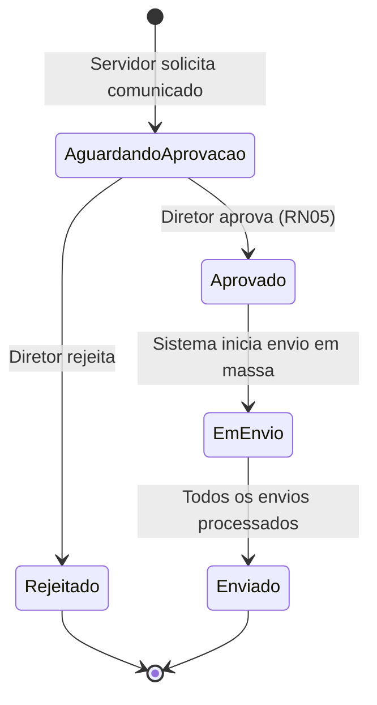

# Modelo Comportamental

Dominio e regras de negocio: ver [README.md](README.md)

### Ciclo de Vida: Notificacao

```mermaid
stateDiagram-v2
    [*] --> Pendente : Evento de notificacao recebido

    Pendente --> Enviada : Envio bem-sucedido (1a tentativa)
    Pendente --> Reenvio : Falha no envio (tentativa < 3)
    Pendente --> Falha : Falha no envio (3a tentativa)

    Reenvio --> Enviada : Reenvio bem-sucedido
    Reenvio --> Reenvio : Falha no reenvio (tentativa < 3)
    Reenvio --> Falha : Falha no reenvio (3a tentativa)

    Enviada --> Entregue : Confirmacao de entrega recebida

    Falha --> [*]
    Entregue --> [*]

    state Pendente : Notificacao criada, aguardando envio
    state Enviada : Email enviado ao servidor de email
    state Entregue : Entrega confirmada ao destinatario
    state Reenvio : Tentativa de reenvio apos falha
    state Falha : Todas as tentativas esgotadas

    note right of Reenvio : Ate 3 tentativas (RN03)
```

### Ciclo de Vida: ComunicadoMassa


