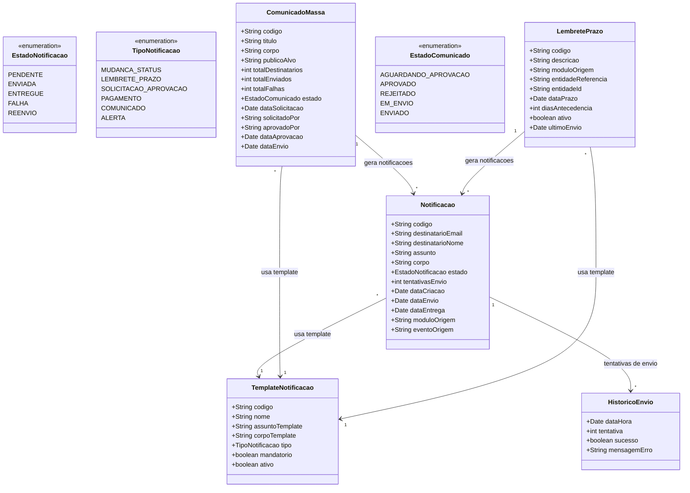

# Modelo Estrutural

Dominio e regras de negocio: ver [README.md](README.md)

### Diagrama de Classes

## Dicionario de Dados

| Classe | Atributo | Definicao | Obrig. | Tipo | Dominio | Tamanho | Unico |
|--------|----------|-----------|--------|------|---------|---------|-------|
| **Notificacao** | codigo | Codigo de identificacao unica da notificacao | Gerado | String | Ex: NTF-2025-001 | | Sim |
| | destinatarioEmail | Endereco de email do destinatario | Sim | String | | 200 | |
| | destinatarioNome | Nome do destinatario | Sim | String | | 200 | |
| | assunto | Assunto do email (gerado a partir do template) | Gerado | String | | 300 | |
| | corpo | Corpo do email (gerado a partir do template com variaveis resolvidas) | Gerado | String | | | |
| | estado | Estado atual da notificacao no ciclo de vida | Gerado | EstadoNotificacao | Pendente, Enviada, Entregue, Falha, Reenvio | | |
| | tentativasEnvio | Numero de tentativas de envio realizadas | Gerado | Int | 0 a 3 | | |
| | dataCriacao | Data e hora de criacao da notificacao | Gerado | Date | | | |
| | dataEnvio | Data e hora do envio bem-sucedido | Cond. | Date | Preenchida ao enviar | | |
| | dataEntrega | Data e hora de confirmacao de entrega | Cond. | Date | Preenchida ao confirmar entrega | | |
| | moduloOrigem | Modulo que originou a notificacao | Sim | String | Ex: M009, M014 | 20 | |
| | eventoOrigem | Evento que disparou a notificacao | Sim | String | Ex: BOLSA_IMPLEMENTADA, PRAZO_VENCENDO | 100 | |
| **TemplateNotificacao** | codigo | Codigo de identificacao do template | Gerado | String | Ex: TPL-001 | | Sim |
| | nome | Nome descritivo do template | Sim | String | Ex: Notificacao de Bolsa Implementada | 200 | Sim |
| | assuntoTemplate | Template do assunto com variaveis | Sim | String | Ex: Bolsa {{codigo}} - {{status}} | 300 | |
| | corpoTemplate | Template do corpo com variaveis HTML | Sim | String | Suporta variaveis: {{nome}}, {{edital}}, {{prazo}}, etc. | | |
| | tipo | Tipo de notificacao | Sim | TipoNotificacao | Mudanca de Status, Lembrete de Prazo, etc. | | |
| | mandatorio | Indica se a notificacao e mandatoria (sem opt-out) | Sim | Boolean | true para prazo e pagamento | | |
| | ativo | Indica se o template esta ativo para uso | Sim | Boolean | true/false | | |
| **HistoricoEnvio** | dataHora | Data e hora da tentativa de envio | Gerado | Date | | | |
| | tentativa | Numero da tentativa (1, 2 ou 3) | Gerado | Int | 1 a 3 | | |
| | sucesso | Indica se a tentativa foi bem-sucedida | Gerado | Boolean | true/false | | |
| | mensagemErro | Mensagem de erro retornada pelo servidor de email | Cond. | String | Preenchida em caso de falha | 500 | |
| **ComunicadoMassa** | codigo | Codigo de identificacao do comunicado | Gerado | String | Ex: COM-2025-001 | | Sim |
| | titulo | Titulo do comunicado | Sim | String | | 300 | |
| | corpo | Conteudo do comunicado | Sim | String | | | |
| | publicoAlvo | Descricao do publico alvo | Sim | String | Ex: Bolsistas do Edital 01/2024 | 300 | |
| | totalDestinatarios | Quantidade total de destinatarios | Gerado | Int | | | |
| | totalEnviados | Quantidade de envios bem-sucedidos | Gerado | Int | | | |
| | totalFalhas | Quantidade de envios com falha | Gerado | Int | | | |
| | estado | Estado do comunicado no ciclo de vida | Gerado | EstadoComunicado | Ver enumeracao | | |
| | dataSolicitacao | Data da solicitacao do comunicado | Gerado | Date | | | |
| | solicitadoPor | Usuario que solicitou o comunicado | Gerado | String | | 200 | |
| | aprovadoPor | Diretor que aprovou o comunicado | Cond. | String | Preenchido ao aprovar | 200 | |
| | dataAprovacao | Data da aprovacao pelo Diretor | Cond. | Date | Preenchida ao aprovar | | |
| | dataEnvio | Data de inicio do envio em massa | Cond. | Date | Preenchida ao iniciar envio | | |
| **LembretePrazo** | codigo | Codigo de identificacao do lembrete | Gerado | String | Ex: LEM-2025-001 | | Sim |
| | descricao | Descricao do lembrete | Sim | String | Ex: Vencimento de bolsa BP-2025-001 | 300 | |
| | moduloOrigem | Modulo que registrou o lembrete | Sim | String | Ex: M009 | 20 | |
| | entidadeReferencia | Tipo da entidade associada ao prazo | Sim | String | Ex: BolsaPesquisa, PrestacaoContas | 100 | |
| | entidadeId | Identificador da entidade associada | Sim | String | | 100 | |
| | dataPrazo | Data do prazo a ser lembrado | Sim | Date | | | |
| | diasAntecedencia | Dias de antecedencia para envio do lembrete | Sim | Int | Padrao: 30, 15, 7 | | |
| | ativo | Indica se o lembrete esta ativo | Sim | Boolean | true/false | | |
| | ultimoEnvio | Data do ultimo envio deste lembrete | Cond. | Date | | | |

## Notas de Implementacao

**Servico transversal:**
- Este modulo e consumido por todos os demais modulos via API interna (RN08). Cada modulo envia eventos que disparam notificacoes usando os templates configurados.

**Navegabilidade:**
- Cardinalidade 1: atributo do tipo da classe destino (ex: Notificacao.template: TemplateNotificacao)
- Cardinalidade N: atributo lista do tipo da classe destino (ex: Notificacao.historico: List&lt;HistoricoEnvio&gt;)
