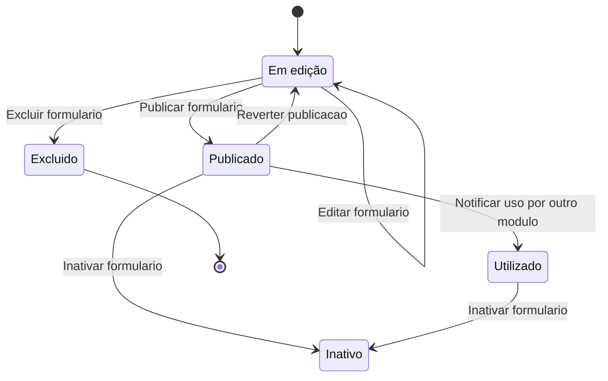

# Modelo Comportamental do Ciclo de Vida do Formulario

Dominio e regras de negocio: ver [README.md](README.md)

## Ciclo de Vida do Formulario

```mermaid
stateDiagram-v2
    state "Em edição" as EmEdicao
    state "Publicado" as Publicado
    state "Utilizado" as Utilizado
    state "Inativo" as Inativo
    state "Excluido" as Excluido

    [*] --> EmEdicao
    EmEdicao --> EmEdicao : Editar formulario
    EmEdicao --> Publicado : Publicar formulario
    EmEdicao --> Excluido : Excluir formulario

    Publicado --> EmEdicao : Reverter publicacao
    Publicado --> Utilizado : Notificar uso por outro modulo
    Publicado --> Inativo : Inativar formulario

    Utilizado --> Inativo : Inativar formulario
    Excluido --> [*]

    state EmEdicao : Pode ser editado e excluido
    state Publicado : Visivel para uso por outros modulos
    state Utilizado : Nao pode voltar para edicao e pode receber respostas
    state Inativo : Indisponivel para novos usos, mas pode receber respostas de usos existentes
```
