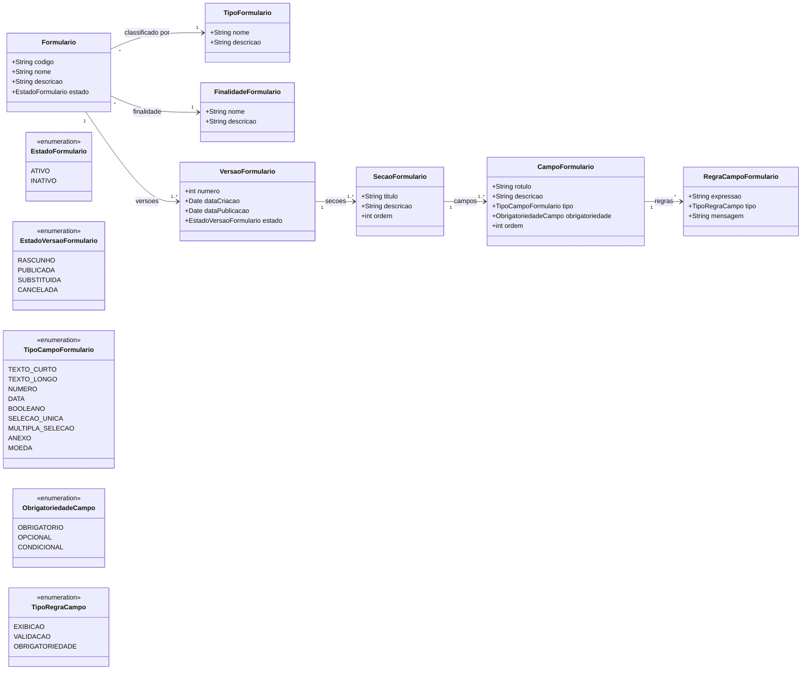

# Modelo Estrutural

Dominio e regras de negocio: ver [README.md](README.md)

## Descricao do Modelo

O modelo representa uma base central de formularios reutilizaveis. O `Formulario` identifica o instrumento de coleta; `VersaoFormulario` guarda uma estrutura versionada e publicavel; `SecaoFormulario` organiza grupos de perguntas; `CampoFormulario` define cada pergunta ou entrada de dado; e `RegraCampoFormulario` descreve regras de exibicao, obrigatoriedade ou validacao.

### Diagrama de Classes

## Dicionario de Dados

| Classe | Atributo | Definicao | Obrig. | Tipo | Dominio |
|--------|----------|-----------|--------|------|---------|
| **Formulario** | codigo | Identificador do formulario | Gerado | String | Ex: FORM-2026-001 |
| | nome | Nome do formulario | Sim | String | |
| | descricao | Descricao do uso do formulario | Nao | String | |
| | estado | Estado do formulario | Gerado | EstadoFormulario | ATIVO, INATIVO |
| **TipoFormulario** | nome | Classificacao do formulario | Sim | String | Ex: Submissao, Avaliacao Ad Hoc, Revisao de Resultado |
| | descricao | Descricao da classificacao | Nao | String | |
| **FinalidadeFormulario** | nome | Finalidade de negocio do formulario | Sim | String | Ex: Captacao de iniciativas |
| | descricao | Descricao da finalidade | Nao | String | |
| **VersaoFormulario** | numero | Numero sequencial da versao | Gerado | Int | 1, 2, 3... |
| | dataCriacao | Data de criacao da versao | Gerado | Date | |
| | dataPublicacao | Data de publicacao da versao | Cond. | Date | Obrigatoria quando estado = PUBLICADA |
| | estado | Estado da versao | Gerado | EstadoVersaoFormulario | RASCUNHO, PUBLICADA, SUBSTITUIDA, CANCELADA |
| **SecaoFormulario** | titulo | Titulo da secao | Sim | String | |
| | descricao | Descricao da secao | Nao | String | |
| | ordem | Ordem da secao no formulario | Sim | Int | |
| **CampoFormulario** | rotulo | Texto apresentado ao usuario | Sim | String | |
| | descricao | Ajuda ou explicacao do campo | Nao | String | |
| | tipo | Tipo de entrada do campo | Sim | TipoCampoFormulario | |
| | obrigatoriedade | Obrigatoriedade do campo | Sim | ObrigatoriedadeCampo | |
| | ordem | Ordem do campo na secao | Sim | Int | |
| **RegraCampoFormulario** | expressao | Expressao ou condicao da regra | Sim | String | |
| | tipo | Tipo da regra | Sim | TipoRegraCampo | |
| | mensagem | Mensagem exibida quando a regra for aplicada | Nao | String | |

## Notas de Implementacao

**Restricoes estruturais:**
- Um formulario pode ter varias versoes.
- Uma versao publicada nao pode ser alterada diretamente.
- Uma versao publicada deve possuir ao menos uma secao e um campo.
- Campos condicionais devem possuir ao menos uma regra de obrigatoriedade ou exibicao.
- Outros modulos devem referenciar sempre uma versao especifica do formulario.
