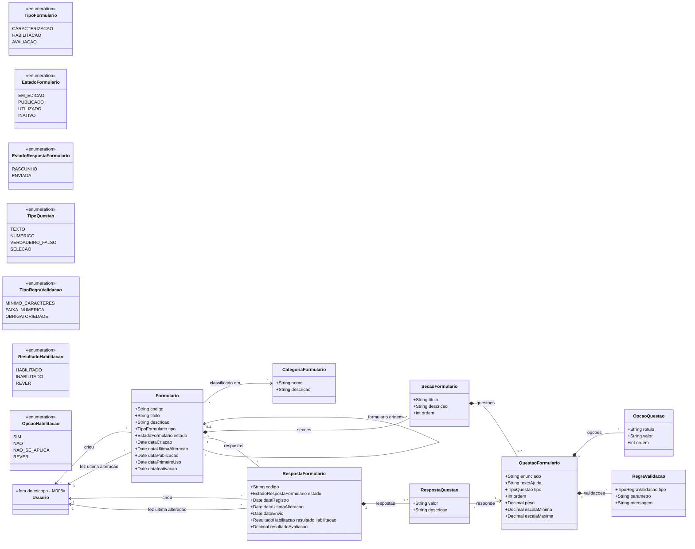
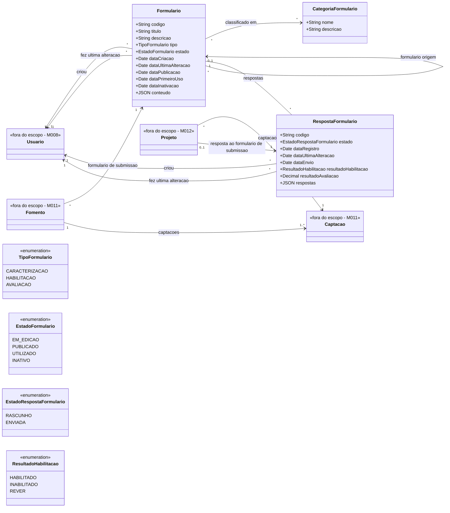

# Modelo Estrutural

Dominio e regras de negocio: ver [README.md](README.md)

## Descricao do Modelo

O modelo representa a base central de formularios reutilizaveis do ConectaFapes. O `Formulario` e a classe principal e possui ciclo de vida proprio representado em [modelo-comportamental.md](modelo-comportamental.md). Um `Formulario` é classificado em um tipo e em zero ou mais categorias, e é composto por secoes e questoes. As `Questoes` definem o formato das respostas esperadas, suas opcoes e regras de validacao. Quando um formulario utilizado por outro modulo recebe dados, o M021 registra uma `RespostaFormulario`, composta por respostas para suas questoes e, quando aplicavel, pelo resultado calculado conforme o tipo do formulario.

### Diagrama de Classes

## Dicionario de Dados

| Classe | Atributo | Definicao | Obrig. | Tipo | Dominio |
|--------|----------|-----------|--------|------|---------|
| **Formulario** | codigo | Identificador do formulario | Gerado | String | Ex: FORM-2026-001 |
| | titulo | Titulo do formulario | Sim | String | |
| | descricao | Descricao do formulario | Sim | String | |
| | tipo | Tipo do formulario | Sim | TipoFormulario | CARACTERIZACAO, HABILITACAO, AVALIACAO |
| | estado | Estado do ciclo de vida | Gerado | EstadoFormulario | EM_EDICAO, PUBLICADO, UTILIZADO, INATIVO |
| | dataCriacao | Data de criacao do formulario | Gerado | Date | |
| | dataUltimaAlteracao | Data da ultima alteracao do formulario | Gerado | Date | Atualizada a cada alteracao do formulario |
| | dataPublicacao | Data de publicacao do formulario | Cond. | Date | Obrigatoria quando estado = PUBLICADO ou posterior |
| | dataPrimeiroUso | Data em que o formulario foi utilizado pela primeira vez | Cond. | Date | Obrigatoria quando estado = UTILIZADO ou posterior |
| | dataInativacao | Data de inativacao do formulario | Cond. | Date | Obrigatoria quando estado = INATIVO |
| **CategoriaFormulario** | nome | Nome da categoria | Sim | String | |
| | descricao | Descricao da categoria | Sim | String | |
| **SecaoFormulario** | titulo | Titulo da secao | Sim | String | |
| | descricao | Descricao da secao | Nao | String | |
| | ordem | Ordem da secao no formulario | Sim | Int | |
| **QuestaoFormulario** | enunciado | Texto da pergunta ou criterio | Sim | String | |
| | textoAjuda | Orientacao adicional ao respondente | Nao | String | |
| | tipo | Tipo de resposta esperado | Sim | TipoQuestao | TEXTO, NUMERICO, VERDADEIRO_FALSO, SELECAO |
| | ordem | Ordem da questao na secao | Sim | Int | |
| | peso | Peso da questao em formularios de avaliacao | Cond. | Decimal | Obrigatorio quando formulario.tipo = AVALIACAO |
| | escalaMinima | Menor valor aceito na escala de avaliacao | Cond. | Decimal | Obrigatoria quando formulario.tipo = AVALIACAO |
| | escalaMaxima | Maior valor aceito na escala de avaliacao | Cond. | Decimal | Obrigatoria quando formulario.tipo = AVALIACAO |
| **OpcaoQuestao** | rotulo | Texto exibido para a opcao de resposta | Sim | String | |
| | valor | Valor registrado para a opcao | Sim | String | Para habilitacao: Sim, Nao, Nao se aplica, Rever |
| | ordem | Ordem da opcao na questao | Sim | Int | |
| **RegraValidacao** | tipo | Tipo da regra aplicada a questao | Sim | TipoRegraValidacao | MINIMO_CARACTERES, FAIXA_NUMERICA, OBRIGATORIEDADE |
| | parametro | Valor usado pela regra de validacao | Sim | String | Ex: minimo=50, min=0;max=10 |
| | mensagem | Mensagem exibida quando a validacao falha | Nao | String | |
| **RespostaFormulario** | codigo | Identificador da resposta | Gerado | String | |
| | estado | Estado do ciclo de vida da resposta | Gerado | EstadoRespostaFormulario | RASCUNHO, ENVIADA |
| | dataRegistro | Data de registro da resposta | Gerado | Date | |
| | dataUltimaAlteracao | Data da ultima alteracao da resposta | Gerado | Date | Atualizada a cada alteracao da resposta |
| | dataEnvio | Data e hora em que a resposta foi enviada | Cond. | DateTime | Obrigatoria quando estado = ENVIADA |
| | resultadoHabilitacao | Resultado calculado para formulario de habilitacao | Cond. | ResultadoHabilitacao | HABILITADO, INABILITADO, REVER |
| | resultadoAvaliacao | Resultado calculado para formulario de avaliacao | Cond. | Decimal | Media ponderada das respostas numericas |
| **RespostaQuestao** | valor | Valor informado para a questao | Sim | String | |
| | descricao | Justificativa ou complemento textual da resposta | Cond. | String | Obrigatoria como justificativa em formularios de habilitacao |
| **Usuario** | - | Usuario responsavel por criacao ou ultima alteracao | Externo | M008 | Entidade importada de M008 |

## Notas de Implementacao

**Restricoes estruturais:**
- Um formulario deve possuir ao menos uma secao e uma questao antes de ser publicado.
- Apenas formularios em estado EM_EDICAO podem ter titulo, descricao, secoes, questoes, opcoes, categorias e validacoes alterados.
- Formularios utilizados nao podem ser alterados nem voltar para EM_EDICAO.
- Formularios inativos nao podem ser selecionados para novos usos, mas podem continuar recebendo respostas de usos existentes.
- Formularios so podem ser excluidos enquanto estiverem em estado EM_EDICAO.
- Formularios de habilitacao devem usar as opcoes Sim, Nao, Nao se aplica e Rever para todas as questoes.
- Formularios de avaliacao devem definir escala numerica e peso para cada questao usada no calculo do resultado.
- Uma resposta deve ser criada em estado RASCUNHO.
- Apenas respostas em estado RASCUNHO podem ser editadas pelo respondedor.
- Ao ser enviada, a resposta muda para ENVIADA e registra dataEnvio.
- Respostas em estado ENVIADA nao podem ser alteradas pelo respondedor.

### Diagrama de Classes Simplificado

Este diagrama foi simplificado considerando que toda as configurações de seções e questões de um formulário serão armazenadas em um campo que conterá um JSON. Haverá também um campo JSON em RespostaFormulario que guardará toda as respostas dadas a todas as perguntas para uma aplicação do formulário.

`Fomento`, `Captacao`, `Projeto` e `Usuario` aparecem no diagrama apenas para explicitar o uso do M021 por outros modulos; suas regras e ciclos de vida permanecem fora do escopo deste modulo. O `Fomento` referencia um `Formulario` do tipo caracterizacao como formulario de submissao, permitindo que varios fomentos reutilizem o mesmo formulario publicado. No M011, um `Fomento` pode originar uma ou mais captacoes, e cada `Projeto` submetido pertence a uma `Captacao`. Para cada `Projeto` submetido, o M021 registra uma `RespostaFormulario` correspondente ao preenchimento do formulario de submissao selecionado para o fomento. `Usuario`, importado do M008, identifica quem criou e quem fez a ultima alteracao de formularios e respostas.
