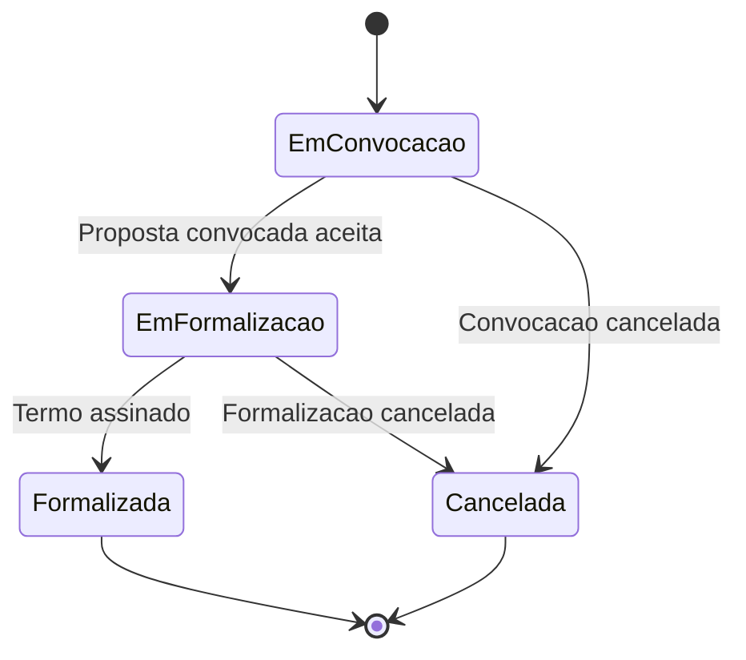
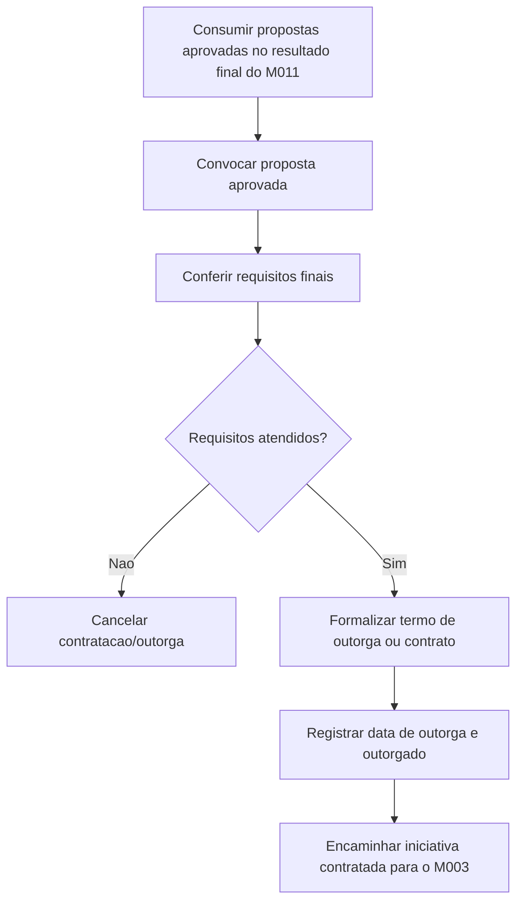

# Modelo Comportamental

Dominio e regras de negocio: ver [README.md](README.md)

## Estados da Contratacao/Outorga

```mermaid
stateDiagram-v2
    [*] --> EmConvocacao
    EmConvocacao --> EmFormalizacao : Proposta convocada aceita
    EmConvocacao --> Cancelada : Convocacao cancelada
    EmFormalizacao --> Formalizada : Termo assinado
    EmFormalizacao --> Cancelada : Formalizacao cancelada
    Formalizada --> [*]
    Cancelada --> [*]
```

## Fluxo Principal

```mermaid
flowchart TD
    A[Consumir propostas aprovadas no resultado final do M011] --> B[Convocar proposta aprovada]
    B --> C[Conferir requisitos finais]
    C --> D{Requisitos atendidos?}
    D -->|Nao| E[Cancelar contratacao/outorga]
    D -->|Sim| F[Formalizar termo de outorga ou contrato]
    F --> G[Registrar data de outorga e outorgado]
    G --> H[Encaminhar iniciativa contratada para o M003]
```
