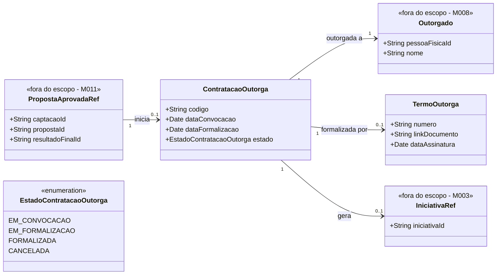

# Modelo Estrutural

Dominio e regras de negocio: ver [README.md](README.md)

## Descricao do Modelo

O M022 representa a etapa em que uma proposta aprovada no M011 e transformada em contratacao/outorga. A contratacao mantem referencia para a captacao e para a proposta aprovada, registra a pessoa outorgada, controla o estado da formalizacao e, quando concluida, permite criar a iniciativa no M003.

## Dicionario de Dados

| Classe | Atributo | Definicao | Obrig. | Tipo | Dominio |
|--------|----------|-----------|--------|------|---------|
| **PropostaAprovadaRef** | captacaoId | Identificador da captacao no M011 | Sim | String | |
| | propostaId | Identificador da proposta aprovada no M011 | Sim | String | |
| | resultadoFinalId | Identificador do resultado final publicado | Sim | String | |
| **ContratacaoOutorga** | codigo | Codigo da contratacao/outorga | Gerado | String | |
| | dataConvocacao | Data de convocacao da proposta aprovada | Sim | Date | |
| | dataFormalizacao | Data de formalizacao da contratacao/outorga | Cond. | Date | Obrigatoria quando estado = FORMALIZADA |
| | estado | Estado da contratacao/outorga | Sim | EstadoContratacaoOutorga | |
| **Outorgado** | pessoaFisicaId | Identificador da pessoa fisica outorgada no M008 | Sim | String | |
| | nome | Nome da pessoa outorgada | Sim | String | |
| **TermoOutorga** | numero | Numero do termo ou contrato | Sim | String | |
| | linkDocumento | Link ou referencia documental do termo | Cond. | String | |
| | dataAssinatura | Data de assinatura do termo | Sim | Date | |
| **IniciativaRef** | iniciativaId | Identificador da iniciativa criada no M003 | Cond. | String | Existente apos envio ao M003 |
