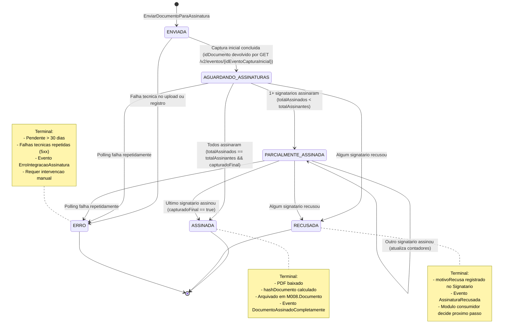
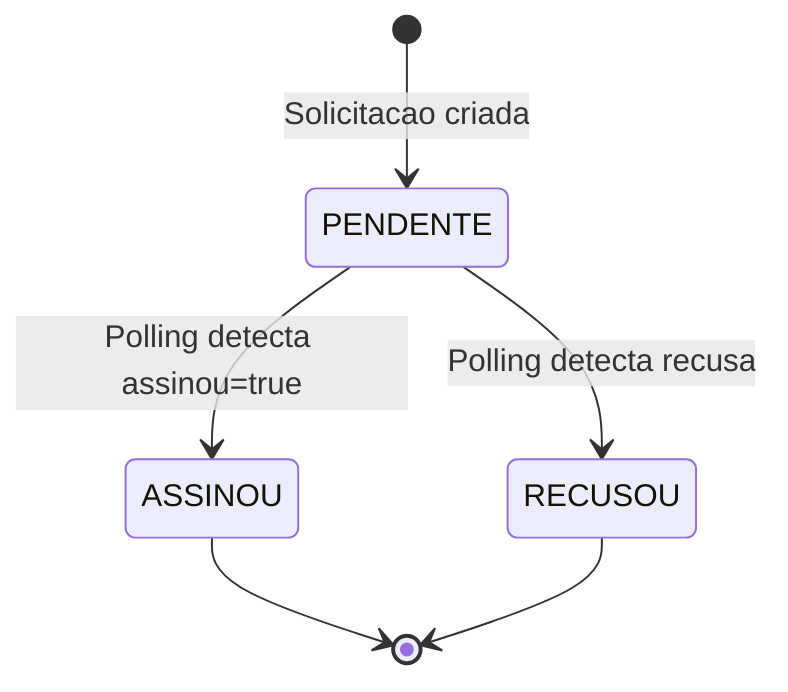
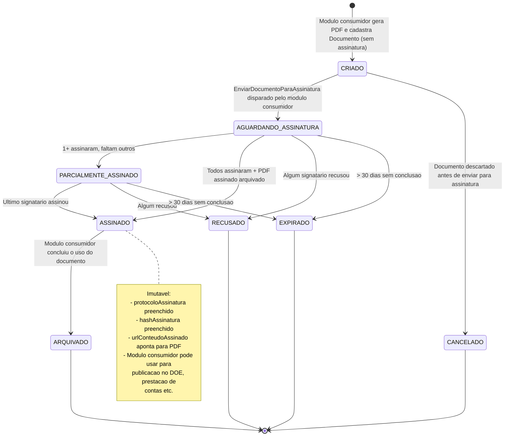

# Modelo Comportamental

Dominio e regras: ver [README.md](README.md) | Estrutura: [modelo-estrutural.md](modelo-estrutural.md)

---

## Ciclo de Vida: SolicitacaoAssinatura

### Transicoes da Solicitacao

| De | Para | Gatilho |
|----|------|---------|
| `[*]` | `ENVIADA` | Comando `EnviarDocumentoParaAssinatura` (apos POST `/v2/documentos/capturar/...` retornar `idEvento`) |
| `ENVIADA` | `AGUARDANDO_ASSINATURAS` | `GET /v2/eventos/{idEventoCapturaInicial}` retorna `status=Executado` com `idDocumento` |
| `ENVIADA` | `ERRO` | Upload falha, registro falha, ou captura inicial nao concluiu em 1 hora |
| `AGUARDANDO_ASSINATURAS`/`PARCIALMENTE_ASSINADA` | `PARCIALMENTE_ASSINADA` | Polling detecta `totalAssinados` aumentou mas `< totalAssinantes` |
| `AGUARDANDO_ASSINATURAS`/`PARCIALMENTE_ASSINADA` | `ASSINADA` | Polling detecta `totalAssinados == totalAssinantes && capturadoFinal == true` |
| `AGUARDANDO_ASSINATURAS`/`PARCIALMENTE_ASSINADA` | `RECUSADA` | Polling detecta `totalRecusados >= 1` |
| `AGUARDANDO_ASSINATURAS`/`PARCIALMENTE_ASSINADA` | `ERRO` | Polling falha 10x consecutivos OU `dataExpiracao` ultrapassada |

---

## Ciclo de Vida: Signatario (estado individual)

| De | Para | Gatilho |
|----|------|---------|
| `[*]` | `PENDENTE` | Cadastro inicial junto com a `SolicitacaoAssinatura` |
| `PENDENTE` | `ASSINOU` | Polling em `GET /v2/documentos/{idEdocs}` mostra `assinatura.assinou=true` para o `idPapelEdocs` |
| `PENDENTE` | `RECUSOU` | Polling mostra recusa explicita; `motivoRecusa` preenchido |

---

## Ciclo de Vida: Documento (visao M008 com perspectiva de assinatura)

> Documento e canonico do M008. M023 propoe enriquecer M008.Documento com estados que refletem o ciclo de assinatura. Estados nao terminais sao mutaveis pelo M023; estados terminais bloqueiam edicao.

### Estados de Documento (M008 enriquecido por M023)

| Estado | Descricao | Quem dispara |
|--------|-----------|--------------|
| `CRIADO` | PDF gerado e cadastrado em M008. Nao foi enviado para E-Docs ainda. | Modulo consumidor (M009/M022/M003/M010) |
| `AGUARDANDO_ASSINATURA` | M023 enviou ao E-Docs e captura inicial concluiu; signatarios podem assinar. | M023 ao executar `EnviarDocumentoParaAssinatura` |
| `PARCIALMENTE_ASSINADO` | Pelo menos 1 signatario assinou; ainda faltam outros. | M023 (job de polling) |
| `ASSINADO` | Todos signatarios assinaram; PDF assinado arquivado com hash. **Estado-chave** para liberar publicacao em DOE, prestacao de contas, etc. | M023 (job de polling) |
| `RECUSADO` | Algum signatario recusou; documento nao avanca. | M023 (job de polling) |
| `EXPIRADO` | Tempo limite (`dataEnvio + 30 dias`) sem conclusao. | M023 (job alertador) |
| `CANCELADO` | Documento descartado antes de enviar para E-Docs. Permitido apenas no estado `CRIADO`. | Modulo consumidor |
| `ARQUIVADO` | Documento concluiu seu uso de negocio (ex: bolsa publicada no DOE; outorga executada). Imutavel. | Modulo consumidor |

### Transicoes do Documento

| De | Para | Gatilho |
|----|------|---------|
| `[*]` | `CRIADO` | Modulo consumidor gera PDF e chama M008 para cadastrar |
| `CRIADO` | `AGUARDANDO_ASSINATURA` | `EnviarDocumentoParaAssinatura` (M023) — apos captura inicial concluir |
| `CRIADO` | `CANCELADO` | Modulo consumidor descarta antes de enviar para assinatura |
| `AGUARDANDO_ASSINATURA`/`PARCIALMENTE_ASSINADO` | `PARCIALMENTE_ASSINADO` | Polling detecta nova assinatura; ainda incompleto |
| `AGUARDANDO_ASSINATURA`/`PARCIALMENTE_ASSINADO` | `ASSINADO` | Polling detecta `capturadoFinal=true` e `totalAssinados==totalAssinantes` |
| `AGUARDANDO_ASSINATURA`/`PARCIALMENTE_ASSINADO` | `RECUSADO` | Polling detecta recusa |
| `AGUARDANDO_ASSINATURA`/`PARCIALMENTE_ASSINADO` | `EXPIRADO` | Job de alertador detecta `dataEnvio + 30 dias < hoje` sem conclusao |
| `ASSINADO` | `ARQUIVADO` | Modulo consumidor (ex: M009 apos publicacao DOE) chama `ArquivarDocumento` |

### Mapeamento Solicitacao ↔ Documento

| Solicitacao (M023) | Documento (M008) |
|--------------------|-------------------|
| `ENVIADA` | `AGUARDANDO_ASSINATURA` (apos captura inicial) |
| `AGUARDANDO_ASSINATURAS` | `AGUARDANDO_ASSINATURA` |
| `PARCIALMENTE_ASSINADA` | `PARCIALMENTE_ASSINADO` |
| `ASSINADA` | `ASSINADO` |
| `RECUSADA` | `RECUSADO` |
| `ERRO` | `EXPIRADO` (apos 30 dias) ou permanece `AGUARDANDO_ASSINATURA` para reconciliacao manual |

---

## Eventos publicos disparados

| Evento | Disparado por | Quando |
|--------|---------------|--------|
| `DocumentoAssinadoCompletamente` | M023 | Transicao Solicitacao → `ASSINADA` |
| `DocumentoAssinadoParcialmente` | M023 | Cada nova assinatura individual durante `PARCIALMENTE_ASSINADA` |
| `AssinaturaRecusada` | M023 | Transicao Solicitacao → `RECUSADA` |
| `AssinaturaExpirando` | M023 | Solicitacao em estado nao terminal por > 25 dias (alerta antes de 30) |
| `ErroIntegracaoAssinatura` | M023 | Transicao Solicitacao → `ERRO` |

Modulos consumidores (M009, M022, M003, M010) reagem a esses eventos para avancar seus proprios fluxos de negocio.

---

## Dicionario de Estados

### Estados de SolicitacaoAssinatura

| Estado | Significado | Quando entra | Quando sai | Terminal? |
|--------|-------------|--------------|------------|-----------|
| `ENVIADA` | Pedido foi disparado para o provedor; captura inicial enfileirada mas ainda nao concluida | Apos comando `EnviarDocumentoParaAssinatura` retornar `idEventoCapturaInicial` | Quando polling do evento devolve `Executado` com `idExterno` (vai para `AGUARDANDO_ASSINATURAS`) ou apos 1h sem conclusao (vai para `ERRO`) | Nao |
| `AGUARDANDO_ASSINATURAS` | Provedor confirmou captura inicial; signatarios podem assinar | Apos captura inicial concluir | Quando 1+ signatarios assinam (`PARCIALMENTE_ASSINADA`), todos assinam (`ASSINADA`), algum recusa (`RECUSADA`) ou prazo expira (`ERRO`) | Nao |
| `PARCIALMENTE_ASSINADA` | 1 ou mais signatarios assinaram, mas ainda faltam outros | Apos primeira assinatura individual detectada | Mesmas saidas de `AGUARDANDO_ASSINATURAS` | Nao |
| `ASSINADA` | Todos os signatarios assinaram; PDF baixado, hash calculado, arquivado em M008 | Apos polling detectar `totalAssinados == totalAssinantes && capturadoFinal == true` e download bem-sucedido | Estado final | **Sim** |
| `RECUSADA` | Pelo menos um signatario recusou; documento nao avanca | Apos polling detectar `totalRecusados >= 1` | Estado final | **Sim** |
| `ERRO` | Falha tecnica continuada ou expiracao por prazo (30 dias) ou cancelamento manual | Apos 10 falhas consecutivas, captura inicial > 1h sem conclusao, prazo > 30 dias ou comando de cancelamento manual | Estado final | **Sim** |

### Estados de Signatario

| Estado | Significado | Quando entra | Terminal? |
|--------|-------------|--------------|-----------|
| `PENDENTE` | Signatario foi cadastrado mas ainda nao assinou nem recusou | Cadastro inicial junto com a SolicitacaoAssinatura | Nao |
| `ASSINOU` | Polling detectou que o signatario assinou no provedor; `dataAssinatura` preenchida | Apos detectar `assinatura.assinou == true` para o `idExterno` do signatario | **Sim** |
| `RECUSOU` | Polling detectou recusa explicita; `motivoRecusa` preenchido | Apos detectar campo de recusa no payload do provedor | **Sim** |

### Estados de Documento (visao M008 enriquecida por M023)

| Estado | Significado | Quando entra | Quem dispara | Terminal? |
|--------|-------------|--------------|--------------|-----------|
| `CRIADO` | PDF gerado e cadastrado em M008; ainda nao foi enviado para assinatura | Modulo consumidor (M009/M022/M003/M010) registra Documento com PDF | Modulo consumidor | Nao |
| `AGUARDANDO_ASSINATURA` | M023 enviou ao provedor; coleta de assinaturas em andamento | Apos `EnviarDocumentoParaAssinatura` concluir captura inicial | M023 | Nao |
| `PARCIALMENTE_ASSINADO` | 1+ signatarios assinaram; ainda faltam outros | Polling detecta nova assinatura | M023 | Nao |
| `ASSINADO` | Todos signatarios assinaram; PDF assinado arquivado com hash + protocolo. **Estado-chave**: libera publicacao em DOE, prestacao de contas, etc. | Polling detecta `capturadoFinal == true` | M023 | Nao (vira `ARQUIVADO` depois) |
| `RECUSADO` | Algum signatario recusou; documento nao avanca | Polling detecta recusa | M023 | **Sim** |
| `EXPIRADO` | Tempo limite (`dataEnvio + 30 dias`) sem conclusao | Job de expiracao | M023 | **Sim** |
| `CANCELADO` | Documento descartado antes de enviar para assinatura | Modulo consumidor descarta documento ainda em `CRIADO` | Modulo consumidor | **Sim** |
| `ARQUIVADO` | Documento concluiu seu uso de negocio (ex: bolsa publicada no DOE; outorga executada). Imutavel. | Modulo consumidor (M009 apos publicacao DOE) chama `ArquivarDocumento` | Modulo consumidor | **Sim** |

---

## Dicionario de Eventos

### Eventos internos (`EventoAssinatura`) — log de auditoria do M023

Estes eventos sao **persistidos** em cada chamada ao provedor e servem para auditoria + idempotencia. Nao sao publicados externamente.

| Tipo | Significado | Quando ocorre | Payload tipico |
|------|-------------|---------------|-----------------|
| `CAPTURA_INICIAL` | Solicitacao foi registrada no provedor; captura inicial enfileirada | Apos `POST /v2/documentos/capturar/...` retornar `idEvento` | `{ idEventoExterno, idArquivoExterno, statusInicial: "Pendente" }` |
| `ASSINATURA_INDIVIDUAL` | Polling detectou nova assinatura individual | Job de polling encontra `signatario.assinou == true` que antes estava `false` | `{ idSignatario, dataAssinatura, papel }` |
| `CAPTURA_FINAL` | Provedor confirmou que todos os signatarios assinaram e capturou definitivamente | Polling detecta `capturadoFinal == true` | `{ idDocumentoFinal, dataCapturaFinal, hashProvedor }` |
| `RECUSA` | Polling detectou recusa de signatario | Job encontra campo de recusa no payload | `{ idSignatario, motivoRecusa, dataRecusa }` |
| `ERRO` | Chamada ao provedor falhou (5xx, timeout, payload invalido) | Cada falha durante polling ou comando | `{ httpStatus, mensagemErro, tentativa: N }` |

### Eventos publicos — emitidos para outros modulos

Estes eventos sao **publicados no barramento interno** e disparam reacoes em modulos consumidores.

| Evento | Significado | Quando emite | Carga util principal | Quem reage |
|--------|-------------|--------------|----------------------|------------|
| `DocumentoAssinadoCompletamente` | Documento foi assinado por todos os signatarios e PDF assinado foi arquivado em M008. Documento avanca para uso de negocio. | Transicao SolicitacaoAssinatura → `ASSINADA`. **Ocorre exatamente uma vez** por solicitacao. | `{ solicitacaoId, documentoId, protocoloAssinatura, hashAssinatura, dataCapturaFinal, urlConteudoAssinado }` | M009 (Bolsa → `TermoAssinado`), M022 (Outorga formalizada), M003 (Aceite/Plano vigente), M010 (Parceria → `Vigente`), M008 (Documento → `ASSINADO`) |
| `DocumentoAssinadoParcialmente` | Algum signatario individual assinou mas faltam outros. Util para UI de progresso e notificacoes. | Cada vez que polling detecta nova assinatura individual durante `AGUARDANDO_ASSINATURAS` ou `PARCIALMENTE_ASSINADA`. **Ocorre N vezes** (uma por assinatura). | `{ solicitacaoId, documentoId, signatarioId, papel, totalAssinados, totalAssinantes }` | M020 (notifica os que ainda nao assinaram), UI de acompanhamento |
| `AssinaturaRecusada` | Algum signatario recusou; documento nao podera ser concluido sem nova rodada. | Transicao SolicitacaoAssinatura → `RECUSADA`. **Ocorre exatamente uma vez**. | `{ solicitacaoId, documentoId, signatarioRecusante, motivoRecusa, dataRecusa }` | M009 (Bolsa → `AssinaturaRecusada`), M020 (notifica gestor), M022/M003/M010 (estado equivalente) |
| `AssinaturaExpirando` | Solicitacao esta proxima de expirar (25 dias do prazo de 30); ainda em estado nao terminal. **Alerta — nao terminal**. | Job diario detecta `dataEnvio + 25 dias < hoje < dataExpiracao` e estado nao terminal | `{ solicitacaoId, documentoId, dataEnvio, diasRestantes }` | M020 (envia lembrete a signatarios pendentes), Sysadmin (avisa para reconciliar ou cancelar) |
| `ErroIntegracaoAssinatura` | Solicitacao chegou em `ERRO` por expiracao (>30d), falha tecnica continuada, cancelamento manual ou erro do provedor. | Transicao SolicitacaoAssinatura → `ERRO`. **Ocorre exatamente uma vez** por solicitacao. | `{ solicitacaoId, documentoId, tipoErro: EXPIRACAO\|FALHA_TECNICA\|CANCELAMENTO_MANUAL, mensagem, ultimaTentativa }` | M009 (Bolsa marcada para revisao), M020 (notifica Sysadmin), Portal Admin (mostra na fila de erros para reconciliacao) |

### Notas sobre emissao

- **Idempotencia**: cada evento publico e emitido **uma unica vez** por transicao real do estado. Polling repetido nao reemite. Garantia: M023 verifica `EventoAssinatura.processado` antes de emitir.
- **Ordem de eventos**: para uma mesma solicitacao, garante-se que `DocumentoAssinadoParcialmente` aparece antes de `DocumentoAssinadoCompletamente`. `AssinaturaExpirando` pode aparecer multiplas vezes (job diario) ate ocorrer transicao para `ASSINADA` ou `ERRO`.
- **Modulos consumidores devem ser idempotentes**: se receberem o mesmo evento duas vezes (ex: replay manual), nao devem reaplicar efeitos colaterais.

---

## Referencias

- **Discovery interno**:
  - [integracoes/e-docs.md](../../../discovery/integracoes/e-docs.md) — passo a passo + 2 sequence diagrams (fluxo completo + ciclo de polling)
  - [glossario.md](../../../discovery/glossario.md) — definicoes de Assinatura Eletronica Qualificada, Protocolo, Signatario Externo
- **Documentacao oficial (V2)**:
  - [Documentos](https://docs.e-docs.es.gov.br/api/Documentos) — base dos estados `ENVIADA`, `AGUARDANDO_ASSINATURAS`
  - [Captura](https://docs.e-docs.es.gov.br/api/Captura) — base do estado `ASSINADA` (captura final automatica apos ultima assinatura)
  - Modelo assincrono via `idEvento` + `GET /v2/eventos/{idEvento}` — base dos eventos `CAPTURA_INICIAL`, `CAPTURA_FINAL`, `ERRO`
- **Lei 14.063/20** — fundamenta validade juridica dos estados `ASSINADA` e impacto sobre `Documento` em M008
- **Modulos consumidores reagentes**:
  - [M009](../M009-gestao-bolsista/modelo-comportamental.md) — Bolsa transita para `TermoAssinado` apos `DocumentoAssinadoCompletamente`
  - [M010](../M010-planejamento-estrategia/parcerias/modelo-comportamental.md) — Parceria transita para `Vigente` apos assinatura
  - [M022](../M022-contratacao-outorga/modelo-estrutural.md) — Termo de Outorga formalizado
  - [M003](../M003-gestao-iniciativas-captadas/README.md) — Aceite/Plano vigente
