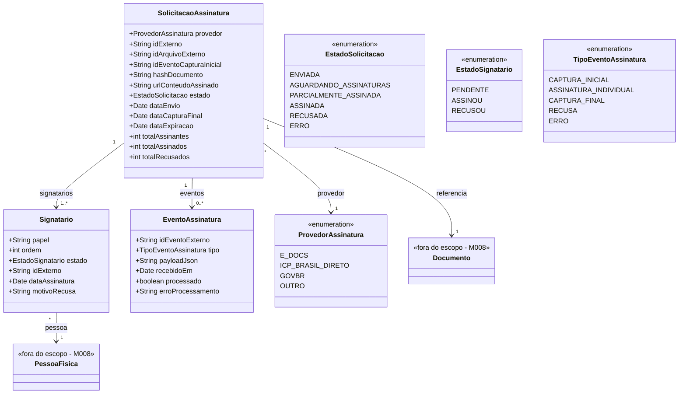

# Modelo Estrutural

Dominio e regras: ver [README.md](README.md) | Implementacao do adapter externo: [Discovery — E-Docs](../../../discovery/integracoes/e-docs.md)

> **Modelagem generica**: este modulo abstrai a coleta de assinaturas em multiplos signatarios independente da plataforma externa. Hoje o adapter e o E-Docs ES; amanha pode ser ICP-Brasil direto, GovBR, DocuSign etc. As entidades de dominio nao referenciam nenhum provedor especifico — apenas o atributo `provedor` e o `idExterno` aparecem.

---

## Diagrama de Classes

## Dicionario de Dados

| Classe | Atributo | Definicao | Obrig. | Tipo | Dominio | Tamanho | Unico |
|--------|----------|-----------|--------|------|---------|---------|-------|
| **SolicitacaoAssinatura** | provedor | Provedor externo de assinatura usado nesta solicitacao | Sim | ProvedorAssinatura | Ver enumeracao | | |
| | idExterno | Identificador opaco do documento no provedor externo | Cond. | String | Atribuido pelo provedor apos captura inicial | 80 | Sim quando informado |
| | idArquivoExterno | Identificador do arquivo no storage temporario do provedor | Sim | String | | 80 | |
| | idEventoCapturaInicial | Identificador do evento de captura inicial enfileirado pelo provedor | Sim | String | | 80 | |
| | hashDocumento | Hash do PDF assinado calculado apos download (auditoria) | Cond. | String | SHA-256 hex | 64 | |
| | urlConteudoAssinado | URL local de arquivamento do PDF assinado em M008.Documento | Cond. | String | Preenchido apos captura final | 500 | |
| | estado | Estado corrente do ciclo de vida | Gerado | EstadoSolicitacao | Ver enumeracao | | |
| | dataEnvio | Data/hora do envio inicial ao provedor | Sim | Date | | | |
| | dataCapturaFinal | Data/hora em que todos signatarios concluiram | Cond. | Date | Preenchido em ASSINADA | | |
| | dataExpiracao | Limite para conclusao apos o qual emite alerta de expiracao (`dataEnvio + 30 dias`) | Gerado | Date | RN08 | | |
| | totalAssinantes | Quantidade total de signatarios da solicitacao | Sim | Integer | >= 1 | | |
| | totalAssinados | Quantidade de signatarios que ja assinaram | Gerado | Integer | 0..totalAssinantes | | |
| | totalRecusados | Quantidade de signatarios que recusaram | Gerado | Integer | 0..totalAssinantes | | |
| | documento (relacao) | Documento canonico em M008 ao qual a solicitacao se refere | Sim | FK → M008.Documento | Via `referencia` | | |
| | signatarios (relacao) | Lista de signatarios da solicitacao | Sim | Lista FK → Signatario | Via `signatarios` | | |
| | eventos (relacao) | Log de eventos detectados durante polling/sincronizacao | Nao | Lista FK → EventoAssinatura | Via `eventos` | | |
| **Signatario** | papel | Papel do signatario no documento (texto livre definido pelo modulo consumidor: ex. "Coordenador", "Bolsista", "Outorgado") | Sim | String | | 80 | |
| | ordem | Ordem de assinatura (quando provedor respeitar ordem sequencial) | Sim | Integer | >= 1 | | |
| | estado | Estado individual do signatario | Gerado | EstadoSignatario | Ver enumeracao | | |
| | idExterno | Identificador do signatario no provedor (definido pelo adapter; ex.: papel/lotacao, CPF) | Sim | String | | 80 | |
| | dataAssinatura | Data/hora em que o signatario assinou | Cond. | Date | Preenchido em `ASSINOU` | | |
| | motivoRecusa | Motivo informado em caso de recusa | Cond. | String | Preenchido em `RECUSOU` | 1000 | |
| | pessoa (relacao) | PessoaFisica do M008 que assina | Sim | FK → M008.PessoaFisica | Via `pessoa` | | |
| | solicitacao (relacao) | Solicitacao mae | Sim | FK → SolicitacaoAssinatura | Via `signatarios` | | |
| **EventoAssinatura** | idEventoExterno | Identificador do evento no provedor | Sim | String | | 80 | Sim |
| | tipo | Tipo do evento detectado | Sim | TipoEventoAssinatura | Ver enumeracao | | |
| | payloadJson | Payload bruto retornado pelo provedor durante polling/sincronizacao | Sim | JSON | | | |
| | recebidoEm | Data/hora de recepcao do evento | Gerado | Date | | | |
| | processado | Indica se o evento ja foi processado pelo M023 (idempotencia) | Gerado | Boolean | true/false | | |
| | erroProcessamento | Mensagem de erro quando processamento falhou | Cond. | String | Preenchido em ERRO | 2000 | |
| | solicitacao (relacao) | Solicitacao a qual o evento pertence | Sim | FK → SolicitacaoAssinatura | Via `eventos` | | |

## Regras Relacionadas

- RN01: Solicitacao referencia exatamente um Documento canonico do M008
- RN02: Lista de signatarios e imutavel apos captura inicial
- RN05: Sincronizacao de status acontece a cada 5 min para solicitacoes em estado nao terminal
- RN06: Apos `ASSINADA`, M023 baixa PDF, calcula hash e arquiva em M008.Documento
- RN07: Recusa de qualquer signatario marca solicitacao como `RECUSADA`
- RN08: Solicitacao pendente > 30 dias dispara alerta de expiracao
- RN09: Cada sincronizacao persiste `EventoAssinatura` para idempotencia
- RN11: PDF deve ser texto pesquisavel; tamanho conforme limite do provedor (E-Docs: 250 MB)
- RI1: estados terminais sao `ASSINADA`, `RECUSADA`, `ERRO`
- RI2: 1 solicitacao nao terminal por Documento (independe do provedor)

## Notas de Implementacao

**Generico vs especifico:**
- Modelo de dominio (este arquivo) e **agnostico de provedor**. Atributos `provedor`, `idExterno`, `idArquivoExterno`, `idEventoCapturaInicial`, `idEventoExterno` carregam o que vier do adapter. Nada acima do nivel do dominio depende de E-Docs.
- O **adapter de E-Docs** (V2) traduz comandos genericos do M023 (`EnviarDocumentoParaAssinatura`, `SincronizarStatus`, `BaixarConteudoAssinado`) em chamadas especificas a `api.e-docs.es.gov.br/v2/...`. A pagina [Discovery — E-Docs](../../../discovery/integracoes/e-docs.md) documenta esse adapter.
- Novos provedores entram como adapters adicionais sem alterar o modelo. Basta acrescentar valor ao enum `ProvedorAssinatura` e implementar a interface do adapter.

**Entidades externas:**
- `Documento`, `PessoaFisica` sao gerenciadas por M008 (Cadastros Corporativos).
- M023 nao replica dados do M008; apenas referencia FK.

**Polling vs Webhook:**
M023 modela o ciclo assumindo polling como padrao (compativel com E-Docs V2 que nao oferece webhook). Provedores que oferecam webhook futuramente populam `EventoAssinatura` no recebimento, sem mudar o modelo.

**Idempotencia:**
- `EventoAssinatura.idEventoExterno` e unico — recebimento repetido (polling ou webhook) nao reprocessa.
- Antes de emitir `DocumentoAssinadoCompletamenteEdocs`, M023 verifica `SolicitacaoAssinatura.estado` — transicao para `ASSINADA` ocorre uma unica vez.

**Navegabilidade:**
- Cardinalidade 1: atributo do tipo da classe destino (ex: `Signatario.pessoa: PessoaFisica`).
- Cardinalidade N: atributo lista do tipo da classe destino (ex: `SolicitacaoAssinatura.signatarios: List<Signatario>`).

**Armazenamento do PDF assinado:**
M023 nao armazena o PDF; apos download via adapter, delega ao M008 via comando `ArquivarDocumentoAssinado(documentoId, pdfBytes, hash, protocoloProvedor)`. M008 atualiza `protocoloAssinatura`, `hashAssinatura`, `urlConteudoAssinado` na entidade Documento.
