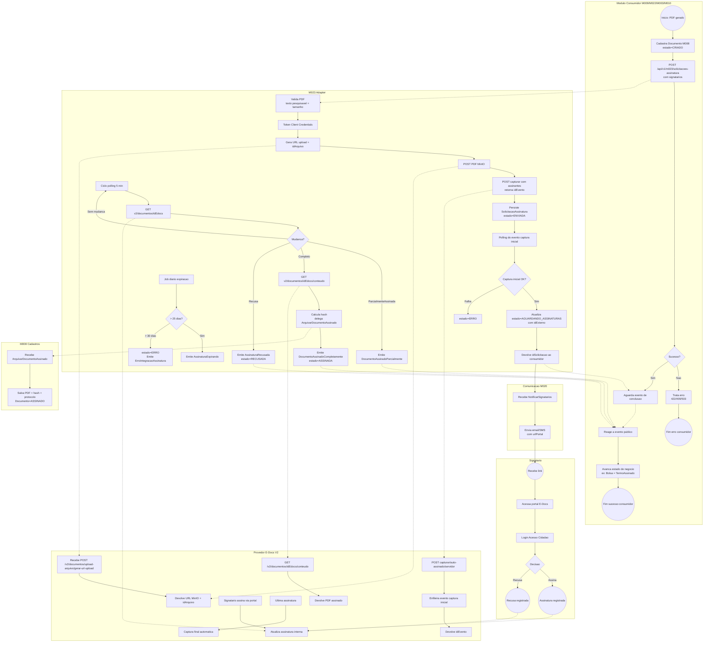
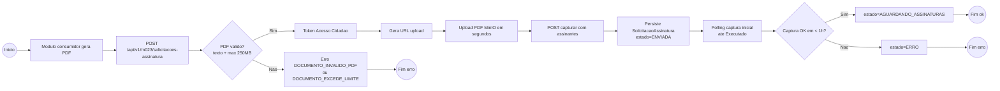
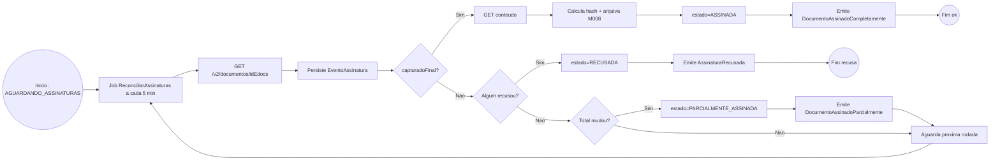
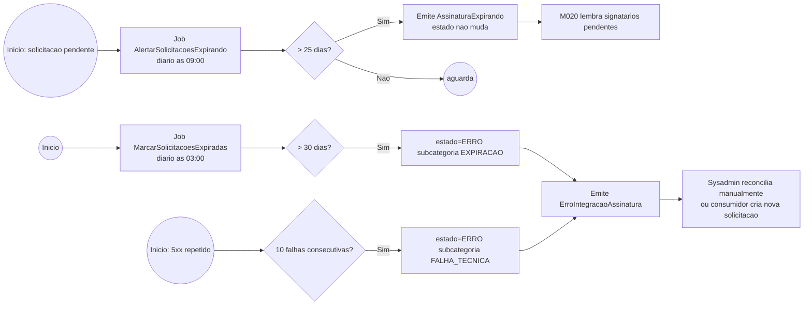
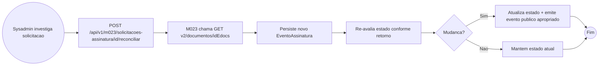
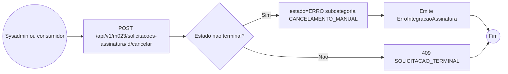

# Modelo de Processo

[README.md](README.md) | [Modelo Estrutural](modelo-estrutural.md) | [Modelo Comportamental](modelo-comportamental.md) | [Contrato](contrato.md)

---

## Atores

| Ator | Responsabilidade |
|------|------------------|
| **Modulo Consumidor** | M009/M022/M003/M010 — gera PDF e dispara coleta de assinatura |
| **M023 (Adapter)** | Orquestra autenticacao, upload, registro, polling e arquivamento |
| **Provedor (E-Docs V2)** | Recebe documento, gera link de assinatura, registra assinaturas, devolve PDF assinado |
| **Acesso Cidadao** | IdP do Estado ES — token de aplicacao + login dos signatarios |
| **Signatario** | Pesquisador, Coordenador, Bolsista, Diretor, Servidor — assina via portal E-Docs |
| **M020 (Comunicacao)** | Envia notificacoes (email/SMS) aos signatarios |
| **M008 (Documento)** | Arquiva PDF assinado com `protocoloAssinatura` + `hashAssinatura` |
| **Job ReconciliarAssinaturas** | Job interno do M023 (a cada 5 min) — pollar status |
| **Job AlertarExpiracoes** | Job interno do M023 (diario) — alerta proximo a 25 dias |
| **Sysadmin** | Reconcilia manualmente solicitacoes em ERRO |

---

## Processo principal — End-to-End

Macro-fluxo do envio ate arquivamento.

```mermaid
flowchart LR
    subgraph Consumidor[Modulo Consumidor]
        A1[Gera PDF do termo] --> A2[Documento CRIADO em M008]
        A2 --> A3[Chama EnviarDocumentoParaAssinatura]
    end

    subgraph M023[M023 Adapter]
        B1[Autentica via Acesso Cidadao] --> B2[Gera URL upload]
        B2 --> B3[Upload PDF MinIO]
        B3 --> B4[Registra documento + assinantes]
        B4 --> B5[Polling captura inicial]
        B5 --> B6[Persiste SolicitacaoAssinatura]
        B6 --> B7[Devolve idSolicitacao + urlPortal]
    end

    subgraph Notif[M020 Comunicacao]
        C1[Envia email/SMS aos signatarios] --> C2[Link portal E-Docs]
    end

    subgraph Sign[Signatario externo]
        D1[Acessa portal E-Docs] --> D2[Login Acesso Cidadao]
        D2 --> D3[Assina ou recusa]
    end

    subgraph Sync[Job ReconciliarAssinaturas]
        E1[GET /v2/documentos/idEdocs] --> E2{Estado mudou?}
        E2 -- Sim, parcial --> E3[Atualiza contadores + emite DocumentoAssinadoParcialmente]
        E2 -- Sim, completo --> E4[Baixa PDF + hash + arquiva M008 + emite DocumentoAssinadoCompletamente]
        E2 -- Recusa --> E5[Marca RECUSADA + emite AssinaturaRecusada]
        E2 -- Expirou --> E6[Marca ERRO + emite ErroIntegracaoAssinatura]
        E2 -- Nada --> E7[Aguarda proxima rodada 5 min]
    end

    A3 --> B1
    B7 --> C1
    C2 --> D1
    D3 -.-> E1
    E1 -.-> E2

    E4 --> F1[Documento M008 = ASSINADO]
    F1 --> F2[Modulo consumidor avanca fluxo]
```

---

## Diagrama BPMN-style com raias (swim lanes)

Visao detalhada com responsabilidades de cada ator.

---

## Subprocesso A — Envio inicial

## Subprocesso B — Coleta de assinaturas e detec'cao de conclusao

## Subprocesso C — Expiracao e tratamento de erro

## Subprocesso D — Reconciliacao manual pelo Sysadmin

## Subprocesso E — Cancelamento manual

---

## Cenarios de excecao consolidados

| Cenario | Detec'cao | Acao do M023 | Evento publico |
|---------|-----------|--------------|----------------|
| PDF invalido (sem texto pesquisavel) | Validacao no envio | Rejeita com 422 antes de chamar provedor | — |
| PDF > 250 MB | Validacao no envio | Rejeita com 422 | — |
| Provedor 503 no upload | Falha imediata | Retorna 503 ao consumidor; nao cria solicitacao | — |
| Provedor 5xx durante polling (1-9x) | Job de polling | Persiste EventoAssinatura ERRO; mantem estado; tenta novamente | — |
| Provedor 5xx durante polling (10x consecutivos) | Job de polling | Transita para ERRO | `ErroIntegracaoAssinatura` |
| Signatario recusa | Polling detecta flag/motivo | Marca Signatario.RECUSOU + Solicitacao.RECUSADA | `AssinaturaRecusada` |
| > 25 dias sem conclusao | Job diario | Emite alerta; estado nao muda | `AssinaturaExpirando` |
| > 30 dias sem conclusao | Job diario | Transita para ERRO subcategoria EXPIRACAO | `ErroIntegracaoAssinatura` |
| Cancelamento manual | Comando Sysadmin/consumidor | Transita para ERRO subcategoria CANCELAMENTO_MANUAL | `ErroIntegracaoAssinatura` |
| Solicitacao duplicada para mesmo Documento | Validacao no envio (RI2) | Retorna 409 com idSolicitacao existente (idempotencia) | — |

---

## Tempos esperados (SLA referencial)

| Fase | Duracao tipica | Limite |
|------|-----------------|--------|
| Envio + captura inicial | 5-30 segundos | 1 hora (apos isso, ERRO) |
| Coleta de 1 assinatura | minutos a dias (depende do signatario) | 30 dias total |
| Polling de status | a cada 5 minutos | latencia maxima de 6 min entre assinatura e atualizacao |
| Captura final + download | 1-5 segundos apos ultima assinatura | — |
| Arquivamento em M008 | < 1 segundo | — |

---

## Referencias

- **Modelos relacionados**:
  - [modelo-estrutural.md](modelo-estrutural.md) — entidades e atributos
  - [modelo-comportamental.md](modelo-comportamental.md) — state machines + dicionario detalhado de estados e eventos
- **Contratos**:
  - [contrato.md](contrato.md) — operacoes publicas, eventos, jobs
  - [contrato-api.md](contrato-api.md) — endpoints HTTP REST internos
- **Discovery**:
  - [integracoes/e-docs.md](../../../discovery/integracoes/e-docs.md) — sequence diagrams + 11 etapas detalhadas
  - [integracoes/organograma.md](../../../discovery/integracoes/organograma.md) — papeis dos servidores capturadores
  - [glossario.md](../../../discovery/glossario.md)
- **Documentacao oficial provedor (E-Docs V2)**: [docs.e-docs.es.gov.br/api](https://docs.e-docs.es.gov.br/api/)
- **Lei 14.063/20** — base juridica das assinaturas eletronicas em atos administrativos do Estado
- **EPICs**:
  - [EPIC-M023-001 — Envio + captura inicial](epics/EPIC-M023-001.md)
  - [EPIC-M023-002 — Sync + arquivamento](epics/EPIC-M023-002.md)
  - [EPIC-M023-003 — Recusa + expiracao + reconciliacao](epics/EPIC-M023-003.md)
