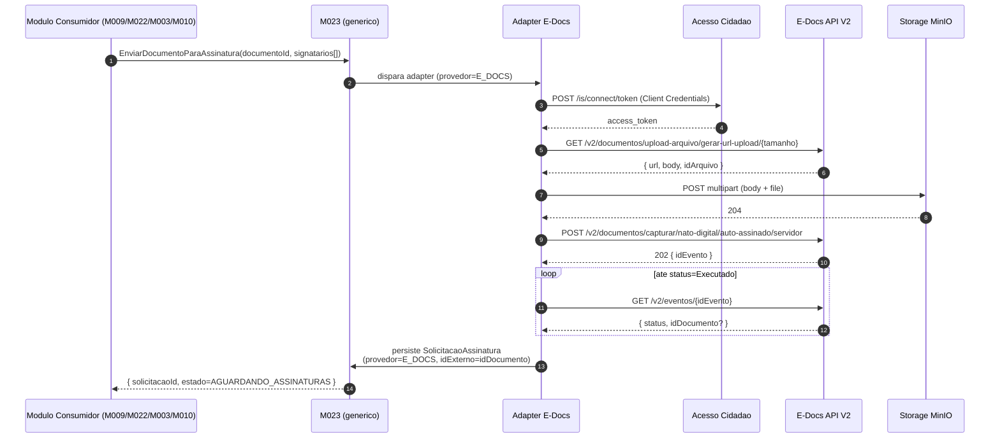
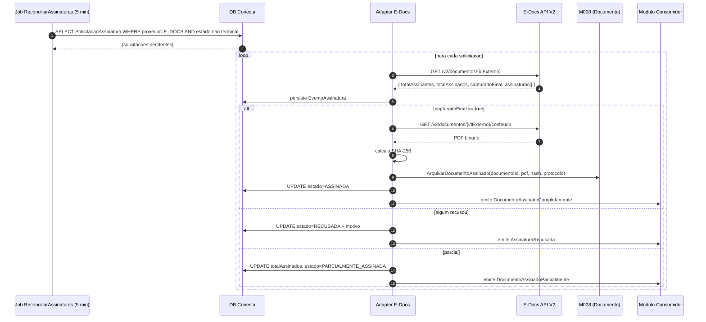
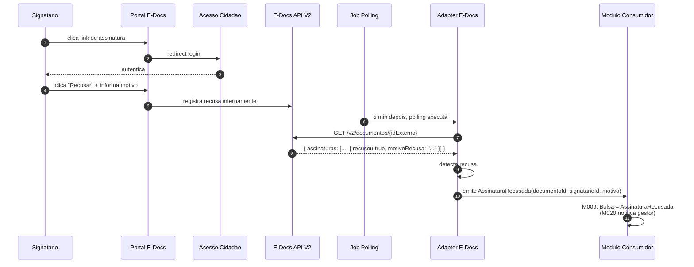
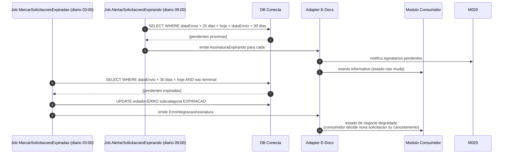
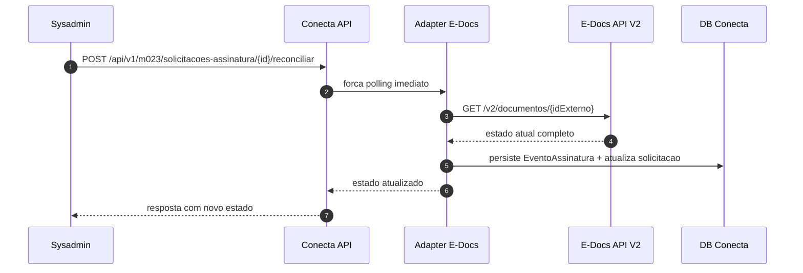

# Adapter E-Docs — Fluxos

[← Voltar ao adapter](README.md) | [Mapeamento V2](adapter.md) | [Modelo de Processo M023](../modelo-processo.md)

---

## Fluxo 1 — Envio + captura inicial

## Fluxo 2 — Polling + detec'cao de conclusao

## Fluxo 3 — Recusa de signatario

## Fluxo 4 — Expiracao (>30 dias)

## Fluxo 5 — Reconciliacao manual

## Referencias

- [Modelo de Processo M023 — fluxo agnostico de provedor](../modelo-processo.md)
- [Discovery — sequence diagrams V2 detalhados](../../../../discovery/integracoes/e-docs.md)
- [Adapter — mapeamento de comandos](adapter.md)
