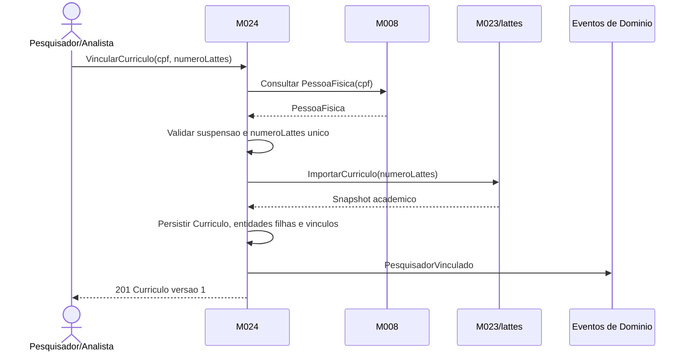
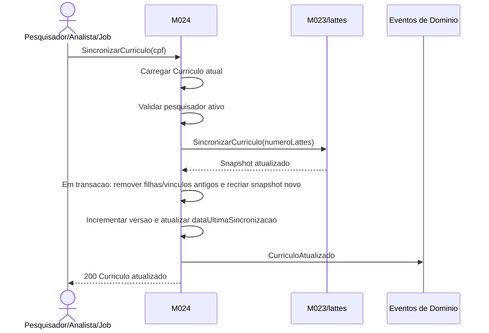
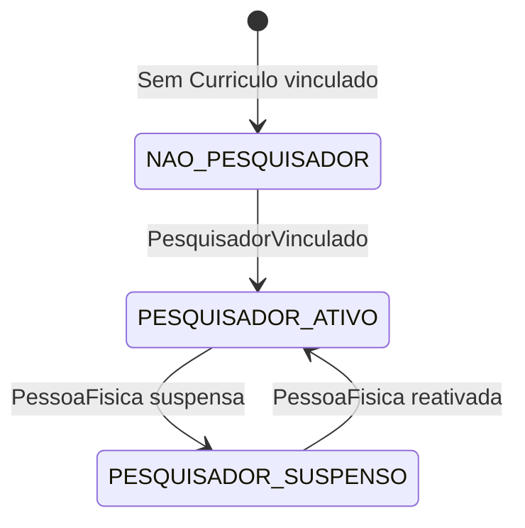

# Modelo Comportamental

Dominio e regras: ver [README.md](README.md) | Estrutura: [modelo-estrutural.md](modelo-estrutural.md)

---

## Ciclo de Vida: Curriculo

```mermaid
stateDiagram-v2
    [*] --> NAO_VINCULADO : PessoaFisica sem numeroLattes

    NAO_VINCULADO --> SINCRONIZANDO : VincularCurriculo
    SINCRONIZANDO --> VINCULADO_VALIDO : Adapter M023/lattes retorna snapshot com sucesso
    SINCRONIZANDO --> NAO_VINCULADO : Adapter falha; vinculacao nao persiste

    VINCULADO_VALIDO --> SINCRONIZANDO : SincronizarCurriculo sob demanda ou job semanal
    VINCULADO_VALIDO --> DESATUALIZADO : dataUltimaSincronizacao > 12 meses
    VINCULADO_VALIDO --> SUSPENSO : PessoaFisica.estado = SUSPENSA

    DESATUALIZADO --> SINCRONIZANDO : SincronizarCurriculo
    DESATUALIZADO --> SUSPENSO : PessoaFisica.estado = SUSPENSA

    SINCRONIZANDO --> VINCULADO_VALIDO : Snapshot persistido e versao incrementada
    SINCRONIZANDO --> VINCULADO_VALIDO : Falha mantendo snapshot anterior valido
    SINCRONIZANDO --> DESATUALIZADO : Falha mantendo snapshot anterior desatualizado

    SUSPENSO --> VINCULADO_VALIDO : PessoaFisica reativada e curriculo valido
    SUSPENSO --> DESATUALIZADO : PessoaFisica reativada e curriculo desatualizado

    note right of SINCRONIZANDO
        Estado transiente de chamada:
        - adapter parseia Lattes
        - entidades filhas e vinculos sao recriados
        - commit ocorre apenas no sucesso
    end note
```

### Transicoes do Curriculo

| De | Para | Gatilho |
|----|------|---------|
| `NAO_VINCULADO` | `SINCRONIZANDO` | Comando `VincularCurriculo(cpf, numeroLattes)` |
| `SINCRONIZANDO` | `VINCULADO_VALIDO` | Adapter M023/lattes retorna snapshot e M024 persiste `Curriculo` versao 1 ou superior |
| `SINCRONIZANDO` | `NAO_VINCULADO` | Primeira importacao falha; nenhuma vinculacao e persistida |
| `VINCULADO_VALIDO` | `SINCRONIZANDO` | Comando `SincronizarCurriculo` ou job semanal |
| `VINCULADO_VALIDO` | `DESATUALIZADO` | `dataUltimaSincronizacao` ultrapassa 12 meses |
| `DESATUALIZADO` | `SINCRONIZANDO` | Comando ou job de sincronizacao |
| `VINCULADO_VALIDO`/`DESATUALIZADO` | `SUSPENSO` | M024 recebe evento/estado de suspensao da `PessoaFisica` em M008 |
| `SUSPENSO` | `VINCULADO_VALIDO` | PessoaFisica reativada e sincronizacao nos ultimos 12 meses |
| `SUSPENSO` | `DESATUALIZADO` | PessoaFisica reativada com curriculo fora da validade |

---

## Fluxo: VincularCurriculo

### Excecoes

| Ponto | Condicao | Resultado |
|-------|----------|-----------|
| PessoaFisica | CPF inexistente | `404 PESSOA_NAO_ENCONTRADA` |
| Validacao | `numeroLattes` ja vinculado a outra PessoaFisica | `409 NUMERO_LATTES_JA_VINCULADO` |
| Validacao | PessoaFisica suspensa | `422 PESQUISADOR_SUSPENSO` |
| Adapter | Falha tecnica, permissao, parse ou fonte indisponivel | `502 ADAPTER_LATTES_FALHOU`; nenhum dado novo persiste |

---

## Fluxo: SincronizarCurriculo

### Garantias

| Garantia | Descricao |
|----------|-----------|
| Atomicidade | Entidades filhas antigas so sao substituidas quando o novo snapshot foi parseado e validado |
| Snapshot anterior intacto | Falha do adapter retorna 502 e preserva a versao anterior |
| Versionamento | `versao` incrementa apenas em sincronizacao bem-sucedida |
| Sem polling | A chamada e sincrona; nao existe estado persistido de importacao pendente |

---

## Ciclo de Vida: PessoaFisica como Pesquisador

| Estado | Significado | Impacto |
|--------|-------------|---------|
| `NAO_PESQUISADOR` | PessoaFisica sem Curriculo vinculado | Nao aparece em busca por expertise |
| `PESQUISADOR_ATIVO` | PessoaFisica com Curriculo vinculado e nao suspensa | Pode aparecer em consultas e selecao Ad Hoc se curriculo valido |
| `PESQUISADOR_SUSPENSO` | PessoaFisica suspensa em M008 | Curriculo segue consultavel para auditoria, mas excluido de selecao e vitrine |

---

## Eventos publicos disparados

| Evento | Disparado por | Quando |
|--------|---------------|--------|
| `PesquisadorVinculado` | M024 | Primeira vinculacao e importacao bem-sucedida |
| `CurriculoAtualizado` | M024 | Sincronizacao sob demanda ou semanal concluida |
| `AreaConhecimentoNaoMapeada` | M024 | Area do Lattes nao corresponde ao cadastro CNPq de M008 |
| `PesquisadorSuspenso` | M024 | PessoaFisica com curriculo entra em estado suspenso |
| `PesquisadorReativado` | M024 | PessoaFisica com curriculo e reativada |

---

## Dicionario de Estados

### Estados de Curriculo

| Estado | Significado | Quando entra | Terminal? |
|--------|-------------|--------------|-----------|
| `NAO_VINCULADO` | PessoaFisica nao possui `numeroLattes`/`Curriculo` em M024 | Estado inicial ou falha na primeira importacao | Nao |
| `SINCRONIZANDO` | Chamada transiente ao adapter M023/lattes em andamento | `VincularCurriculo`, `SincronizarCurriculo` ou job semanal | Nao |
| `VINCULADO_VALIDO` | Curriculo existe, pesquisador esta ativo e sincronizacao ocorreu nos ultimos 12 meses | Importacao/sincronizacao bem-sucedida | Nao |
| `DESATUALIZADO` | Curriculo existe, mas `dataUltimaSincronizacao` ultrapassou 12 meses | Passagem do tempo ou falha sucessiva em sincronizacao | Nao |
| `SUSPENSO` | PessoaFisica vinculada ao curriculo esta suspensa | Evento/estado de M008 | Nao |

### Estados derivados para busca de expertise

| Condicao | Resultado |
|----------|-----------|
| Curriculo `VINCULADO_VALIDO` + PessoaFisica ativa | Elegivel para busca quando filtros batem |
| Curriculo `DESATUALIZADO` + `apenasValidos=true` | Excluido do resultado |
| Curriculo `DESATUALIZADO` + `apenasValidos=false` | Retornado com `curriculoValido=false` |
| Curriculo `SUSPENSO` | Sempre excluido de busca e vitrine publica |
