# Modelo Estrutural — M024 Curriculo do Pesquisador

Dominio e regras de negocio: ver [README.md](README.md). Modelo conceitual consolidado em discovery: [01-corporativo-pesquisador.md](../../../discovery/domains/01-corporativo-pesquisador.md). Adapter externo: [M023/lattes](../M023-integracoes/lattes/README.md).

> Este documento consolida diagrama, dicionario de dados, responsabilidades, relacionamentos, enumeracoes e regras de cada entidade do curriculo. Nao ha README.md separado por entidade -- tudo esta aqui.

## Referencias a outros modulos

M024 nao redefine entidades canonicas de outros modulos. As entidades abaixo sao **referenciadas** (aparecem no diagrama apenas como nomes, sem atributos):

| Entidade canonica | Modulo | Onde aparece em M024 | Forma de referencia |
|-------------------|--------|----------------------|---------------------|
| [PessoaFisica](../M008-cadastros-corporativos/pessoas/pessoa-fisica/README.md) | M008 | Raiz da vinculacao do curriculo; tambem em `Orientacao.orientando` | Relacao 1:1 com `Curriculo` via `numeroLattes`; relacao N:1 com `Orientacao` |
| [Instituicao](../M008-cadastros-corporativos/instituicoes/README.md) | M008 | `FormacaoAcademica.instituicao`, `Orientacao.instituicao`, `Projeto.financiador`, `Premio.entidade`, `Livro.editora` | Adapter [M023/lattes](../M023-integracoes/lattes/README.md) executa match-or-create em M008 a partir do nome canonico do Lattes |
| [AreaConhecimento](../M008-cadastros-corporativos/classificacoes/area-conhecimento/README.md) | M008 §1.3.6 | `FormacaoAcademica.areaConhecimento`, `Curriculo.areasDeAtuacao` | Cadastro canonico CNPq; areas do Lattes nao mapeadas vao para log de discrepancia |
| [Cidade](../M008-cadastros-corporativos/geografia/cidade/README.md) | M008 §1.3.4 | `ParticipacaoEvento.local` | Match-or-create no adapter quando o local do evento for inferivel do nome ou metadados do Lattes |
| [NivelAcademico](../M008-cadastros-corporativos/pessoas/nivel-academico/README.md) | M008 | Derivado de `FormacaoAcademica.nivel` mais alto concluido | Conecta atualiza `PessoaFisica.nivelAcademico` (M008) apos `CurriculoImportado` |
| [Documento](../M008-cadastros-corporativos/README.md) | M008 | XML bruto do Lattes (quando fonte for upload manual) | Arquivado em M008.Documento para auditoria |
| [Pesquisador (persona)](../../../discovery/personas.md) | Discovery | Flag derivado em `PessoaFisica` quando existe `Curriculo` | Nao e entidade -- ver §Pesquisador no [README.md](README.md#dominio) |

Eventos cruzando o limite do modulo estao em [eventos-dominio.md](eventos-dominio.md). Adapter externo que popula as entidades esta em [M023/lattes](../M023-integracoes/lattes/README.md).

## Diagrama de Classes

> Atributos do bloco de classe sao apenas tipos primitivos e enums. Referencias a outras entidades (M024 ou M008) sao representadas como **relacoes**, com cardinalidade e papel rotulado, seguindo o estilo de M008 (ver `Instituicao "*" -- "1" TipoInstituicao` em M008/modelo-estrutural.md). Entidades de outros modulos aparecem como nome apenas, sem atributos.

```mermaid
classDiagram
    direction TB

    class Curriculo {
        +String numeroLattes
        +Integer versao
        +String resumo
        +Date dataAtualizacaoLattes
        +Date dataUltimaSincronizacao
    }

    class FormacaoAcademica {
        +NivelFormacao nivel
        +String curso
        +Integer anoInicio
        +Integer anoConclusao
        +StatusFormacao status
    }

    class Artigo {
        +String titulo
        +String doi
        +Integer ano
    }

    class Periodico {
        +String nome
        +String issn
        +String qualis
    }

    class Livro {
        +String titulo
        +TipoProducaoLivro tipo
        +String isbn
        +Integer ano
        +String papel
    }

    class Orientacao {
        +Integer anoInicio
        +Integer anoConclusao
        +StatusOrientacao status
    }

    class NivelOrientacao {
        +String codigo
        +String nome
        +String descricao
    }

    class Projeto {
        +String titulo
        +PapelProjeto papel
        +Date dataInicio
        +Date dataFim
        +StatusProjeto status
    }

    class TipoProjeto {
        +String codigo
        +String nome
        +String descricao
    }

    class Premio {
        +String nome
        +Integer ano
    }

    class ParticipacaoEvento {
        +String nome
        +PapelEvento papel
        +Integer ano
    }

    class Idioma {
        +String idioma
        +NivelProficienciaIdioma compreensao
        +NivelProficienciaIdioma fala
        +NivelProficienciaIdioma leitura
        +NivelProficienciaIdioma escrita
    }

    class PessoaFisica {
        << M008 >>
    }

    class Instituicao {
        << M008 >>
    }

    class AreaConhecimento {
        << M008 §1.3.6 >>
    }

    class Cidade {
        << M008 §1.3.4 >>
    }

    class NivelFormacao {
        <<enumeration>>
        Graduacao
        Especializacao
        Mestrado
        Doutorado
        PosDoutorado
    }

    class StatusFormacao {
        <<enumeration>>
        Concluida
        EmAndamento
    }

    class TipoProducaoLivro {
        <<enumeration>>
        Livro
        Capitulo
    }

    class StatusOrientacao {
        <<enumeration>>
        Concluida
        EmAndamento
    }

    class PapelProjeto {
        <<enumeration>>
        Coordenador
        Membro
    }

    class StatusProjeto {
        <<enumeration>>
        EmAndamento
        Concluido
        Suspenso
    }

    class PapelEvento {
        <<enumeration>>
        Apresentador
        Ouvinte
        Organizador
        Convidado
    }

    class NivelProficienciaIdioma {
        <<enumeration>>
        Pouco
        Razoavel
        Bom
        Fluente
    }

    %% Vinculacao raiz com M008
    PessoaFisica "1" -- "0..1" Curriculo : titular

    %% Composicao do curriculo
    Curriculo "1" *-- "0..*" FormacaoAcademica
    Curriculo "1" *-- "0..*" Artigo
    Curriculo "1" *-- "0..*" Livro
    Curriculo "1" *-- "0..*" Orientacao
    Curriculo "1" *-- "0..*" Projeto
    Curriculo "1" *-- "0..*" Premio
    Curriculo "1" *-- "0..*" ParticipacaoEvento
    Curriculo "1" *-- "0..*" Idioma
    Curriculo "0..*" -- "0..*" AreaConhecimento : areasDeAtuacao

    %% Referencias a cadastros (M024 ou M008)
    FormacaoAcademica "0..*" -- "1" Instituicao : instituicao
    FormacaoAcademica "0..*" -- "0..1" AreaConhecimento : areaConhecimento
    Artigo "0..*" -- "1" Periodico : periodico
    Artigo "0..*" -- "0..*" PessoaFisica : coautores
    Orientacao "0..*" -- "1" PessoaFisica : orientando
    Orientacao "0..*" -- "1" Instituicao : instituicao
    Orientacao "0..*" -- "1" NivelOrientacao : nivel
    Projeto "0..*" -- "1" TipoProjeto : tipo
    Projeto "0..*" -- "0..1" Instituicao : financiador
    Premio "0..*" -- "1" Instituicao : entidade
    Livro "0..*" -- "0..1" Instituicao : editora
    ParticipacaoEvento "0..*" -- "0..1" Cidade : local
```

---

## Entidades

### Curriculo

Raiz do curriculo importado da Plataforma Lattes. Identifica o snapshot academico vinculado a uma `PessoaFisica` pelo `numeroLattes` do CNPq. Quando existe, transforma a pessoa em `Pesquisador`. Versionado a cada reimportacao. Sincronizacao e sincrona: chamada ao adapter retorna o snapshot persistido ou erro; nao ha estado intermediario. `dataUltimaSincronizacao` registra a ultima execucao bem-sucedida feita pelo Conecta; `dataAtualizacaoLattes` reflete a data de atualizacao na fonte (CNPq), permitindo distinguir curriculo estagnado no Lattes de curriculo simplesmente nao re-sincronizado pelo Conecta.

| Atributo | Definicao | Obrig. | Tipo | Dominio | Tamanho |
|----------|-----------|--------|------|---------|---------|
| numeroLattes | Identificador CNPq do curriculo, unico no sistema | Sim | String | 16 digitos | 16 |
| versao | Numero da versao do snapshot, incrementado a cada reimport com sucesso | Sim | Integer | | |
| resumo | Resumo livre do curriculo, importado do Lattes | Nao | String | | 4000 |
| dataAtualizacaoLattes | Data informada pelo proprio Lattes (CNPq) de quando o pesquisador atualizou seu curriculo na fonte. Permite detectar curriculos estagnados no CNPq independente da frequencia de sync do Conecta | Sim | Date | | |
| dataUltimaSincronizacao | Data e hora da ultima sincronizacao bem-sucedida feita pelo Conecta | Sim | Date | | |

| Relacao | Cardinalidade | Descricao |
|---------|----------------|-----------|
| titular | 1 | [M008 PessoaFisica](../M008-cadastros-corporativos/pessoas/pessoa-fisica/README.md) titular do curriculo |
| formacoes | 0..* | `FormacaoAcademica` (composicao) |
| artigos | 0..* | `Artigo` (composicao) |
| livros | 0..* | `Livro` (composicao) |
| orientacoes | 0..* | `Orientacao` (composicao) |
| projetos | 0..* | `Projeto` (composicao) |
| premios | 0..* | `Premio` (composicao) |
| eventos | 0..* | `ParticipacaoEvento` (composicao) |
| idiomas | 0..* | `Idioma` (composicao) |
| areasDeAtuacao | 0..* | [M008 AreaConhecimento](../M008-cadastros-corporativos/classificacoes/area-conhecimento/README.md) (referencia N:N) |

Regras:
- RN-M024-01: toda Pessoa identificada como `Pesquisador` deve possuir exatamente um `Curriculo` vinculado.
- RN-M024-02: `numeroLattes` e unico no sistema -- nao pode haver duas `PessoaFisica` com o mesmo numero Lattes.
- RN-M024-04: curriculo valido para uso em fluxos exige `dataUltimaSincronizacao` nos ultimos 12 meses.
- Sincronizacao e sincrona: a chamada ao adapter (M023/lattes) bloqueia ate retornar com sucesso (snapshot persistido, `versao` incrementada, `dataUltimaSincronizacao` atualizada) ou com erro (chamada falha, snapshot anterior intacto). Nao ha agregado de auditoria persistido para tentativas falhas -- erros sao registrados em log estruturado.

---

### FormacaoAcademica

Titulacao academica do pesquisador (Graduacao, Especializacao, Mestrado, Doutorado, PosDoutorado). Entidade-filha de `Curriculo`, populada pelo adapter [M023/lattes](../M023-integracoes/lattes/README.md).

| Atributo | Definicao | Obrig. | Tipo | Dominio | Tamanho |
|----------|-----------|--------|------|---------|---------|
| nivel | Nivel da formacao | Sim | NivelFormacao | Graduacao, Especializacao, Mestrado, Doutorado, PosDoutorado | |
| curso | Nome do curso ou programa de pos-graduacao | Sim | String | | 300 |
| anoInicio | Ano de inicio da formacao | Sim | Integer | | 4 |
| anoConclusao | Ano de conclusao; vazio quando `status = EmAndamento` | Nao | Integer | | 4 |
| status | Estado atual da formacao | Sim | StatusFormacao | Concluida, EmAndamento | |

| Relacao | Cardinalidade | Descricao |
|---------|----------------|-----------|
| curriculo | 1 | `Curriculo` ao qual a formacao pertence (composicao) |
| instituicao | 1 | [M008 Instituicao](../M008-cadastros-corporativos/instituicoes/README.md) onde a formacao foi realizada -- match-or-create no adapter |
| areaConhecimento | 0..1 | [M008 AreaConhecimento](../M008-cadastros-corporativos/classificacoes/area-conhecimento/README.md) (CNPq) |

Enumeracoes: `NivelFormacao` (Graduacao, Especializacao, Mestrado, Doutorado, PosDoutorado); `StatusFormacao` (Concluida, EmAndamento).

Regras:
- RN-M024-03: reimportacao do curriculo apaga todas as `FormacaoAcademica` anteriores e recria a partir do snapshot atual.
- RN-M024-06: `areaConhecimento` deve existir no cadastro canonico CNPq de M008; areas nao mapeadas vao para log de discrepancia e o campo fica vazio para o item.
- `anoConclusao` e obrigatorio quando `status = Concluida`; deve ser vazio quando `status = EmAndamento`.
- Cardinalidade 0..* em relacao a `Curriculo`: um `Curriculo` agrega **multiplas** `FormacaoAcademica`. Como `PessoaFisica` tem 1:1 com `Curriculo`, uma mesma pessoa pode acumular qualquer numero de formacoes (graduacao + especializacao + mestrado + doutorado + pos-doc + outras), uma instancia por titulacao.
- Nao ha unicidade por `nivel`: uma pessoa pode ter duas graduacoes, duas especializacoes etc. Unicidade so e garantida pela combinacao `(curriculo, instituicao, curso, anoInicio)`.

---

### Artigo

Producao bibliografica publicada em periodico ou anais de conferencia. Entidade-filha de `Curriculo`, populada pelo adapter [M023/lattes](../M023-integracoes/lattes/README.md). Cada artigo referencia um `Periodico` -- o nome, ISSN e Qualis ficam no periodico, nao replicados por artigo.

| Atributo | Definicao | Obrig. | Tipo | Dominio | Tamanho |
|----------|-----------|--------|------|---------|---------|
| titulo | Titulo do artigo | Sim | String | | 500 |
| doi | Digital Object Identifier | Nao | String | | 100 |
| ano | Ano de publicacao | Sim | Integer | | 4 |

| Relacao | Cardinalidade | Descricao |
|---------|----------------|-----------|
| curriculo | 1 | `Curriculo` ao qual o artigo pertence (composicao) |
| periodico | 1 | `Periodico` que publicou o artigo -- match-or-create no adapter pelo ISSN ou nome |
| coautores | 0..* | [M008 PessoaFisica](../M008-cadastros-corporativos/pessoas/pessoa-fisica/README.md) dos coautores do artigo -- match-or-create no adapter a partir dos nomes/CPFs do Lattes (best-effort; quando nao houver match confiavel, registra log de discrepancia) |

Regras:
- RN-M024-03: reimportacao do curriculo apaga todos os `Artigo` anteriores e recria a partir do snapshot atual. O `Periodico` referenciado **nao** e apagado -- pode ser referenciado por outros artigos.
- Cardinalidade 0..* em relacao a `Curriculo`: um curriculo pode nao possuir nenhum artigo registrado.
- `producaoMinima` consultada por [M011](../M011-configuracao-captacao/README.md) na selecao de Ad Hoc opera sobre a contagem desta entidade.

---

### Periodico

Periodico cientifico ou anais de conferencia onde artigos foram publicados. Cadastro compartilhado entre artigos do mesmo curriculo e entre curriculos diferentes -- nao e composicao de `Curriculo`. Adapter [M023/lattes](../M023-integracoes/lattes/README.md) executa match-or-create pelo ISSN (preferencial) ou nome normalizado.

| Atributo | Definicao | Obrig. | Tipo | Dominio | Tamanho |
|----------|-----------|--------|------|---------|---------|
| nome | Nome do periodico ou anais | Sim | String | | 300 |
| issn | Identificador internacional do periodico | Nao | String | | 20 |
| qualis | Estrato Qualis CAPES (A1, A2, B1, ...) quando conhecido | Nao | String | | 5 |

| Relacao | Cardinalidade | Descricao |
|---------|----------------|-----------|
| artigos | 0..* | `Artigo` publicados neste periodico |

Regras:
- `issn` e a chave de deduplicacao preferencial; quando ausente, adapter usa nome normalizado.
- `qualis` nao e dado canonico do Lattes -- e obtido via cross-reference externa (CAPES); quando indisponivel, o campo fica vazio.
- Reimportacao de curriculo nao apaga `Periodico`: o cadastro persiste e pode passar a nao ter mais artigos referenciando (orfao tolerado para historico).
- Periodico pode ser promovido a cadastro canonico em M008 no futuro -- por ora vive em M024.

---

### Livro

Producao bibliografica em livro completo ou capitulo de livro. Entidade-filha de `Curriculo`, populada pelo adapter [M023/lattes](../M023-integracoes/lattes/README.md).

| Atributo | Definicao | Obrig. | Tipo | Dominio | Tamanho |
|----------|-----------|--------|------|---------|---------|
| titulo | Titulo do livro ou capitulo | Sim | String | | 500 |
| tipo | Discriminador entre livro completo e capitulo | Sim | TipoProducaoLivro | Livro, Capitulo | |
| isbn | ISBN-10 ou ISBN-13 | Nao | String | | 20 |
| ano | Ano de publicacao | Sim | Integer | | 4 |
| papel | Papel do pesquisador na obra (autor, organizador, tradutor) | Nao | String | | 100 |

| Relacao | Cardinalidade | Descricao |
|---------|----------------|-----------|
| curriculo | 1 | `Curriculo` ao qual o livro pertence (composicao) |
| editora | 0..1 | [M008 Instituicao](../M008-cadastros-corporativos/instituicoes/README.md) editora do livro -- match-or-create no adapter |

Enumeracoes: `TipoProducaoLivro` (Livro, Capitulo).

Regras:
- RN-M024-03: reimportacao do curriculo apaga todos os `Livro` anteriores e recria a partir do snapshot atual.
- `tipo` discrimina entre livro completo e capitulo de livro -- nao ha entidade separada para capitulo.
- Cardinalidade 0..* em relacao a `Curriculo`: um curriculo pode nao possuir nenhum livro registrado.

---

### Orientacao

Orientacao academica do pesquisador, concluida ou em andamento. Entidade-filha de `Curriculo`, populada pelo adapter [M023/lattes](../M023-integracoes/lattes/README.md). O nivel da orientacao (IC, Mestrado, Doutorado, PosDoutorado) e cadastro local em `NivelOrientacao`.

| Atributo | Definicao | Obrig. | Tipo | Dominio | Tamanho |
|----------|-----------|--------|------|---------|---------|
| anoInicio | Ano de inicio da orientacao | Sim | Integer | | 4 |
| anoConclusao | Ano de conclusao; vazio quando `status = EmAndamento` | Nao | Integer | | 4 |
| status | Estado atual da orientacao | Sim | StatusOrientacao | Concluida, EmAndamento | |

| Relacao | Cardinalidade | Descricao |
|---------|----------------|-----------|
| curriculo | 1 | `Curriculo` ao qual a orientacao pertence (composicao) |
| nivel | 1 | `NivelOrientacao` -- cadastro local de niveis (IC, Mestrado, Doutorado, PosDoutorado) |
| orientando | 1 | [M008 PessoaFisica](../M008-cadastros-corporativos/pessoas/pessoa-fisica/README.md) do orientando -- match-or-create no adapter |
| instituicao | 1 | [M008 Instituicao](../M008-cadastros-corporativos/instituicoes/README.md) onde a orientacao ocorre -- match-or-create no adapter |

Enumeracoes: `StatusOrientacao` (Concluida, EmAndamento).

Regras:
- RN-M024-03: reimportacao do curriculo apaga todas as `Orientacao` anteriores e recria a partir do snapshot atual. `NivelOrientacao` referenciado nao e apagado.
- `anoConclusao` e obrigatorio quando `status = Concluida`; deve ser vazio quando `status = EmAndamento`.
- Cardinalidade 0..* em relacao a `Curriculo`: um curriculo pode nao possuir nenhuma orientacao registrada.
- Persona Orientador (papel em projeto) e distinta da `Orientacao` aqui registrada (atividade academica historica do curriculo).

---

### NivelOrientacao

Cadastro local dos niveis de orientacao academica (IC, Mestrado, Doutorado, PosDoutorado). Compartilhado entre `Orientacao` de curriculos distintos -- nao e composicao de `Curriculo`. Pode ser promovido a cadastro canonico em M008 (analogo a `NivelAcademico`) no futuro.

| Atributo | Definicao | Obrig. | Tipo | Dominio | Tamanho |
|----------|-----------|--------|------|---------|---------|
| codigo | Codigo canonico do nivel | Sim | String | IC, M, D, PD | 5 |
| nome | Nome do nivel | Sim | String | | 100 |
| descricao | Descricao livre | Nao | String | | 500 |

| Relacao | Cardinalidade | Descricao |
|---------|----------------|-----------|
| orientacoes | 0..* | `Orientacao` que adotam este nivel |

Regras:
- `codigo` e unico no cadastro.
- Valores iniciais (seed): IC (Iniciacao Cientifica), M (Mestrado), D (Doutorado), PD (Pos-Doutorado).

---

### Projeto

Projeto de pesquisa do qual o pesquisador participou como coordenador ou membro. Entidade-filha de `Curriculo`, populada pelo adapter [M023/lattes](../M023-integracoes/lattes/README.md). O tipo do projeto (Pesquisa, Extensao, Desenvolvimento, etc.) e cadastro local em `TipoProjeto`.

| Atributo | Definicao | Obrig. | Tipo | Dominio | Tamanho |
|----------|-----------|--------|------|---------|---------|
| titulo | Titulo do projeto | Sim | String | | 500 |
| papel | Papel do pesquisador no projeto | Sim | PapelProjeto | Coordenador, Membro | |
| dataInicio | Data de inicio do projeto | Sim | Date | | |
| dataFim | Data de fim; vazia quando `status = EmAndamento` | Nao | Date | | |
| status | Estado atual do projeto | Sim | StatusProjeto | EmAndamento, Concluido, Suspenso | |

| Relacao | Cardinalidade | Descricao |
|---------|----------------|-----------|
| curriculo | 1 | `Curriculo` ao qual o projeto pertence (composicao) |
| tipo | 1 | `TipoProjeto` -- cadastro local de tipos de projeto |
| financiador | 0..1 | [M008 Instituicao](../M008-cadastros-corporativos/instituicoes/README.md) financiadora (FAPES, CNPq, CAPES etc.) -- match-or-create no adapter quando houver financiador declarado |

Enumeracoes: `PapelProjeto` (Coordenador, Membro); `StatusProjeto` (EmAndamento, Concluido, Suspenso).

Regras:
- RN-M024-03: reimportacao do curriculo apaga todos os `Projeto` anteriores e recria a partir do snapshot atual. `TipoProjeto` referenciado nao e apagado.
- `dataFim` e obrigatoria quando `status = Concluido`; deve ser vazia quando `status = EmAndamento`.
- Cardinalidade 0..* em relacao a `Curriculo`: um curriculo pode nao possuir nenhum projeto registrado.
- Este `Projeto` e historico academico do pesquisador, distinto do `Projeto Contratado` em M003 (projeto operacional financiado pela FAPES).

---

### TipoProjeto

Cadastro local de tipos de projeto academico (Pesquisa, Extensao, Desenvolvimento, Ensino etc.). Compartilhado entre `Projeto` de curriculos distintos -- nao e composicao de `Curriculo`.

| Atributo | Definicao | Obrig. | Tipo | Dominio | Tamanho |
|----------|-----------|--------|------|---------|---------|
| codigo | Codigo canonico do tipo | Sim | String | | 20 |
| nome | Nome do tipo | Sim | String | | 100 |
| descricao | Descricao livre | Nao | String | | 500 |

| Relacao | Cardinalidade | Descricao |
|---------|----------------|-----------|
| projetos | 0..* | `Projeto` que adotam este tipo |

Regras:
- `codigo` e unico no cadastro.
- Valores iniciais (seed): PESQUISA, EXTENSAO, DESENVOLVIMENTO, ENSINO, OUTRO.

---

### Premio

Premio, titulo honorifico ou homenagem recebido pelo pesquisador. Entidade-filha de `Curriculo`, populada pelo adapter [M023/lattes](../M023-integracoes/lattes/README.md).

| Atributo | Definicao | Obrig. | Tipo | Dominio | Tamanho |
|----------|-----------|--------|------|---------|---------|
| nome | Nome do premio ou titulo honorifico | Sim | String | | 300 |
| ano | Ano em que o premio foi recebido | Sim | Integer | | 4 |

| Relacao | Cardinalidade | Descricao |
|---------|----------------|-----------|
| curriculo | 1 | `Curriculo` ao qual o premio pertence (composicao) |
| entidade | 1 | [M008 Instituicao](../M008-cadastros-corporativos/instituicoes/README.md) que conferiu o premio -- match-or-create no adapter |

Regras:
- RN-M024-03: reimportacao do curriculo apaga todos os `Premio` anteriores e recria a partir do snapshot atual.
- Cardinalidade 0..* em relacao a `Curriculo`: um curriculo pode nao possuir nenhum premio registrado.

---

### ParticipacaoEvento

Participacao do pesquisador em evento cientifico (congresso, simposio, workshop, encontro). Entidade-filha de `Curriculo`, populada pelo adapter [M023/lattes](../M023-integracoes/lattes/README.md).

| Atributo | Definicao | Obrig. | Tipo | Dominio | Tamanho |
|----------|-----------|--------|------|---------|---------|
| nome | Nome do evento cientifico | Sim | String | | 500 |
| papel | Papel do pesquisador no evento | Sim | PapelEvento | Apresentador, Ouvinte, Organizador, Convidado | |
| ano | Ano do evento | Sim | Integer | | 4 |

| Relacao | Cardinalidade | Descricao |
|---------|----------------|-----------|
| curriculo | 1 | `Curriculo` ao qual a participacao pertence (composicao) |
| local | 0..1 | [M008 Cidade](../M008-cadastros-corporativos/geografia/cidade/README.md) onde o evento ocorreu -- match-or-create no adapter quando informacao estiver disponivel |

Enumeracoes: `PapelEvento` (Apresentador, Ouvinte, Organizador, Convidado).

Regras:
- RN-M024-03: reimportacao do curriculo apaga todas as `ParticipacaoEvento` anteriores e recria a partir do snapshot atual.
- Cardinalidade 0..* em relacao a `Curriculo`: um curriculo pode nao possuir nenhuma participacao em evento registrada.

---

### Idioma

Idioma declarado pelo pesquisador no curriculo Lattes, com nivel de proficiencia separado por habilidade (compreensao, fala, leitura, escrita). Entidade-filha de `Curriculo`, populada pelo adapter [M023/lattes](../M023-integracoes/lattes/README.md).

| Atributo | Definicao | Obrig. | Tipo | Dominio | Tamanho |
|----------|-----------|--------|------|---------|---------|
| idioma | Nome do idioma | Sim | String | | 100 |
| compreensao | Nivel de proficiencia em compreensao oral | Sim | NivelProficienciaIdioma | Pouco, Razoavel, Bom, Fluente | |
| fala | Nivel de proficiencia na fala | Sim | NivelProficienciaIdioma | Pouco, Razoavel, Bom, Fluente | |
| leitura | Nivel de proficiencia na leitura | Sim | NivelProficienciaIdioma | Pouco, Razoavel, Bom, Fluente | |
| escrita | Nivel de proficiencia na escrita | Sim | NivelProficienciaIdioma | Pouco, Razoavel, Bom, Fluente | |

| Relacao | Cardinalidade | Descricao |
|---------|----------------|-----------|
| curriculo | 1 | `Curriculo` ao qual o idioma pertence (composicao) |

Enumeracoes: `NivelProficienciaIdioma` (Pouco, Razoavel, Bom, Fluente).

Regras:
- RN-M024-03: reimportacao do curriculo apaga todos os `Idioma` anteriores e recria a partir do snapshot atual.
- Cardinalidade 0..* em relacao a `Curriculo`: um curriculo pode nao possuir nenhum idioma registrado.
- Cada idioma e registrado uma unica vez por curriculo -- nao ha duplicidade do mesmo `idioma` no mesmo `Curriculo`.

---

## Resumo de Enumeracoes

| Enum | Entidade | Valores |
|------|----------|---------|
| `NivelFormacao` | FormacaoAcademica | Graduacao, Especializacao, Mestrado, Doutorado, PosDoutorado |
| `StatusFormacao` | FormacaoAcademica | Concluida, EmAndamento |
| `TipoProducaoLivro` | Livro | Livro, Capitulo |
| `StatusOrientacao` | Orientacao | Concluida, EmAndamento |
| `PapelProjeto` | Projeto | Coordenador, Membro |
| `StatusProjeto` | Projeto | EmAndamento, Concluido, Suspenso |
| `PapelEvento` | ParticipacaoEvento | Apresentador, Ouvinte, Organizador, Convidado |
| `NivelProficienciaIdioma` | Idioma | Pouco, Razoavel, Bom, Fluente |
