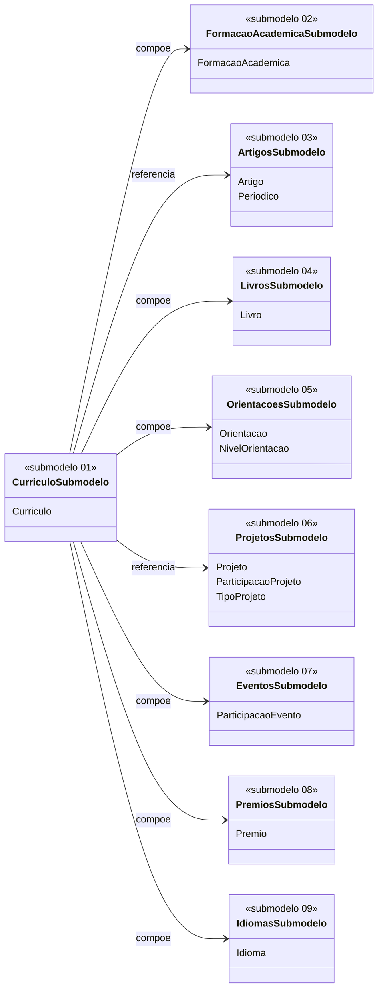

# Modelo Estrutural — M024 Curriculo do Pesquisador

Dominio e regras de negocio: ver [README.md](README.md). Modelo conceitual consolidado em discovery: [01-corporativo-pesquisador.md](../../../discovery/domains/01-corporativo-pesquisador.md). Adapter externo: [M023/lattes](../M023-integracoes/lattes/README.md).

> Este documento e o mapa estrutural do M024. O detalhamento foi dividido em submodelos menores por assunto de curriculo para melhorar leitura, revisao e implementacao.

## Submodelos

| Submodelo | Escopo | Entidades principais |
|-----------|--------|----------------------|
| [01 - Curriculo](submodelos/01-curriculo.md) | Raiz do curriculo, versao do snapshot, validade e areas de atuacao | `Curriculo`, `PessoaFisica`, `AreaConhecimento` |
| [02 - Formacao Academica](submodelos/02-formacao-academica.md) | Titulacao academica e instituicao formadora | `FormacaoAcademica`, `NivelFormacao`, `StatusFormacao` |
| [03 - Artigos](submodelos/03-artigos.md) | Producao bibliografica em periodicos e anais | `Artigo`, `Periodico` |
| [04 - Livros e Capitulos](submodelos/04-livros.md) | Livros completos e capitulos de livro | `Livro`, `TipoProducaoLivro` |
| [05 - Orientacoes](submodelos/05-orientacoes.md) | Orientacoes academicas concluidas ou em andamento | `Orientacao`, `NivelOrientacao` |
| [06 - Projetos](submodelos/06-projetos.md) | Projetos academicos e participacoes com papel por pessoa | `Projeto`, `ParticipacaoProjeto`, `TipoProjeto` |
| [07 - Eventos](submodelos/07-eventos.md) | Participacao em eventos cientificos | `ParticipacaoEvento`, `PapelEvento` |
| [08 - Premios](submodelos/08-premios.md) | Premios, titulos honorificos e homenagens | `Premio` |
| [09 - Idiomas](submodelos/09-idiomas.md) | Idiomas e proficiencia por habilidade | `Idioma`, `NivelProficienciaIdioma` |
| [10 - Cadastros de Apoio e Referencias](submodelos/10-cadastros-apoio.md) | Cadastros locais, entidades compartilhaveis e referencias canonicas externas | `Periodico`, `NivelOrientacao`, `TipoProjeto`, `Artigo`, `Projeto`, M008 refs |

## Referencias a outros modulos

M024 nao redefine entidades canonicas de outros modulos. As entidades abaixo sao **referenciadas** e aparecem nos diagramas apenas como nomes, sem atributos:

| Entidade canonica | Modulo | Onde aparece em M024 | Forma de referencia |
|-------------------|--------|----------------------|---------------------|
| [PessoaFisica](../M008-cadastros-corporativos/pessoas/modelo-estrutural.md) | M008 | Raiz da vinculacao do curriculo; tambem em `Orientacao.orientando` e `Artigo.autores` | Relacao 1:1 com `Curriculo`; relacoes N:N/N:1 em producoes e orientacoes |
| [Instituicao](../M008-cadastros-corporativos/instituicoes/README.md) | M008 | `FormacaoAcademica.instituicao`, `Orientacao.instituicao`, `Projeto.financiador`, `Premio.entidade`, `Livro.editora` | M024 associa instituicoes canonicas durante a persistencia do snapshot; nomes vindos do Lattes sem correspondencia seguem para reconciliacao/match-or-create conforme politica de M008 |
| [AreaConhecimento](../M008-cadastros-corporativos/classificacoes/area-conhecimento/README.md) | M008 §1.3.6 | `FormacaoAcademica.areaConhecimento`, `Curriculo.areasDeAtuacao` | Cadastro canonico CNPq; areas nao mapeadas vao para log de discrepancia |
| [Cidade](../M008-cadastros-corporativos/geografia/cidade/README.md) | M008 §1.3.4 | `ParticipacaoEvento.local` | M024 associa cidade canonica durante a persistencia do snapshot; locais sem correspondencia seguem politica de reconciliacao/match-or-create de M008 |
| [NivelAcademico](../M008-cadastros-corporativos/pessoas/modelo-estrutural.md) | M008 | Derivado de `FormacaoAcademica.nivel` mais alto concluido | M024 solicita atualizacao de `PessoaFisica.nivelAcademico` apos sincronizacao |
| [Documento](../M008-cadastros-corporativos/README.md) | M008 | XML bruto do Lattes quando fonte for upload manual | Arquivado em M008.Documento para auditoria |
| [Pesquisador (persona)](../../../discovery/personas.md) | Discovery | Flag derivado em `PessoaFisica` quando existe `Curriculo` | Nao e entidade propria -- ver [README.md#dominio](README.md#dominio) |

Eventos cruzando o limite do modulo estao em [eventos-dominio.md](eventos-dominio.md). O adapter externo que fornece snapshots normalizados esta em [M023/lattes](../M023-integracoes/lattes/README.md).

## Diagrama de Submodelos

## Diagrama Consolidado

> Atributos do bloco de classe sao apenas tipos primitivos e enums. Referencias a outras entidades (M024 ou M008) sao representadas como relacoes, com cardinalidade e papel rotulado.

```mermaid
classDiagram
    direction TB

    class Curriculo {
        +String numeroLattes
        +Integer versao
        +String resumo
        +Date dataAtualizacaoLattes
        +Date dataUltimaSincronizacao
    }

    class FormacaoAcademica {
        +NivelFormacao nivel
        +String curso
        +Integer anoInicio
        +Integer anoConclusao
        +StatusFormacao status
    }

    class Artigo {
        +String titulo
        +String doi
        +Integer ano
    }

    class Periodico {
        +String nome
        +String issn
        +String qualis
    }

    class Livro {
        +String titulo
        +TipoProducaoLivro tipo
        +String isbn
        +Integer ano
        +String papel
    }

    class Orientacao {
        +Integer anoInicio
        +Integer anoConclusao
        +StatusOrientacao status
    }

    class NivelOrientacao {
        +String codigo
        +String nome
        +String descricao
    }

    class Projeto {
        +String titulo
        +Date dataInicio
        +Date dataFim
        +StatusProjeto status
    }

    class ParticipacaoProjeto {
        +PapelProjeto papel
    }

    class TipoProjeto {
        +String codigo
        +String nome
        +String descricao
    }

    class Premio {
        +String nome
        +Integer ano
    }

    class ParticipacaoEvento {
        +String nome
        +PapelEvento papel
        +Integer ano
    }

    class Idioma {
        +String idioma
        +NivelProficienciaIdioma compreensao
        +NivelProficienciaIdioma fala
        +NivelProficienciaIdioma leitura
        +NivelProficienciaIdioma escrita
    }

    class PessoaFisica {
        << M008 >>
    }

    class Instituicao {
        << M008 >>
    }

    class AreaConhecimento {
        << M008 §1.3.6 >>
    }

    class Cidade {
        << M008 §1.3.4 >>
    }

    class NivelFormacao {
        <<enumeration>>
        Graduacao
        Especializacao
        Mestrado
        Doutorado
        PosDoutorado
    }

    class StatusFormacao {
        <<enumeration>>
        Concluida
        EmAndamento
    }

    class TipoProducaoLivro {
        <<enumeration>>
        Livro
        Capitulo
    }

    class StatusOrientacao {
        <<enumeration>>
        Concluida
        EmAndamento
    }

    class PapelProjeto {
        <<enumeration>>
        Coordenador
        Membro
    }

    class StatusProjeto {
        <<enumeration>>
        EmAndamento
        Concluido
        Suspenso
    }

    class PapelEvento {
        <<enumeration>>
        Apresentador
        Ouvinte
        Organizador
        Convidado
    }

    class NivelProficienciaIdioma {
        <<enumeration>>
        Pouco
        Razoavel
        Bom
        Fluente
    }

    PessoaFisica "1" -- "0..1" Curriculo : titular
    Curriculo "1" *-- "0..*" FormacaoAcademica
    Curriculo "0..*" -- "0..*" Artigo : artigos
    Curriculo "1" *-- "0..*" Livro
    Curriculo "1" *-- "0..*" Orientacao
    Curriculo "1" *-- "0..*" ParticipacaoProjeto
    Curriculo "1" *-- "0..*" Premio
    Curriculo "1" *-- "0..*" ParticipacaoEvento
    Curriculo "1" *-- "0..*" Idioma
    Curriculo "0..*" -- "0..*" AreaConhecimento : areasDeAtuacao

    FormacaoAcademica "0..*" -- "1" Instituicao : instituicao
    FormacaoAcademica "0..*" -- "0..1" AreaConhecimento : areaConhecimento
    Artigo "0..*" -- "1" Periodico : periodico
    Artigo "0..*" -- "1..*" PessoaFisica : autores
    Orientacao "0..*" -- "1" PessoaFisica : orientando
    Orientacao "0..*" -- "1" Instituicao : instituicao
    Orientacao "0..*" -- "1" NivelOrientacao : nivel
    ParticipacaoProjeto "0..*" -- "1" Projeto : projeto
    ParticipacaoProjeto "0..*" -- "1" PessoaFisica : participante
    Projeto "0..*" -- "1" TipoProjeto : tipo
    Projeto "0..*" -- "0..1" Instituicao : financiador
    Premio "0..*" -- "0..1" Instituicao : entidade
    Livro "0..*" -- "0..1" Instituicao : editora
    ParticipacaoEvento "0..*" -- "0..1" Cidade : local
```

## Dicionario de Dados Consolidado

Cada submodelo possui seu dicionario proprio com regras e relacionamentos. A tabela abaixo serve como indice rapido dos atributos persistidos.

| Classe | Atributos | Submodelo |
|--------|-----------|-----------|
| `Curriculo` | `numeroLattes`, `versao`, `resumo`, `dataAtualizacaoLattes`, `dataUltimaSincronizacao` | [01 - Curriculo](submodelos/01-curriculo.md) |
| `FormacaoAcademica` | `nivel`, `curso`, `anoInicio`, `anoConclusao`, `status` | [02 - Formacao Academica](submodelos/02-formacao-academica.md) |
| `Artigo` | `titulo`, `doi`, `ano` | [03 - Artigos](submodelos/03-artigos.md) |
| `Periodico` | `nome`, `issn`, `qualis` | [03 - Artigos](submodelos/03-artigos.md) |
| `Livro` | `titulo`, `tipo`, `isbn`, `ano`, `papel` | [04 - Livros e Capitulos](submodelos/04-livros.md) |
| `Orientacao` | `anoInicio`, `anoConclusao`, `status` | [05 - Orientacoes](submodelos/05-orientacoes.md) |
| `NivelOrientacao` | `codigo`, `nome`, `descricao` | [05 - Orientacoes](submodelos/05-orientacoes.md) |
| `Projeto` | `titulo`, `dataInicio`, `dataFim`, `status` | [06 - Projetos](submodelos/06-projetos.md) |
| `ParticipacaoProjeto` | `papel` | [06 - Projetos](submodelos/06-projetos.md) |
| `TipoProjeto` | `codigo`, `nome`, `descricao` | [06 - Projetos](submodelos/06-projetos.md) |
| `ParticipacaoEvento` | `nome`, `papel`, `ano` | [07 - Eventos](submodelos/07-eventos.md) |
| `Premio` | `nome`, `ano` | [08 - Premios](submodelos/08-premios.md) |
| `Idioma` | `idioma`, `compreensao`, `fala`, `leitura`, `escrita` | [09 - Idiomas](submodelos/09-idiomas.md) |

## Resumo de Enumeracoes

| Enum | Entidade | Valores | Submodelo |
|------|----------|---------|-----------|
| `NivelFormacao` | FormacaoAcademica | Graduacao, Especializacao, Mestrado, Doutorado, PosDoutorado | [02](submodelos/02-formacao-academica.md) |
| `StatusFormacao` | FormacaoAcademica | Concluida, EmAndamento | [02](submodelos/02-formacao-academica.md) |
| `TipoProducaoLivro` | Livro | Livro, Capitulo | [04](submodelos/04-livros.md) |
| `StatusOrientacao` | Orientacao | Concluida, EmAndamento | [05](submodelos/05-orientacoes.md) |
| `PapelProjeto` | ParticipacaoProjeto | Coordenador, Membro | [06](submodelos/06-projetos.md) |
| `StatusProjeto` | Projeto | EmAndamento, Concluido, Suspenso | [06](submodelos/06-projetos.md) |
| `PapelEvento` | ParticipacaoEvento | Apresentador, Ouvinte, Organizador, Convidado | [07](submodelos/07-eventos.md) |
| `NivelProficienciaIdioma` | Idioma | Pouco, Razoavel, Bom, Fluente | [09](submodelos/09-idiomas.md) |
