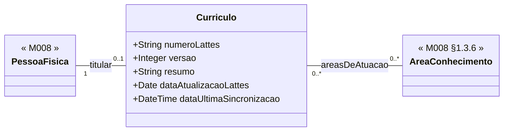

# Submodelo 01 — Curriculo

[← Modelo Estrutural](../modelo-estrutural.md) | [M024](../README.md)

## Escopo

Raiz do curriculo importado da Plataforma Lattes. Controla vinculacao com `PessoaFisica`, numero Lattes, versionamento do snapshot, validade da sincronizacao e areas gerais de atuacao.

## Diagrama

## Dicionario de Dados

| Classe | Atributo | Definicao | Obrig. | Tipo | Dominio | Tamanho | Unico |
|--------|----------|-----------|--------|------|---------|---------|-------|
| **Curriculo** | numeroLattes | Identificador CNPq do curriculo vinculado a PessoaFisica | Sim | String | 16 digitos | 16 | Sim |
| | versao | Numero sequencial do snapshot importado | Gerado | Integer | Incrementado a cada sincronizacao bem-sucedida | | Nao |
| | resumo | Resumo livre importado do Lattes | Nao | String | | 4000 | Nao |
| | dataAtualizacaoLattes | Data de atualizacao declarada pela Plataforma Lattes | Sim | Date | | | Nao |
| | dataUltimaSincronizacao | Data e hora da ultima sincronizacao bem-sucedida pelo Conecta | Sim | DateTime | ISO 8601 | | Nao |

## Relacionamentos

| Relacao | Cardinalidade | Descricao |
|---------|----------------|-----------|
| titular | 1 | [M008 PessoaFisica](../../M008-cadastros-corporativos/pessoas/modelo-estrutural.md) titular do curriculo |
| areasDeAtuacao | 0..* | [M008 AreaConhecimento](../../M008-cadastros-corporativos/classificacoes/area-conhecimento/README.md) associadas ao curriculo |

## Regras

- RN-M024-01: toda Pessoa identificada como `Pesquisador` deve possuir exatamente um `Curriculo` vinculado.
- RN-M024-02: `numeroLattes` e unico no sistema.
- RN-M024-04: curriculo valido exige `dataUltimaSincronizacao` nos ultimos 12 meses.
- Falha de primeira importacao nao persiste vinculacao.
- Falha em reimportacao preserva o snapshot anterior intacto.

