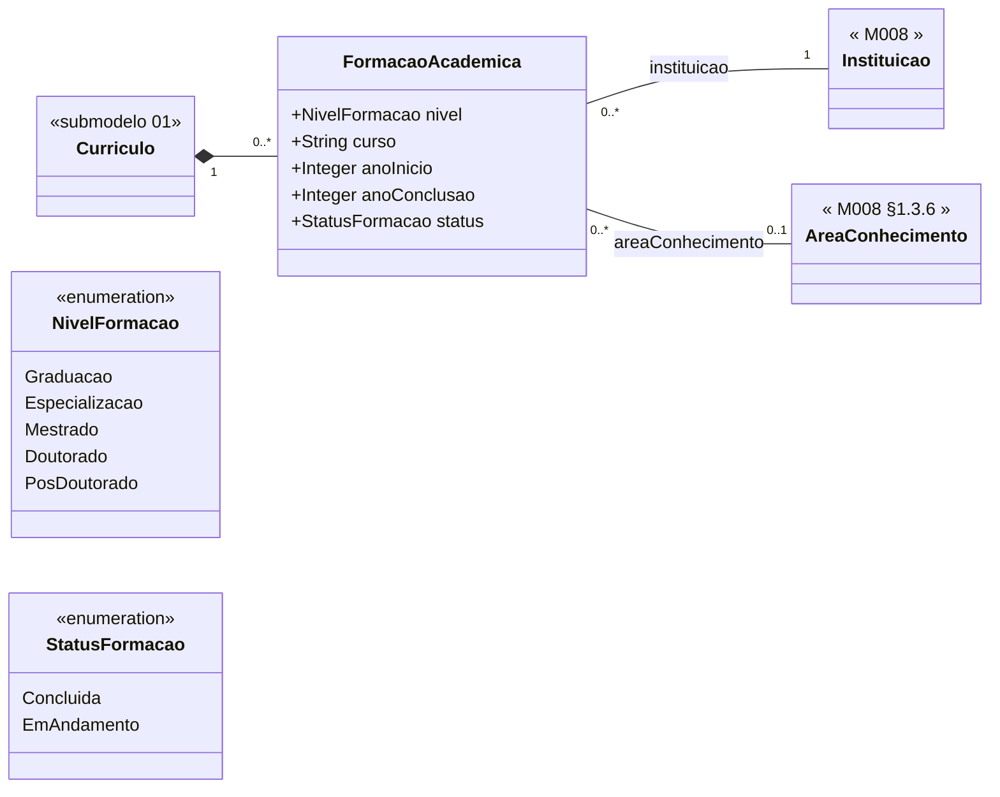

# Submodelo 02 — Formacao Academica

[← Modelo Estrutural](../modelo-estrutural.md) | [M024](../README.md)

## Escopo

Titulacao academica do pesquisador: graduacao, especializacao, mestrado, doutorado e pos-doutorado. Este submodelo alimenta elegibilidade, titulacao maxima e busca por expertise.

## Diagrama

## Dicionario de Dados

| Classe | Atributo | Definicao | Obrig. | Tipo | Dominio | Tamanho | Unico |
|--------|----------|-----------|--------|------|---------|---------|-------|
| **FormacaoAcademica** | nivel | Nivel da titulacao academica | Sim | NivelFormacao | Graduacao, Especializacao, Mestrado, Doutorado, PosDoutorado | | Nao |
| | curso | Nome do curso ou programa de pos-graduacao | Sim | String | | 300 | Nao |
| | anoInicio | Ano de inicio da formacao | Sim | Integer | Ano com 4 digitos | 4 | Nao |
| | anoConclusao | Ano de conclusao da formacao | Cond. | Integer | Obrigatorio quando status = Concluida | 4 | Nao |
| | status | Estado atual da formacao | Sim | StatusFormacao | Concluida, EmAndamento | | Nao |

## Relacionamentos

| Relacao | Cardinalidade | Descricao |
|---------|----------------|-----------|
| curriculo | 1 | `Curriculo` ao qual a formacao pertence |
| instituicao | 1 | [M008 Instituicao](../../M008-cadastros-corporativos/instituicoes/README.md) onde a formacao foi realizada |
| areaConhecimento | 0..1 | [M008 AreaConhecimento](../../M008-cadastros-corporativos/classificacoes/area-conhecimento/README.md) associada a formacao |

## Regras

- RN-M024-03: reimportacao apaga todas as `FormacaoAcademica` anteriores e recria a partir do snapshot atual.
- RN-M024-06: areas nao mapeadas geram log/evento de discrepancia e o campo fica vazio.
- `anoConclusao` e obrigatorio quando `status = Concluida`; deve ser vazio quando `status = EmAndamento`.
- Nao ha unicidade por `nivel`: uma pessoa pode ter mais de uma formacao no mesmo nivel.
- Unicidade recomendada no snapshot: `(curriculo, instituicao, curso, anoInicio)`.

