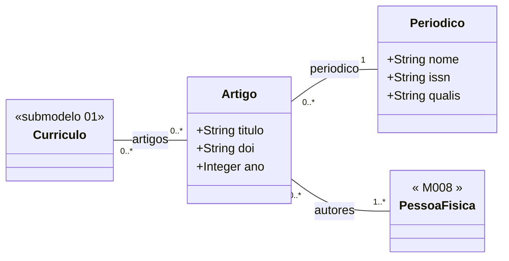

# Submodelo 03 — Artigos

[← Modelo Estrutural](../modelo-estrutural.md) | [M024](../README.md)

## Escopo

Producao bibliografica em periodicos ou anais. Um mesmo `Artigo` pode aparecer em mais de um `Curriculo`, pois artigos possuem multiplos autores. O submodelo sustenta consultas de producao cientifica e o filtro `producaoMinima` usado por M011 na selecao de Ad Hoc.

## Diagrama

## Dicionario de Dados

| Classe | Atributo | Definicao | Obrig. | Tipo | Dominio | Tamanho | Unico |
|--------|----------|-----------|--------|------|---------|---------|-------|
| **Artigo** | titulo | Titulo do artigo publicado | Sim | String | | 500 | Nao |
| | doi | Digital Object Identifier do artigo | Nao | String | DOI valido quando informado | 100 | Nao |
| | ano | Ano de publicacao | Sim | Integer | Ano com 4 digitos | 4 | Nao |
| **Periodico** | nome | Nome do periodico ou anais de conferencia | Sim | String | | 300 | Nao |
| | issn | Identificador internacional do periodico | Nao | String | ISSN quando disponivel | 20 | Sim |
| | qualis | Estrato Qualis CAPES do periodico | Nao | String | A1, A2, A3, A4, B1, B2, B3, B4, C | 5 | Nao |

## Relacionamentos

| Relacao | Cardinalidade | Descricao |
|---------|----------------|-----------|
| curriculos | 0..* | `Curriculo` em que o artigo aparece como producao do pesquisador titular |
| periodico | 1 | `Periodico` que publicou o artigo |
| autores | 1..* | [M008 PessoaFisica](../../M008-cadastros-corporativos/pessoas/pessoa-fisica/README.md) dos autores/coautores, com match best-effort |

## Regras

- RN-M024-03: reimportacao apaga os vinculos `Curriculo` x `Artigo` do curriculo sincronizado e recria a partir do snapshot atual. O registro compartilhado de `Artigo` nao e apagado se estiver vinculado a outro curriculo.
- `Periodico` nao e composicao de `Curriculo`; persiste como cadastro compartilhado.
- `Periodico.issn` e a chave de deduplicacao preferencial; quando ausente, M024 usa nome normalizado durante a persistencia.
- `Artigo.doi` e a chave de deduplicacao preferencial; quando ausente, M024 usa a combinacao normalizada `(titulo, ano, periodico)` durante a persistencia.
- `qualis` nao e dado canonico do Lattes; quando indisponivel, fica vazio.
