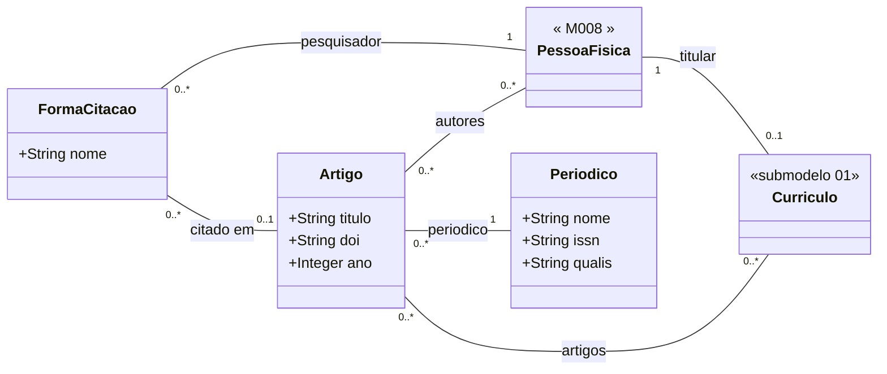

# Submodelo 03 — Artigos

[← Modelo Estrutural](../modelo-estrutural.md) | [M024](../README.md)

## Escopo

Producao bibliografica em periodicos ou anais. Um mesmo `Artigo` pode aparecer em mais de um `Curriculo`, pois artigos possuem multiplos autores. O submodelo sustenta consultas de producao cientifica e o filtro `producaoMinima` usado por M011 na selecao de Ad Hoc.

`FormaCitacao` e a entidade de juncao entre `Curriculo` e `Artigo`: registra o nome exatamente como o pesquisador foi citado naquela publicacao. A `PessoaFisica` e alcancada atraves do `Curriculo`. Durante a importacao, o adapter cria um `FormaCitacao` por autor resolvido; autores sem correspondencia no sistema nao geram registro.

## Diagrama

## Dicionario de Dados

| Classe | Atributo | Definicao | Obrig. | Tipo | Dominio | Tamanho | Unico |
|--------|----------|-----------|--------|------|---------|---------|-------|
| **FormaCitacao** | nome | Nome como o pesquisador foi citado na publicacao | Sim | String | | 200 | Nao |
| **Artigo** | titulo | Titulo do artigo publicado | Sim | String | | 500 | Nao |
| | doi | Digital Object Identifier do artigo | Nao | String | DOI valido quando informado | 100 | Nao |
| | ano | Ano de publicacao | Sim | Integer | Ano com 4 digitos | 4 | Nao |
| **Periodico** | nome | Nome do periodico ou anais de conferencia | Sim | String | | 300 | Nao |
| | issn | Identificador internacional do periodico | Nao | String | ISSN quando disponivel | 20 | Sim |
| | qualis | Estrato Qualis CAPES do periodico | Nao | String | A1, A2, A3, A4, B1, B2, B3, B4, C | 5 | Nao |

## Relacionamentos

| Relacao | Cardinalidade | Descricao |
|---------|----------------|-----------|
| Curriculo → FormaCitacao | 1:N | Composicao — `FormaCitacao` pertence ao `Curriculo` |
| FormaCitacao → Artigo | N:1 (opcional) | Artigo em que o pesquisador foi citado com esse nome; nulo quando a forma e declarada sem publicacao associada |
| Artigo → Periodico | N:1 | `Periodico` que publicou o artigo |
| Artigo → PessoaFisica | N:N | Autores resolvidos — caminho derivado: `Artigo ← FormaCitacao → Curriculo → PessoaFisica` |
| PessoaFisica → Curriculo | 1:0..1 | `PessoaFisica` e alcancada atraves do `Curriculo` titular |

## Regras

- RN-M024-03: reimportacao apaga todas as `FormaCitacao` do curriculo sincronizado e recria a partir do snapshot. O registro compartilhado de `Artigo` nao e apagado se vinculado a `FormaCitacao` de outro curriculo.
- RN-M024-03b: durante a importacao, o adapter cria um `FormaCitacao` por autor do snapshot que seja resolvido para um `Curriculo` existente. Autores sem correspondencia nao geram registro.
- `Periodico` nao e composicao de `Curriculo`; persiste como cadastro compartilhado.
- `Periodico.issn` e a chave de deduplicacao preferencial; quando ausente, M024 usa nome normalizado.
- `Artigo.doi` e a chave de deduplicacao preferencial; quando ausente, M024 usa `(titulo, ano, periodico)` normalizado.
- `qualis` nao e dado canonico do Lattes; quando indisponivel, fica vazio.
- `UNIQUE(FormaCitacao.curriculoId, FormaCitacao.artigoId)` — um curriculo so aparece uma vez por artigo.
