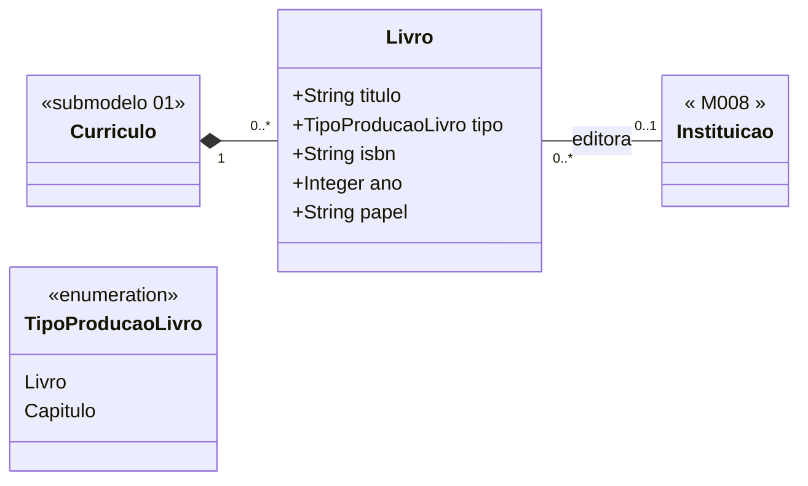

# Submodelo 04 — Livros e Capitulos

[← Modelo Estrutural](../modelo-estrutural.md) | [M024](../README.md)

## Escopo

Producao bibliografica em livro completo ou capitulo de livro. O submodelo mantem o tipo da producao, ISBN, ano e papel do pesquisador na obra.

## Diagrama

## Dicionario de Dados

| Classe | Atributo | Definicao | Obrig. | Tipo | Dominio | Tamanho | Unico |
|--------|----------|-----------|--------|------|---------|---------|-------|
| **Livro** | titulo | Titulo do livro ou capitulo | Sim | String | | 500 | Nao |
| | tipo | Tipo da producao bibliografica | Sim | TipoProducaoLivro | Livro, Capitulo | | Nao |
| | isbn | ISBN-10 ou ISBN-13 | Nao | String | ISBN valido quando informado | 20 | Nao |
| | ano | Ano de publicacao | Sim | Integer | Ano com 4 digitos | 4 | Nao |
| | papel | Papel do pesquisador na obra | Nao | String | Autor, Organizador, Tradutor ou equivalente vindo do Lattes | 100 | Nao |

## Relacionamentos

| Relacao | Cardinalidade | Descricao |
|---------|----------------|-----------|
| curriculo | 1 | `Curriculo` ao qual o livro/capitulo pertence |
| editora | 0..1 | [M008 Instituicao](../../M008-cadastros-corporativos/instituicoes/README.md) editora da obra |

## Regras

- RN-M024-03: reimportacao apaga todos os `Livro` anteriores e recria a partir do snapshot atual.
- `tipo` discrimina livro completo e capitulo; nao ha entidade separada para capitulo.
- `editora` e opcional porque o Lattes pode trazer a informacao incompleta.

