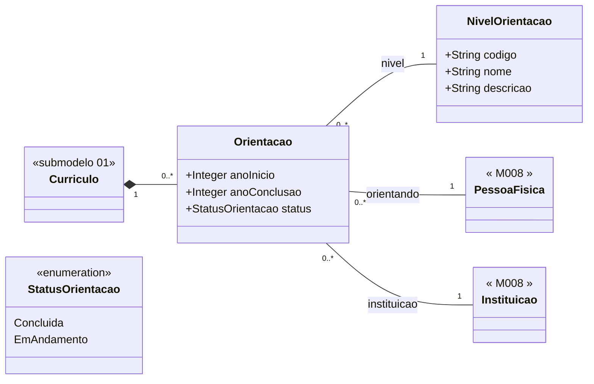

# Submodelo 05 — Orientacoes

[← Modelo Estrutural](../modelo-estrutural.md) | [M024](../README.md)

## Escopo

Orientacoes academicas concluidas ou em andamento: iniciacao cientifica, mestrado, doutorado e pos-doutorado. Representa atividade academica historica do curriculo.

## Diagrama

## Dicionario de Dados

| Classe | Atributo | Definicao | Obrig. | Tipo | Dominio | Tamanho | Unico |
|--------|----------|-----------|--------|------|---------|---------|-------|
| **Orientacao** | anoInicio | Ano de inicio da orientacao | Sim | Integer | Ano com 4 digitos | 4 | Nao |
| | anoConclusao | Ano de conclusao da orientacao | Cond. | Integer | Obrigatorio quando status = Concluida | 4 | Nao |
| | status | Estado atual da orientacao | Sim | StatusOrientacao | Concluida, EmAndamento | | Nao |
| **NivelOrientacao** | codigo | Codigo canonico do nivel de orientacao | Sim | String | IC, M, D, PD | 5 | Sim |
| | nome | Nome do nivel de orientacao | Sim | String | | 100 | Nao |
| | descricao | Descricao do nivel de orientacao | Nao | String | | 500 | Nao |

## Relacionamentos

| Relacao | Cardinalidade | Descricao |
|---------|----------------|-----------|
| curriculo | 1 | `Curriculo` ao qual a orientacao pertence |
| nivel | 1 | `NivelOrientacao` -- cadastro local de niveis |
| orientando | 1 | [M008 PessoaFisica](../../M008-cadastros-corporativos/pessoas/modelo-estrutural.md) do orientando |
| instituicao | 1 | [M008 Instituicao](../../M008-cadastros-corporativos/instituicoes/README.md) onde a orientacao ocorre |

## Regras

- RN-M024-03: reimportacao apaga todas as `Orientacao` anteriores e recria a partir do snapshot atual.
- `NivelOrientacao` nao e composicao de `Curriculo`; e cadastro local compartilhado.
- `anoConclusao` e obrigatorio quando `status = Concluida`; deve ser vazio quando `status = EmAndamento`.
- Valores iniciais de `NivelOrientacao`: IC, M, D, PD.

