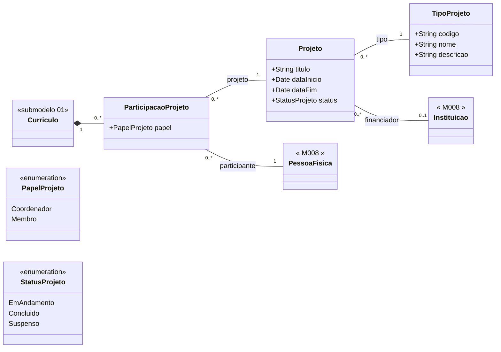

# Submodelo 06 — Projetos

[← Modelo Estrutural](../modelo-estrutural.md) | [M024](../README.md)

## Escopo

Projetos de pesquisa, extensao, desenvolvimento ou ensino registrados no curriculo Lattes. Um mesmo `Projeto` pode aparecer em mais de um `Curriculo`, pois pode ter varios participantes. A entidade `ParticipacaoProjeto` liga pessoa/curriculo ao projeto e carrega o papel exercido pelo pesquisador.

## Diagrama

## Dicionario de Dados

| Classe | Atributo | Definicao | Obrig. | Tipo | Dominio | Tamanho | Unico |
|--------|----------|-----------|--------|------|---------|---------|-------|
| **Projeto** | titulo | Titulo do projeto de pesquisa | Sim | String | | 500 | Nao |
| | dataInicio | Data de inicio do projeto | Sim | Date | | | Nao |
| | dataFim | Data de encerramento do projeto | Cond. | Date | Obrigatoria quando status = Concluido | | Nao |
| | status | Estado atual do projeto | Sim | StatusProjeto | EmAndamento, Concluido, Suspenso | | Nao |
| **ParticipacaoProjeto** | papel | Papel da pessoa no projeto | Sim | PapelProjeto | Coordenador, Membro | | Nao |
| **TipoProjeto** | codigo | Codigo canonico do tipo de projeto | Sim | String | PESQUISA, EXTENSAO, DESENVOLVIMENTO, ENSINO, OUTRO | 20 | Sim |
| | nome | Nome do tipo de projeto | Sim | String | | 100 | Nao |
| | descricao | Descricao do tipo de projeto | Nao | String | | 500 | Nao |

## Relacionamentos

| Relacao | Cardinalidade | Descricao |
|---------|----------------|-----------|
| participacoes | 0..* | Participacoes do curriculo em projetos academicos |
| projeto | 1 | `Projeto` compartilhado ao qual a participacao se refere |
| participante | 1 | [M008 PessoaFisica](../../M008-cadastros-corporativos/pessoas/pessoa-fisica/README.md) que exerce o papel no projeto; normalmente a titular do curriculo |
| tipo | 1 | `TipoProjeto` -- cadastro local de tipos |
| financiador | 0..1 | [M008 Instituicao](../../M008-cadastros-corporativos/instituicoes/README.md) financiadora, quando declarada no Lattes |

## Regras

- RN-M024-03: reimportacao apaga as `ParticipacaoProjeto` do curriculo sincronizado e recria a partir do snapshot atual. O registro compartilhado de `Projeto` nao e apagado se estiver vinculado a outro curriculo.
- `TipoProjeto` nao e composicao de `Curriculo`; e cadastro local compartilhado.
- `dataFim` e obrigatoria quando `status = Concluido`; deve ser vazia quando `status = EmAndamento`.
- `PapelProjeto` pertence a `ParticipacaoProjeto`, nao a `Projeto`, pois pessoas diferentes podem ter papeis diferentes no mesmo projeto.
- `Projeto` deve ser deduplicado preferencialmente por `(titulo, dataInicio, tipo, financiador)` quando nao houver identificador externo confiavel no Lattes.
- Valores iniciais de `TipoProjeto`: PESQUISA, EXTENSAO, DESENVOLVIMENTO, ENSINO, OUTRO.
