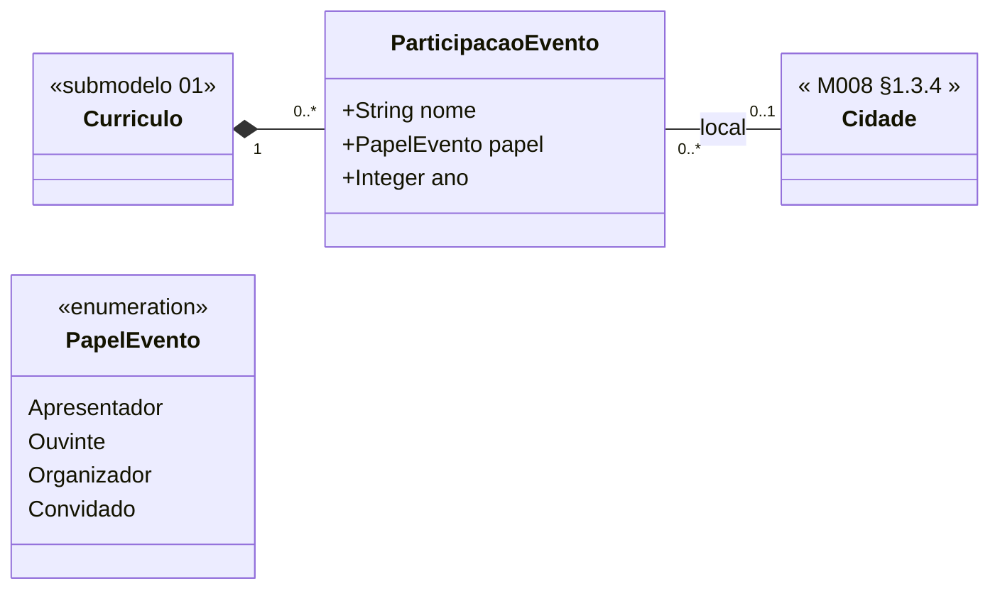

# Submodelo 07 — Eventos

[← Modelo Estrutural](../modelo-estrutural.md) | [M024](../README.md)

## Escopo

Participacoes do pesquisador em eventos cientificos, como congresso, simposio, workshop ou encontro. Registra papel, ano e local quando inferivel.

## Diagrama

## Dicionario de Dados

| Classe | Atributo | Definicao | Obrig. | Tipo | Dominio | Tamanho | Unico |
|--------|----------|-----------|--------|------|---------|---------|-------|
| **ParticipacaoEvento** | nome | Nome do evento cientifico | Sim | String | | 500 | Nao |
| | papel | Papel do pesquisador no evento | Sim | PapelEvento | Apresentador, Ouvinte, Organizador, Convidado | | Nao |
| | ano | Ano de realizacao do evento | Sim | Integer | Ano com 4 digitos | 4 | Nao |

## Relacionamentos

| Relacao | Cardinalidade | Descricao |
|---------|----------------|-----------|
| curriculo | 1 | `Curriculo` ao qual a participacao pertence |
| local | 0..1 | [M008 Cidade](../../M008-cadastros-corporativos/geografia/cidade/README.md) onde o evento ocorreu, quando inferivel |

## Regras

- RN-M024-03: reimportacao apaga todas as `ParticipacaoEvento` anteriores e recria a partir do snapshot atual.
- `local` e opcional porque o Lattes nem sempre informa cidade de forma estruturada.
- Um curriculo pode nao possuir participacao em evento registrada.

