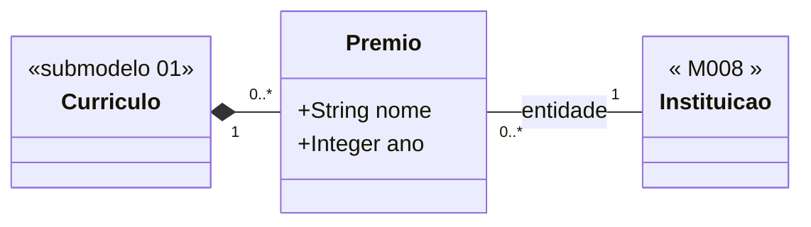

# Submodelo 08 — Premios

[← Modelo Estrutural](../modelo-estrutural.md) | [M024](../README.md)

## Escopo

Premios, titulos honorificos e homenagens recebidos pelo pesquisador. Complementa a leitura da trajetoria academica e pode apoiar vitrines e transparencia.

## Diagrama

## Dicionario de Dados

| Classe | Atributo | Definicao | Obrig. | Tipo | Dominio | Tamanho | Unico |
|--------|----------|-----------|--------|------|---------|---------|-------|
| **Premio** | nome | Nome do premio, titulo honorifico ou homenagem | Sim | String | | 300 | Nao |
| | ano | Ano em que o premio foi recebido | Sim | Integer | Ano com 4 digitos | 4 | Nao |

## Relacionamentos

| Relacao | Cardinalidade | Descricao |
|---------|----------------|-----------|
| curriculo | 1 | `Curriculo` ao qual o premio pertence |
| entidade | 1 | [M008 Instituicao](../../M008-cadastros-corporativos/instituicoes/README.md) que conferiu o premio |

## Regras

- RN-M024-03: reimportacao apaga todos os `Premio` anteriores e recria a partir do snapshot atual.
- `entidade` deve ser criada/associada via match-or-create no adapter quando houver entidade concedente.
- Um curriculo pode nao possuir premio registrado.

