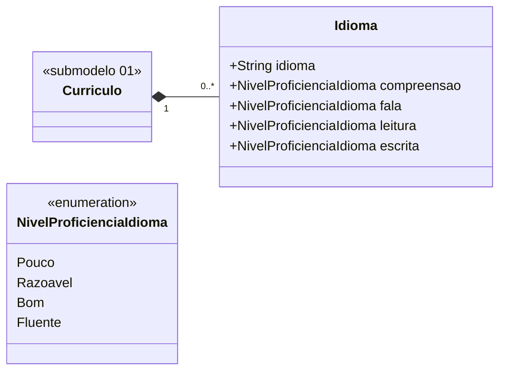

# Submodelo 09 — Idiomas

[← Modelo Estrutural](../modelo-estrutural.md) | [M024](../README.md)

## Escopo

Idiomas declarados pelo pesquisador no Lattes, com proficiencia por habilidade: compreensao, fala, leitura e escrita.

## Diagrama

## Dicionario de Dados

| Classe | Atributo | Definicao | Obrig. | Tipo | Dominio | Tamanho | Unico |
|--------|----------|-----------|--------|------|---------|---------|-------|
| **Idioma** | idioma | Nome do idioma declarado no Lattes | Sim | String | | 100 | Nao |
| | compreensao | Nivel de proficiencia em compreensao oral | Sim | NivelProficienciaIdioma | Pouco, Razoavel, Bom, Fluente | | Nao |
| | fala | Nivel de proficiencia na fala | Sim | NivelProficienciaIdioma | Pouco, Razoavel, Bom, Fluente | | Nao |
| | leitura | Nivel de proficiencia na leitura | Sim | NivelProficienciaIdioma | Pouco, Razoavel, Bom, Fluente | | Nao |
| | escrita | Nivel de proficiencia na escrita | Sim | NivelProficienciaIdioma | Pouco, Razoavel, Bom, Fluente | | Nao |

## Relacionamentos

| Relacao | Cardinalidade | Descricao |
|---------|----------------|-----------|
| curriculo | 1 | `Curriculo` ao qual o idioma pertence |

## Regras

- RN-M024-03: reimportacao apaga todos os `Idioma` anteriores e recria a partir do snapshot atual.
- Cada idioma deve aparecer uma unica vez por curriculo.
- Um curriculo pode nao possuir idioma registrado.

