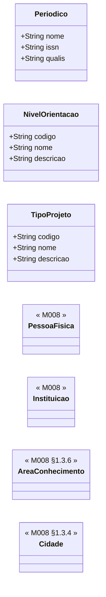

# Submodelo 10 — Cadastros de Apoio

[← Modelo Estrutural](../modelo-estrutural.md) | [M024](../README.md)

## Escopo

Consolida entidades auxiliares usadas por mais de um submodelo. Algumas vivem em M024 (`Periodico`, `NivelOrientacao`, `TipoProjeto`), outras sao apenas referencias canonicas de M008.

## Diagrama

## Dicionario de Dados

| Classe | Atributo | Definicao | Obrig. | Tipo | Dominio | Tamanho | Unico |
|--------|----------|-----------|--------|------|---------|---------|-------|
| **Periodico** | nome | Nome do periodico ou anais de conferencia | Sim | String | | 300 | Nao |
| | issn | Identificador internacional do periodico | Nao | String | ISSN quando disponivel | 20 | Sim |
| | qualis | Estrato Qualis CAPES do periodico | Nao | String | A1, A2, A3, A4, B1, B2, B3, B4, C | 5 | Nao |
| **NivelOrientacao** | codigo | Codigo canonico do nivel de orientacao | Sim | String | IC, M, D, PD | 5 | Sim |
| | nome | Nome do nivel de orientacao | Sim | String | | 100 | Nao |
| | descricao | Descricao do nivel de orientacao | Nao | String | | 500 | Nao |
| **TipoProjeto** | codigo | Codigo canonico do tipo de projeto | Sim | String | PESQUISA, EXTENSAO, DESENVOLVIMENTO, ENSINO, OUTRO | 20 | Sim |
| | nome | Nome do tipo de projeto | Sim | String | | 100 | Nao |
| | descricao | Descricao do tipo de projeto | Nao | String | | 500 | Nao |

## Relacionamentos

| Entidade | Tipo | Usado por | Observacao |
|----------|------|-----------|------------|
| `Periodico` | Cadastro local M024 | [Artigos](03-artigos.md) | Cadastro compartilhado, deduplicado por `issn` ou nome normalizado |
| `Artigo` | Producao compartilhavel M024 | [Artigos](03-artigos.md) | Pode aparecer em mais de um curriculo; deduplicado por `doi` ou `(titulo, ano, periodico)` |
| `NivelOrientacao` | Cadastro local M024 | [Orientacoes](05-orientacoes.md) | Valores iniciais: IC, M, D, PD |
| `TipoProjeto` | Cadastro local M024 | [Projetos](06-projetos.md) | Valores iniciais: PESQUISA, EXTENSAO, DESENVOLVIMENTO, ENSINO, OUTRO |
| `Projeto` | Producao/atividade compartilhavel M024 | [Projetos](06-projetos.md) | Pode aparecer em mais de um curriculo por meio de `ParticipacaoProjeto` |
| `PessoaFisica` | Referencia M008 | Curriculo, Artigos, Orientacoes | Titular do curriculo, autores de artigos e orientandos |
| `Instituicao` | Referencia M008 | Formacao, Livros, Orientacoes, Projetos, Premios | Match-or-create pelo adapter quando vier do Lattes |
| `AreaConhecimento` | Referencia M008 | Curriculo, Formacao | Cadastro canonico CNPq |
| `Cidade` | Referencia M008 | Eventos | Local de evento quando inferivel |

## Regras

- Cadastros locais e producoes compartilhadas do M024 nao sao apagados por reimportacao de curriculo quando ainda estiverem referenciados.
- Entidades filhas compostas pelo `Curriculo` sao apagadas e recriadas na reimportacao; referencias e vinculos compartilhados sao reconciliados.
- Areas CNPq sem correspondencia geram `AreaConhecimentoNaoMapeada` e nao bloqueiam a sincronizacao.
