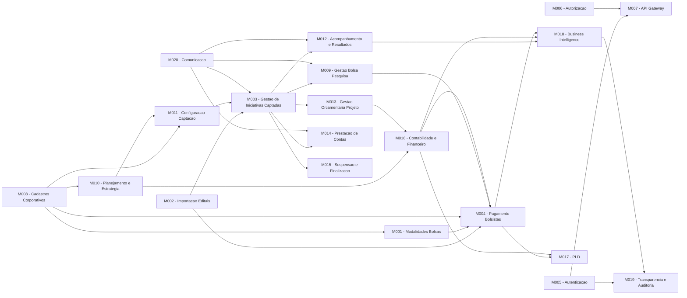

# Product Backlog - Conecta FAPES

Backlog central do produto. Ponto de entrada unico para a visao executiva e navegacao para os sub-backlogs de cada modulo.

[← Voltar ao Management](README.md)

| Documento relacionado | Descricao |
|----------------------|-----------|
| [product-vision.md](../discovery/product-vision.md) | Visao detalhada com fundamentacao legal |
| [milestones.md](milestones.md) | Agrupamento dos domains em marcos de entrega |
| [releases-2026.csv](releases-2026.csv) | Calendario de entregas 2026 por produto e trimestre |

---

## Visao Geral do Produto

Conecta FAPES e uma plataforma de apoio a pesquisa, desenvolvimento e inovacao da agencia de fomento (Fundacao de Amparo a Pesquisa e Inovacao do Espirito Santo). O sistema gerencia o ciclo completo de fomento: desde o planejamento estrategico e captacao de propostas, passando pela contratacao e execucao de iniciativas, ate o pagamento de bolsistas e prestacao de contas.

---

## Dominios

| Dominio | Sub-dominio | Descricao | Modulos |
|---------|-------------|-----------|---------|
| **1. Corporativo e Administrativo** | 1.1 Acesso e Seguranca (IAM) | Autenticacao, portais back/front-office e portal de transparencia | M005, M006, M007 |
| | 1.2 Pessoas e Organizacoes | Cadastro de pessoas fisicas, instituicoes, unidades e dirigentes | M008 |
| | 1.3 Cadastros Basicos | Estrutura organizacional da agencia, tabelas geograficas, areas de conhecimento e rubricas | M008 |
| | 1.4 Modalidades de Bolsa | Cadastro e versionamento de modalidades, niveis e requisitos de bolsas | M001 |
| **2. Planejamento e Estrategia** | 2.1 Planejamento Estrategico | Plano estrategico e eixos que orientam programas de fomento | M010 |
| | 2.2 Gestao de Parcerias | Cooperacao com entidades publicas e privadas, aportes e aditivos | M010 |
| | 2.3 Gestao de Programa | Cadastro de programas, comites gestores, dotacao orcamentaria e captacoes | M010 |
| **3. Fomento — Pre-Award** | 3.1 Configuracao da Captacao | Elaboracao do edital, formularios, revisores e parametrizacao | M011 |
| | 3.2 Fases da Captacao | Submissao, analise documental, analise de merito, contratacao e deposito | M011, M002 |
| **4. Fomento — Post-Award** | 4.0 Gestao de Iniciativas Captadas | Ownership operacional de editais, projetos contratados, cotas e alocacoes | M003 |
| | 4.1 Acompanhamento de Iniciativas | Dashboards de monitoramento para coordenador, agencia de fomento e SECONT | M003, M012 |
| | 4.2 Gestao de Resultados | Submissao e analise de relatorios tecnicos e contestacao | M012 |
| | 4.3 Gestao Orcamentaria do Projeto | Adicoes orcamentarias, rubricas e remanejamentos | M013 |
| | 4.4 Prestacao de Contas | Submissao de documentos fiscais, analise, auditoria e contestacao | M014 |
| | 4.5 Gestao de Bolsistas de Equipe | Ciclo de vida das bolsas, plano de trabalho, voluntarios e coordenador adjunto | M009 |
| | 4.6 Suspensao e Finalizacao | Suspensao temporaria e encerramento definitivo de projetos | M015 |
| **5. Financeiro** | 5.1 Contabilidade | Escrituracao contabil, vinculacao de contas e dashboard contabil | M016 |
| | 5.2 Financeiro | Contas bancarias, fluxo de caixa, conciliacao e controle de saldo | M016 |
| | 5.3 Pagamentos | Marcos de pagamento, bolsas, parcelas, auxilios, Banestes/BANDES | M004 |
| | 5.4 Prevencao a Lavagem de Dinheiro (PLD) | KYC, monitoramento de transacoes, bloqueios, COAF e conflito de interesse com PJ | M017 |
| **6. Suporte e Inteligencia** | 6.1 Business Intelligence | Paineis analiticos de programas, projetos, bolsas e resultados | M018 |
| | 6.2 Transparencia e Auditoria | Portal de dados abertos, relatorios SECONT e trilha de auditoria | M019 |
| | 6.3 Comunicacao | Servico de envio de notificacoes e comunicados por email | M020 |
| **7. Importacao SIGFAPES** | 7.1 Importacao de Editais | Importar e conciliar editais do sistema legado | M002 |
| | 7.2 Importacao de Projetos | Importar projetos contratados, equipes e conciliar duplicidades | M002 |
| | 7.3 Importacao de Pessoas | Importar pesquisadores, coordenadores, bolsistas e resolver duplicidades | M002 |
| | 7.4 Importacao de Pagamentos | Importar historico financeiro de bolsas, auxilios e parcelas | M002 |
| | 7.5 Gestao da Importacao | Monitorar execucao, reprocessar erros e dashboard de progresso da migracao | M002 |

---

## Modulos e Sub-Backlogs

| ID | Modulo | Dor do Cliente | Capacidade (Solucao) | KPI de Sucesso | % Desenv. | Sub-Backlog |
|----|--------|----------------|----------------------|----------------|-----------|-------------|
| M001 | Modalidades de Bolsas | Modalidades, niveis e requisitos de bolsas sao controlados manualmente via planilhas, gerando inconsistencias entre resolucoes e dados cadastrados | Permitir o cadastro e manutencao de Modalidades, Niveis e Requisitos de Bolsas vinculados as Resolucoes da agencia de fomento | Reducao de inconsistencias cadastrais; tempo de cadastro de nova modalidade | 80% | [backlog](../implementation/modules/M001-modalidade-bolsa/backlog.md) |
| M002 | Importacao SIGFAPES | Dados de editais, projetos, pessoas e pagamentos precisam ser digitados manualmente a partir do Sigfapes, causando retrabalho e erros de transcricao | Importar automaticamente do Sigfapes editais, projetos, equipes, pessoas e historico de pagamentos | Percentual de registros importados automaticamente; reducao de erros de transcricao | 100% | [backlog](../implementation/modules/M002-importacao-editais/backlog.md) |
| M003 | Gestao de Iniciativas Captadas | Falta de visibilidade consolidada sobre iniciativas contratadas, projetos, cotas e alocacoes dificulta a gestao pos-contratacao | Ownership operacional de editais, projetos contratados, cotas de bolsa e alocacoes de bolsistas em um unico contexto | Tempo medio de consulta para tomada de decisao; consistencia dos dados operacionais | 80% | [backlog](../implementation/modules/M003-gestao-iniciativas-captadas/backlog.md) |
| M004 | Pagamento de Bolsistas | Geracao de folhas de pagamento e comunicacao com Banestes/BANDES e feita por processos manuais, sujeitos a atrasos e erros que impactam bolsistas | Gerar folhas de pagamento e operacionalizar o pagamento via integracao com Banestes e BANDES, gerando documentos para EDOCS | Percentual de pagamentos processados no prazo; reducao de erros em folha | 100% | [backlog](../implementation/modules/M004-pagamento-bolsista/backlog.md) |
| M005 | Autenticacao e Auditoria | Sem controle granular de acesso, qualquer usuario autenticado pode acessar dados sensiveis sem rastro de auditoria | Implementar autenticacao integrada ao Acesso Cidadao com autorizacao em nivel de dados e logs de auditoria | Cobertura de controle de acesso; percentual de acoes auditadas | 30% | A definir |
| M006 | Autorizacao | Permissoes de acesso sao rigidas e nao permitem delegacao de funcoes, travando processos quando responsaveis estao ausentes | Gerenciar autorizacoes e delegacao de funcoes com politicas flexiveis via OpenFGA | Tempo medio de concessao/revogacao de acesso; incidentes de acesso indevido | 0% | A definir |
| M007 | API Gateway | Servicos expostos diretamente sem camada unificada de roteamento, autenticacao e rate limiting, aumentando superficie de ataque | Gateway centralizado para roteamento, autenticacao e controle de acesso das APIs | Disponibilidade do gateway; latencia media das requisicoes; incidentes de seguranca | 0% | A definir |
| M008 | Cadastros Corporativos | Dados de pessoas, instituicoes e tabelas de referencia estao dispersos em planilhas e sistemas isolados, gerando duplicidades e inconsistencias entre areas | Cadastro unificado de pessoas fisicas, instituicoes, unidades organizacionais, dirigentes, areas de conhecimento, regioes e rubricas financeiras | Reducao de cadastros duplicados; tempo medio de cadastro de nova entidade; cobertura de dados mestres | 40% | [backlog](../implementation/modules/M008-cadastros-corporativos/backlog.md) |
| M009 | Gestao Bolsa Pesquisa | Acompanhamento do ciclo de vida das bolsas (alocacao, vigencia, renovacao, encerramento) e feito de forma descentralizada e sem visao integrada | Gestao integrada do ciclo de vida das bolsas de pesquisa, da alocacao ao encerramento | Taxa de bolsas com acompanhamento em dia; tempo medio de processamento de renovacao | 35% | [backlog](../implementation/modules/M009-gestao-bolsista/backlog.md) |
| M010 | Planejamento e Estrategia | Planos estrategicos, parcerias e programas sao gerenciados em documentos avulsos sem rastreabilidade entre eixos, aportes e captacoes | Gestao integrada de planos estrategicos, eixos, parcerias (com aditivos e aportes) e programas de fomento vinculados a dotacao orcamentaria | Percentual de programas vinculados a eixos estrategicos; tempo de formalizacao de parcerias; visibilidade orcamentaria dos programas | 15% | [backlog](../implementation/modules/M010-planejamento-estrategia/backlog.md) |
| M011 | Configuracao de Captacao | A elaboracao de editais, formularios e parametrizacao de captacoes e feita de forma manual e descentralizada, causando retrabalho e erros de configuracao | Configuracao completa do processo de captacao: elaboracao de edital, formularios de submissao e avaliacao, cadastro de revisores ad hoc e parametrizacao de regras | Tempo medio de configuracao de uma captacao; taxa de erros em editais publicados | 10% | [backlog](../implementation/modules/M011-configuracao-captacao/backlog.md) |
| M012 | Acompanhamento e Resultados | Falta de visibilidade sobre o andamento das iniciativas contratadas e dificuldade na gestao de relatorios tecnicos e contestacoes | Dashboards de monitoramento para coordenador, agencia de fomento e SECONT, e fluxo de submissao, analise e contestacao de resultados tecnicos | Percentual de iniciativas com acompanhamento atualizado; tempo medio de analise de relatorios tecnicos | 0% | [backlog](../implementation/modules/M012-acompanhamento-resultados/backlog.md) |
| M013 | Gestao Orcamentaria do Projeto | Adicoes orcamentarias, inclusao de rubricas e remanejamentos sao controlados por e-mail e planilhas, sem rastreabilidade e com risco de inconsistencias | Fluxo digital de solicitacao e aprovacao de adicoes orcamentarias, novas rubricas e remanejamentos entre rubricas, com aprovacao automatica intra-rubrica | Tempo medio de aprovacao de remanejamento; taxa de solicitacoes processadas digitalmente | 0% | [backlog](../implementation/modules/M013-gestao-orcamentaria-projeto/backlog.md) |
| M014 | Prestacao de Contas | Submissao e analise de prestacao de contas e feita com documentos fisicos e tramites manuais, gerando atrasos e dificuldade de auditoria | Fluxo digital de submissao de documentos fiscais (com validacao SERPRO), analise, recusa, reavaliacao e auditoria SECONT | Tempo medio de analise de prestacao de contas; percentual de prestacoes validadas automaticamente; taxa de contestacoes resolvidas | 55% | [backlog](../implementation/modules/M014-prestacao-contas/backlog.md) |
| M015 | Suspensao e Finalizacao | Processos de suspensao e encerramento de projetos sao informais, sem fluxo de aprovacao definido e sem vinculo com a prestacao de contas final | Fluxo formal de solicitacao, aprovacao e efetivacao de suspensao temporaria e encerramento definitivo de projetos | Tempo medio de finalizacao de projeto; percentual de projetos encerrados com prestacao de contas final aprovada | 0% | [backlog](../implementation/modules/M015-suspensao-finalizacao/backlog.md) |
| M016 | Contabilidade e Financeiro | Escrituracao contabil e controle financeiro sao feitos em sistemas separados sem conciliacao automatica, dificultando a visao consolidada de saldos e fluxo de caixa | Escrituracao contabil integrada, cadastro de contas bancarias, fluxo de caixa, conciliacao bancaria e controle de saldo por conta | Tempo de fechamento contabil mensal; percentual de conciliacoes automatizadas; acuracia do fluxo de caixa | 0% | [backlog](../implementation/modules/M016-contabilidade-financeiro/backlog.md) |
| M017 | Prevencao a Lavagem de Dinheiro (PLD) | Ausencia de controles sistematizados de PLD expoe a agencia a riscos regulatorios e dificulta a deteccao de operacoes atipicas e conflitos de interesse | Verificacao cadastral (KYC), monitoramento de transacoes atipicas, alertas, bloqueio preventivo, reporte ao COAF, consulta a listas restritivas e analise de conflito de interesse com PJ | Percentual de beneficiarios verificados antes do pagamento; tempo medio de tratamento de alertas; cobertura de reportes ao COAF | 0% | [backlog](../implementation/modules/M017-prevencao-lavagem-dinheiro/backlog.md) |
| M018 | Business Intelligence | Dados de programas, projetos, bolsas e resultados estao dispersos, sem paineis consolidados para apoio a decisao estrategica | Paineis analiticos de programas, projetos, bolsas e resultados com analise de indicadores de desempenho | Numero de consultas aos dashboards; tempo medio de geracao de relatorios; satisfacao dos gestores com as analises | 0% | [backlog](../implementation/modules/M018-business-intelligence/backlog.md) |
| M019 | Transparencia e Auditoria | Cumprimento de obrigacoes de transparencia e atendimento a demandas da SECONT dependem de extraccoes manuais e relatorios ad hoc | Portal de dados abertos, relatorios de execucao financeira para SECONT, exportacao de dados para auditoria e trilha de auditoria | Percentual de dados publicados no portal de transparencia; tempo de atendimento a demandas SECONT; cobertura da trilha de auditoria | 0% | [backlog](../implementation/modules/M019-transparencia-auditoria/backlog.md) |
| M020 | Comunicacao | Notificacoes e comunicados sao enviados manualmente por e-mail, sem padronizacao e sem rastreabilidade de entrega | Servico centralizado de envio de notificacoes e comunicados por e-mail com templates, filas e confirmacao de entrega | Taxa de entrega de notificacoes; tempo medio de envio; percentual de comunicacoes rastreadas | 0% | [backlog](../implementation/modules/M020-comunicacao/backlog.md) |

---

## Funcionalidades Sem Modulo (Backlog Futuro)

Funcionalidades identificadas na [visao do produto](../discovery/product-vision.md) que ainda nao possuem modulo atribuido.

### Corporativo / Administrativo

| Funcionalidade | Fundamentacao Legal |
|---------------|---------------------|
| Cadastro de Instituicoes de Ensino e Pesquisa | Art. 4 |
| Cadastro de Unidades Organizacionais e hierarquia | - |
| Cadastro de Reitor, Diretores e Chefes | Art. 4 |
| Dashboard de Iniciativas por unidade organizacional | Art. 3 |
| Cadastrar Area Tecnica | - |
| Cadastro de Cidades / Regioes | - |
| Cadastro de Areas de Conhecimento | - |
| Rubricas Financeiras | - |
| Suspender Pessoa (agencia de fomento) | Art. 30, II |
| Cadastro automatico de pessoas Front-office | Art. 4 |
| Cadastro automatico de pessoas Back-office via API Organograma | Art. 30 |

### Planejamento e Estrategia

| Funcionalidade | Fundamentacao Legal |
|---------------|---------------------|
| Cadastrar Plano Estrategico | - |
| Cadastrar Eixo Estrategico | - |
| Cadastrar Programa | Art. 4, 3; Art. 14, VII |
| Cadastro de Comite Gestor | Art. 12 |
| Dashboard de Programas | Art. 14, VII; Art. 3, 3 |
| Cadastrar Parceria | Art. 3, X; Art. 28, I |
| Associar Parceria a Programa | Art. 3, X; Art. 14, VII |
| Cadastrar Entidade Parceira | Art. 3, X |
| Registrar Aporte Financeiro do Parceiro | Art. 25, III; Art. 28, II |
| Registrar Aditivo de Tempo da Parceria | Art. 28, I; Art. 6, par. unico |
| Registrar Aditivo de Aporte da Parceria | Art. 25, III; Art. 28, II |
| Acompanhar Execucao da Parceria | Art. 3, II; Art. 15, III |
| Encerrar Parceria | Art. 15, III |
| Dashboard de Parcerias | Art. 3, 3; Art. 14, VII |

### Fomento - Pre-Award (Captacao e Selecao)

| Funcionalidade | Fundamentacao Legal |
|---------------|---------------------|
| Dashboard do Processo Seletivo | Art. 4; Art. 14, IX |
| Templates de Formularios (Avaliacao e Submissao) | Art. 4, 1 e 2; Art. 15, III |
| Gestao de Revisores Ad Hoc | Art. 4, 2; Art. 12 |
| Configurar/Instanciar Processo de Captacao | Art. 15, I; Art. 5, I |
| Submeter Proposta (Pesquisador) | Art. 4 |
| Avaliacao de Habilitacao | Art. 4, 1 |
| Avaliacao de Merito | Art. 4, 2; Art. 12 |
| Publicar Resultados (Intermediario e Final) | Art. 3, 3; Art. 14, IX |
| Contratar Iniciativa (Termo de Outorga) | Art. 28, I; Art. 3, X |

### Fomento - Post-Award (Execucao)

| Funcionalidade | Fundamentacao Legal |
|---------------|---------------------|
| Dashboard de Iniciativas Contratadas | Art. 3, II |
| Gestao de Resultados (submissao, analise, contestacao) | Art. 12, 2; Art. 18 |
| Solicitar / Aprovar Adicao Orcamentaria | Art. 25 e 26 |
| Solicitar / Aprovar Adicao de Rubrica | - |
| Remanejamento Orcamentario | Art. 25 e 26 |
| Prestacao de Contas de Servico | Art. 27, II; Art. 3, 1 |
| Prestacao de Contas de Diarias | Art. 27, II; Art. 3, 1 |
| Prestacao de Contas de Passagens Aereas | Art. 27, II; Art. 3, 1 |
| Analisar / Recusar Prestacao de Contas | Art. 15, III |
| Auditar Prestacao de Contas (SECONT) | Art. 15, III; Art. 27, II |
| Plano de Trabalho do Bolsista | Art. 4, 1 |
| Gerir Voluntarios e Coordenador Adjunto | - |
| Suspender / Finalizar Projetos | Art. 3, II; Art. 6, par. unico |

### Financeiro

| Funcionalidade | Fundamentacao Legal |
|---------------|---------------------|
| Cadastro de Contas-Contabeis | Art. 5, III; Art. 25 |
| Associar Contas com Iniciativas/Programas/Parcerias | Art. 25, III |
| Dashboard Contabil e Financeiro | Art. 25, III; Art. 3, 3 |
| Cadastro de Contas Bancarias | Art. 25, I; Art. 27, II |
| Fluxo de Caixa | Art. 25, III; Art. 5, III |
| Conciliacao Bancaria | Art. 25, III; Art. 27, II |
| Controle de Saldo por Conta | Art. 25, III |
| Dashboard Financeiro | Art. 25, III; Art. 3, 3 |
| Bolsas Unac (nao seriada) | Art. 3, VII; Art. 14, VIII |
| Bolsas Mestrado e Doutorado | Art. 3, VII; Art. 15, III |
| Pagamento de Auxilios | Art. 28, II |
| Pagamento das Parcelas dos Projetos | Art. 16; Art. 25 |
| Servico Remessa/Retorno Banestes (@-EDI) | Art. 16; Art. 25, III |
| Gestao de Pagamento Duplicado | Art. 27, II; Art. 25, III |
| Gestao de Pagamento a Maior | Art. 27, II; Art. 25, III |

### Prevencao a Lavagem de Dinheiro (PLD)

| Funcionalidade | Fundamentacao Legal |
|---------------|---------------------|
| Verificacao Cadastral (KYC) | Art. 4, 1; Art. 6, par. unico |
| Monitoramento de Transacoes Atipicas | Art. 25, III; Art. 27, II |
| Alertas de Operacoes Suspeitas | Art. 25, III; Art. 6, par. unico |
| Analise e Tratamento de Alertas | Art. 6, par. unico; Art. 15, III |
| Bloqueio Preventivo de Pagamento | Art. 16; Art. 25, III |
| Reporte ao COAF | Art. 25, III; Art. 6, par. unico |
| Consulta a Listas Restritivas | Art. 4, 1; Art. 6, par. unico |
| Trilha de Auditoria PLD | Art. 6, par. unico; Art. 15, III; Art. 27, II |
| Analise de Conflito de Interesse com PJ | Art. 6, par. unico; Art. 4, 1 |
| Dashboard PLD | Art. 25, III; Art. 3, 3 |

### Suporte e Inteligencia

| Funcionalidade | Fundamentacao Legal |
|---------------|---------------------|
| BI (versao simplificada) | Art. 5, II; Art. 3, 3 |
| Analise de Resultados | Art. 12, 2; Art. 18 |
| Dashboard com dados dos projetos | Art. 3, II; Art. 3, 3 |
| Portal de Transparencia (dados abertos de fomento) | Art. 3, 3 |
| Relatorios de Execucao Financeira para SECONT | Art. 25, III; Art. 15, III |
| Exportacao de Dados para Auditoria | Art. 27, II; Art. 25, III |
| Trilha de Auditoria | Art. 6, par. unico; Art. 15, III |
| Dashboard de Indicadores de Transparencia | Art. 3, 3; Art. 5, II |
| Envio de Email | - |

---

## Dependencias entre Modulos



---

## Produtos

Canais de entrega frontend que compoem funcionalidades de multiplos modulos backend. Documentacao completa em [products/](../products/README.md).

| Produto | Descricao | Perfil principal | Documentacao |
|---------|-----------|------------------|--------------|
| Portal Coordenador | Portal web do coordenador de projeto | Coordenador, Bolsista | [README](../products/portal-coordenador/README.md) |
| Portal Admin | Portal administrativo da agencia (back-office) | Operadores, Diretores | [README](../products/portal-admin/README.md) |
| Importador | Importacao de dados do SIGFAPES | Equipe tecnica | [README](../products/importador/README.md) |

---

## Estrutura de Arquivos

```
docs/
├── README.md                           # Indice principal da documentacao
├── discovery/
│   ├── product-vision.md               # Visao detalhada com fundamentacao legal
│   └── domains/                        # Descoberta por dominio
├── management/
│   ├── README.md
│   └── backlog-product.md              # Este documento (ancora central)
├── architecture/
│   ├── README.md
│   └── adr/
└── implementation/
    └── modules/
        └── {M00x-name}/
            ├── README.md               # Dominio + regras de negocio
            ├── contrato.md             # Superficie publica do modulo
            ├── backlog.md              # EPICs + rastreabilidade
            ├── modelo-estrutural.md    # Diagrama de classes + dicionario
            ├── modelo-comportamental.md    # Diagramas de estado
            └── epics/
                └── EPIC-M00x-NNN.md    # Contexto + US com Gherkin
```
