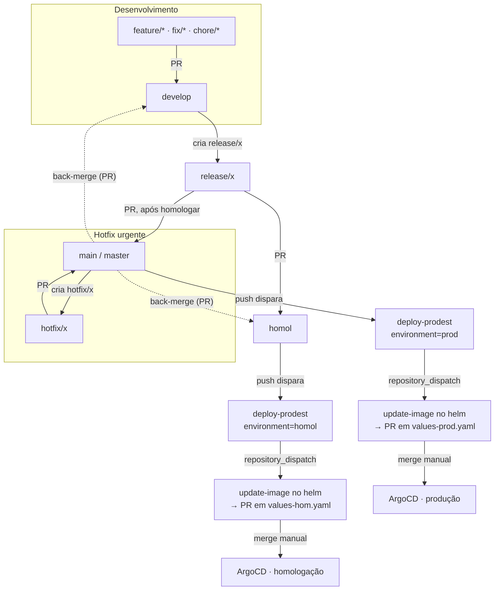

# Fluxo de deploy: `homol` → homologação, `main` → produção

Este documento ensina **como uma mudança sai do código e chega em cada ambiente**,
e como fazer um **hotfix** — que agora é possível sem contaminar o que ainda não
foi promovido.

Complementa o [git-flow-conectafapes.md](git-flow-conectafapes.md) (política de PR)
e o [plano-branch-homol.md](plano-branch-homol.md) (racional da migração). Aqui o
foco é a **operação**: qual branch leva a qual ambiente e o que fazer no dia a dia.

---

## 1. Os três ambientes e as três branches

Cada repositório de aplicação tem três branches de longa duração. **A branch
define o ambiente** — não existe escolha manual de destino.

| Branch | Ambiente | Quem escreve nela | O que dispara |
|---|---|---|---|
| `develop` | integração de desenvolvimento | PRs de branches de trabalho | CI de build/teste |
| `homol` | **homologação** (Prodest) | PRs de `release/*`, `hotfix/*` ou back-merge de produção | deploy em homologação |
| `main` (`master` na prestação de contas) | **produção** (Prodest) | PRs de `release/*` ou `hotfix/*` | deploy em produção |

> A prestação de contas usa `master` como branch de produção; os demais usam `main`.
> Onde este doc disser "`main`", leia "`main`/`master`" conforme o repo.

> **Cluster LEDS.** O stage do cluster LEDS foi **desligado**: os CIs dos apps não
> publicam mais em `values-stage.yaml`, e homologação passou a ser exclusivamente
> no Prodest (branch `homol`). O cluster LEDS mantém só o ambiente de **dev**
> (push em `develop` → `values-develop.yaml`).

---

## 2. O caminho completo, em um diagrama



---

## 3. Como o deploy realmente acontece

O deploy **não** é um `kubectl apply` direto do CI. É uma cadeia de quatro elos:

1. **Push na branch** (`homol` ou `main`) — via merge de um PR.
2. **Job `deploy-prodest`** no CI do repo de aplicação. Ele deriva o ambiente da
   branch:
   - `homol` → `environment: homol`
   - `main`/`master` → `environment: prod`
   - qualquer outra branch → aborta com `::error::` (não despacha ambiente errado).
   Em seguida faz um `repository_dispatch` para o repo de infra
   `leds-conectafapes-helm-prodest`.
3. **Workflow `update-image` no helm** recebe o dispatch, atualiza a tag da imagem
   no arquivo do ambiente (`values-hom.yaml` ou `values-prod.yaml`) e **abre um
   Pull Request** — não faz commit direto.
4. **Merge desse PR no helm** (manual, feito por uma pessoa que confere o digest)
   → o ArgoCD detecta a mudança no values e aplica no cluster.

> **Ponto importante:** o CI **propõe** o deploy (abre o PR no helm). Quem
> **confirma** é quem mescla esse PR. Nada sobe em produção automaticamente a
> partir de um push no repo de aplicação.

---

## 4. Fluxo normal (feature até produção)

1. **Trabalho.** Crie uma branch de trabalho a partir de `develop`
   (`feature/*`, `feat/*`, `fix/*`, `bugfix/*`, `chore/*`, `docs/*`,
   `refactor/*`, `test/*`) e abra PR para `develop`.
2. **Homologar.** Quando um conjunto está pronto para validação, crie uma branch
   de release a partir de `develop` e abra PR para `homol`:
   ```bash
   git checkout develop && git pull
   git checkout -b release/vX.Y.Z
   git push -u origin release/vX.Y.Z
   # abrir PR:  release/vX.Y.Z  ->  homol
   ```
   Ao mesclar, o `deploy-prodest` dispara e abre o PR de imagem em `values-hom.yaml`.
   Mescle esse PR no helm para subir em homologação.
3. **Promover para produção.** Homologação aprovada? Abra PR da mesma
   `release/vX.Y.Z` para `main`:
   ```bash
   # abrir PR:  release/vX.Y.Z  ->  main
   ```
   Ao mesclar, o `deploy-prodest` dispara com `environment=prod` e abre o PR de
   imagem em `values-prod.yaml`.
4. **Fechar o ciclo (back-merge).** Traga `main` de volta para `develop`, para que
   correções/versionamento feitos no caminho não se percam:
   ```bash
   # abrir PR:  main  ->  develop
   ```

---

## 5. Hotfix — o que a separação `homol`×`main` destravou

**Por que antes era ruim:** a homologação saía da `main`. Para corrigir um bug de
produção, era preciso passar por uma branch que carregava **tudo o que já tinha
sido mesclado e ainda não foi promovido** — ou seja, o hotfix arrastava mudanças
não homologadas junto. Agora que `homol` é separada, o hotfix sai **direto da
produção**, isolado.

### Passo a passo

1. **Ramifique da produção** (nunca de `develop`):
   ```bash
   git checkout main && git pull        # master, na prestação de contas
   git checkout -b hotfix/descricao-curta
   ```
2. **Corrija, commite, abra PR `hotfix/*` → `main`.** A política de PR aceita
   `hotfix/*` para produção. Ao mesclar, o `deploy-prodest` dispara `environment=prod`
   → PR de imagem em `values-prod.yaml` → mescle no helm para subir a correção.
3. **Propague a correção** para os outros ambientes com back-merges (senão o bug
   volta na próxima release):
   ```bash
   # abrir PR:  main  ->  homol      (a política aceita como back-merge)
   # abrir PR:  main  ->  develop    (idem)
   ```

> Regra de ouro do hotfix: **saiu da produção, volta para a produção, e depois
> desce para `homol` e `develop` por back-merge.** Nunca crie `hotfix/*` a partir
> de `develop`.

---

## 6. O que a política de PR (`git-flow/pr-policy`) exige

O status automático `git-flow/pr-policy` (publicado pelo worker do Project 43)
reprova PRs fora do padrão. Resumo do que é **aceito**:

| PR (base ← head) | Aceito? | Motivo |
|---|---|---|
| `main`/`master` ← `release/*` ou `hotfix/*` | ✅ | única forma de entrar em produção |
| `main`/`master` ← qualquer outra | ❌ | `production_pr_must_come_from_release_or_hotfix` |
| `homol` ← `release/*` ou `hotfix/*` | ✅ | veículo versionado até homologação |
| `homol` ← `main`/`master` | ✅ | back-merge após hotfix |
| `homol` ← qualquer outra | ❌ | `homologation_pr_must_come_from_release_or_hotfix` |
| `develop` ← branch de trabalho (`feature/*`, `fix/*`, …) | ✅ | desenvolvimento normal |
| `develop` ← `main`/`master` ou `homol` | ✅ | back-merge |
| `develop` ← `develop` | ❌ | não faz sentido |

Prefixos configuráveis (padrão): trabalho = `feature/ feat/ fix/ bugfix/ chore/
docs/ refactor/ test/`; release = `release/`; hotfix = `hotfix/`.

---

## 7. Cheat sheet

```bash
# Nova feature
git checkout develop && git pull
git checkout -b feat/minha-tarefa
#  PR:  feat/minha-tarefa  ->  develop

# Homologar um conjunto
git checkout develop && git pull
git checkout -b release/v1.4.0 && git push -u origin release/v1.4.0
#  PR:  release/v1.4.0  ->  homol      (sobe em homologação)

# Promover para produção (após homologar)
#  PR:  release/v1.4.0  ->  main       (sobe em produção)
#  PR:  main            ->  develop    (back-merge)

# Hotfix de produção
git checkout main && git pull
git checkout -b hotfix/corrige-x
#  PR:  hotfix/corrige-x  ->  main     (sobe a correção)
#  PR:  main              ->  homol    (back-merge)
#  PR:  main              ->  develop  (back-merge)
```

Depois de cada merge em `homol`/`main`, **mescle também o PR de imagem** que o
`update-image` abre no `leds-conectafapes-helm-prodest` — é ele que efetiva o
deploy.

---

## 8. Ressalvas e pendências conhecidas

- **Branch de criação do `homol`.** Ao criar/recriar a branch `homol` de um repo,
  crie-a **a partir da branch de produção** (`main`/`master`) — assim ela já
  carrega o workflow que reconhece `homol`. Uma `homol` desatualizada roda o CI
  antigo e não dispara nada.
- **`backendPrestacaoContas` em produção.** O serviço ainda não existe em
  `values-prod.yaml`; até o PR que o adiciona ser mesclado, todo deploy de
  produção da prestação falha com `::error::Servico ... nao encontrado` (guarda
  intencional, não bug).
- **`sync-prod` (ArgoCD).** O workflow de sync do helm não estava autenticando no
  ArgoCD. Se o ArgoCD estiver em auto-sync, o merge do PR no helm aplica sozinho;
  se não, é preciso sincronizar pela UI do ArgoCD após o merge.
- **Duas rotas para produção.** Além do fluxo por branch descrito aqui, o repo de
  helm tem o workflow "Release homol → prod", que promove o digest **já
  homologado** de `values-hom.yaml` para `values-prod.yaml`. Escolha **uma** rota
  por serviço para não gerar digests conflitantes na mesma linha do values.

---

## 9. Repositórios cobertos

O fluxo vale para os 7 repositórios de aplicação:

`leds-conectafapes-authentication`, `leds-conectafapes-backend-admin`,
`leds-conectafapes-frontend-backoffice`, `leds-conectafapes-frontoffice-backend`,
`leds-conectafapes-frontoffice-frontend`, `leds-conectafapes-prestacao-de-contas`
(produção em `master`) e `leds-conectafapes-backend-pagamento-bolsistas`.

O repositório `conectafapes-project` (ferramentas/automação) não entra neste fluxo
de deploy — ele não tem branch `homol`.
