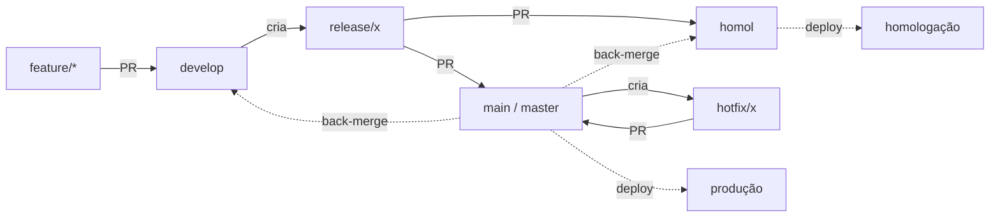

# Fluxo de deploy: `homol` → homologação, `main` → produção

**A branch define o ambiente.** Não existe escolha manual de destino.

| Branch | Ambiente | Recebe PR de |
|---|---|---|
| `develop` | dev | branches de trabalho (`feature/*`, `fix/*`, …) |
| `homol` | **homologação** | `release/*`, `hotfix/*` ou back-merge de produção |
| `main` (`master` na prestação de contas) | **produção** | `release/*` ou `hotfix/*` |

## Diagrama



## Como o deploy acontece

Push na `homol`/`main` → o CI (`deploy-prodest`) despacha para o
`leds-conectafapes-helm-prodest` → abre um **PR** no `values-*.yaml`. **O deploy
só acontece quando esse PR é mesclado** (manual). Nada sobe sozinho.

## Cheat sheet

```bash
# Nova feature
git checkout develop && git pull
git checkout -b feat/minha-tarefa
#  PR:  feat/minha-tarefa  ->  develop

# Homologar → produção
git checkout -b release/v1.4.0 && git push -u origin release/v1.4.0
#  PR:  release/v1.4.0  ->  homol     (sobe em homologação)
#  PR:  release/v1.4.0  ->  main      (sobe em produção, após homologar)
#  PR:  main            ->  develop   (back-merge)

# Hotfix (ramifica da PRODUÇÃO, nunca de develop)
git checkout main && git pull
git checkout -b hotfix/corrige-x
#  PR:  hotfix/corrige-x  ->  main     (sobe a correção)
#  PR:  main              ->  homol    (back-merge)
#  PR:  main              ->  develop  (back-merge)
```

Após cada merge em `homol`/`main`, **mescle também o PR de imagem** que abre no
`leds-conectafapes-helm-prodest` — é ele que efetiva o deploy.

## Regras do `git-flow/pr-policy`

- Produção (`main`/`master`) e `homol`: só recebem `release/*` ou `hotfix/*`
  (e back-merge de produção, no caso de `homol`).
- `develop`: recebe branch de trabalho ou back-merge de `main`/`homol`.

## Notas

- O **stage do cluster LEDS foi desligado**; homologação é só no Prodest, via
  `homol`. O LEDS mantém só o **dev** (`develop` → `values-develop.yaml`).
- Ao criar a branch `homol` de um repo, crie-a **a partir da produção**.
- Cobre os 7 repos de aplicação. O `conectafapes-project` não entra neste fluxo.
