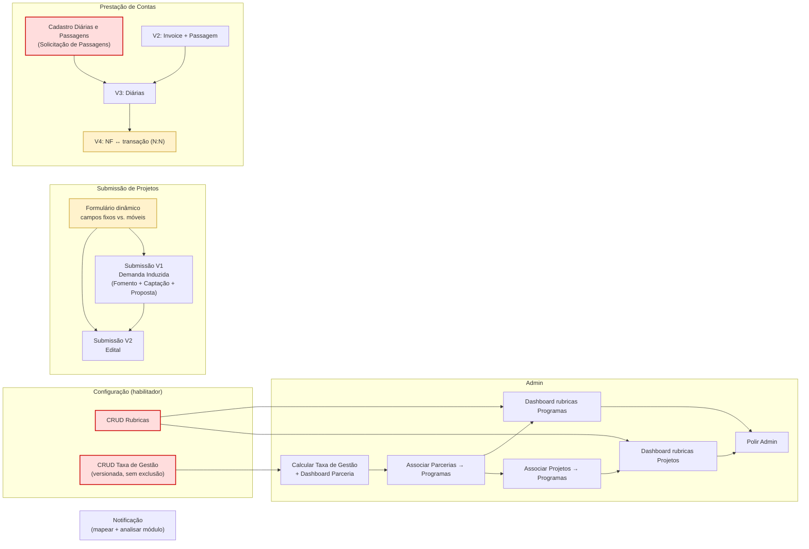

# Plano de Gestão — 2º Trimestre

## Objetivo do trimestre

Duas frentes carregam o trimestre: **submissão de demanda induzida** e **prestação de contas**. Todo o resto (Admin, Notificação, Configuração) é suporte para essas duas entregarem valor. Se precisar cortar escopo, corta do suporte primeiro — nunca do foco.

## Prioridades (ordem de execução)

A ordem abaixo não é a ordem em que os itens aparecem no arquivo original — é a ordem em que fazem sentido entregar, respeitando dependências.

1. **Configuração primeiro.** CRUD de Taxa de Gestão e CRUD de Rubricas destravam o Admin e o cálculo de dashboards. Sem rubrica cadastrada, não há como associar programa/projeto nem atualizar dashboard.
2. **Submissão V1 (demanda induzida).** É metade do foco do trimestre. Tela de Fomento → Tela de Captação → Submissão da proposta → validação do formulário dinâmico.
3. **Prestação de Contas V2.** A outra metade do foco. Invoice e Passagem primeiro por serem os casos mais simples e frequentes.
4. **Admin (Parceria + Programa).** Depende de Rubricas prontas.
5. **Prestação de Contas V3 e V4.** Diárias e associação N:N ficam para o fim — dependem de cadastros e são as regras mais complexas.
6. **Submissão V2 (demanda pública/edital).** Repete a estrutura da V1; entra depois que a V1 estiver validada.
7. **Notificação.** Trabalho de mapeamento/análise, sem bloqueio de outras frentes. Encaixa em janelas livres.

## Frentes de trabalho

### 1. Submissão de Projetos

**V1 — Demanda Induzida (foco do trimestre)**
- Tela de Fomento
- Tela de Captação
- Submissão de Proposta de Demanda Induzida
- Testar formulário dinâmico com campos da demanda induzida — decidir design e o que é campo fixo vs. campo móvel

**V2 — Demanda Pública / Edital**
- Mesma estrutura da V1 (Fomento, Captação, Submissão, formulário dinâmico)
- Só inicia depois da V1 validada. Reaproveitar o máximo possível de componente.

Ponto de atenção: a definição de **campos fixos e móveis** do formulário dinâmico é a decisão de design que trava as duas versões. Resolver isso cedo na V1.

### 2. Prestação de Contas

**V2**
- Prestação de Contas de Invoice
- Prestação de Contas de Passagem

**V3**
- Prestação de Contas de Diárias — depende do **Cadastro de Diárias e Passagens** existir antes

**V4**
- Associar uma nota fiscal a mais de uma transação e vice-versa (relação N:N)

**Diárias e Passagens (habilitador)**
- Solicitação de Passagens — pré-requisito de V3

Ponto de atenção: a numeração das versões representa **ordem de dependência**, não paralelismo. V3 não começa sem o cadastro; V4 é a regra mais cara e fica por último.

### 3. Admin

**Parceria**
- Calcular Taxa de Gestão e melhorar o dashboard
- Associar Parcerias a Programas
- Atualizar dashboard com rubricas dos programas

**Programa**
- Associar Projetos a Programas
- Atualizar dashboard com rubricas dos projetos associados

**Polimento**
- Deixar o Admin com visual apresentável (fazer por último dentro da frente)

Ponto de atenção: toda a frente Admin depende de **Rubricas cadastradas** (ver Configuração). Não iniciar antes.

### 4. Notificação
- Mapear novas notificações: Submissão de Bolsa, Pagamento de Bolsa, Diárias e Passagens
- Analisar o módulo de notificação atual antes de codar qualquer coisa

### 5. Ambiente de Configuração (habilitador)

**Taxa de Gestão**
- CRUD de Taxa de Gestão de Parcerias
- **Regra dura:** taxa muda ao longo do tempo. Nunca apagar taxa existente — sempre criar nova versão. Podem coexistir duas taxas de mesmo valor (ex.: R$ 500 mil), uma ativa e outra inativa. Precisa de status ativo/inativo e histórico.

**Rubricas**
- CRUD de Rubricas — habilitador do Admin (dashboards de programa e projeto)

## Dependências críticas

| Item | Depende de |
|------|-----------|
| Admin — dashboards de programa/projeto | CRUD de Rubricas pronto |
| Prestação de Contas V3 (Diárias) | Cadastro de Diárias e Passagens |
| Submissão V2 (edital) | Submissão V1 validada |
| Cálculo de Taxa de Gestão | CRUD de Taxa de Gestão |

## Mapa de dependências

Seta `A --> B` = A precisa estar pronto antes de B. Nós em vermelho são **habilitadores** — sem eles, frentes inteiras ficam bloqueadas.

Leitura rápida:
- **Vermelho (habilitadores):** Rubricas, Taxa de Gestão, Cadastro de Diárias/Passagens. Nenhuma frente dependente arranca sem eles.
- **Amarelo (risco):** Formulário dinâmico (trava V1 **e** V2) e N:N nota fiscal↔transação (regra mais cara, fica por último).
- **Notificação** é ilha — sem dependência de entrada nem de saída. Roda em janela livre.

## Riscos

- **Formulário dinâmico (campos fixos vs. móveis).** Decisão de design não resolvida trava V1 e V2. Maior risco do trimestre. Tratar como primeiro item da Submissão.
- **Regra de imutabilidade da Taxa de Gestão.** Se o CRUD apagar em vez de versionar, quebra auditoria. Modelar histórico desde o início, não depois.
- **Relação N:N nota fiscal ↔ transação (V4).** Regra mais complexa. Deixada por último de propósito; se o trimestre atrasar, é a primeira candidata a escorregar para o próximo.
- **Notificação sem escopo fechado.** "Analisar o módulo" ainda é investigação, não entrega. Fechar escopo antes de comprometer prazo.

## Definição de pronto (por frente)

- **Submissão:** proposta submetida ponta a ponta, formulário dinâmico validado com dados reais de demanda induzida.
- **Prestação de Contas:** cada tipo (invoice, passagem, diária) fecha o fluxo de lançamento e reconciliação.
- **Admin:** dashboards refletem rubricas reais dos programas/projetos associados.
- **Configuração:** CRUDs com versionamento e status funcionando, sem exclusão física de taxas.
