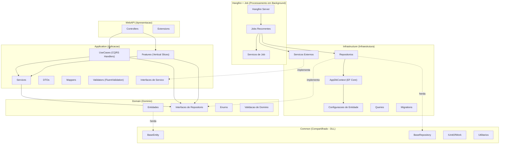
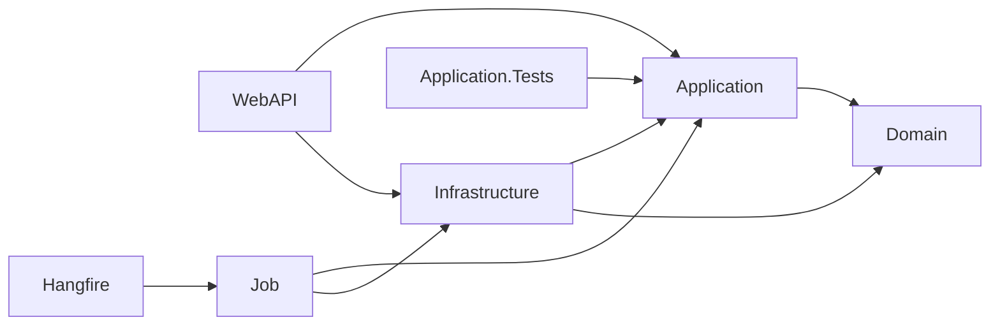
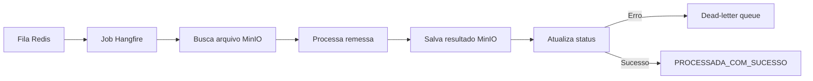
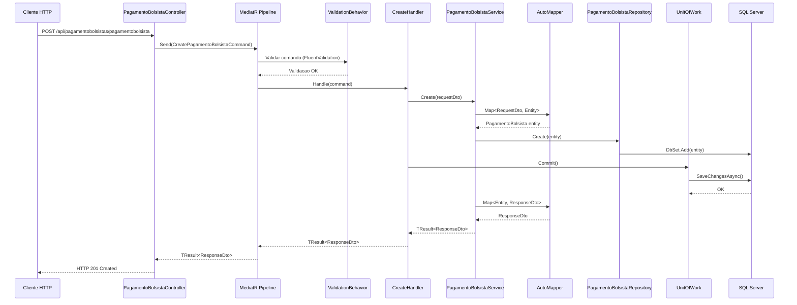
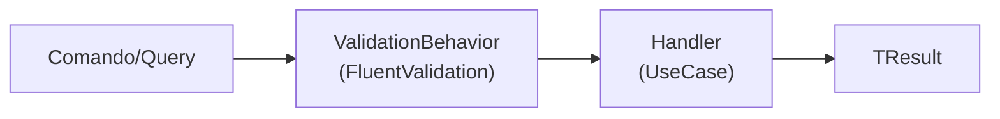
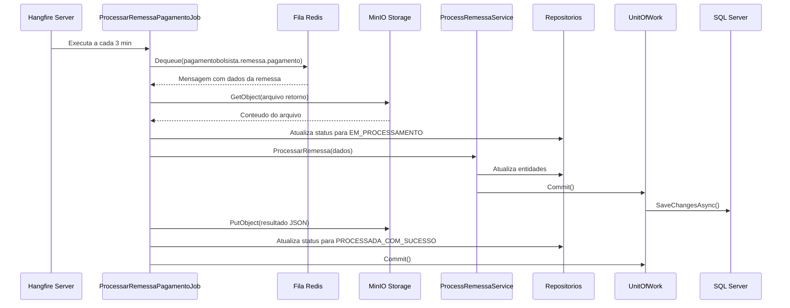
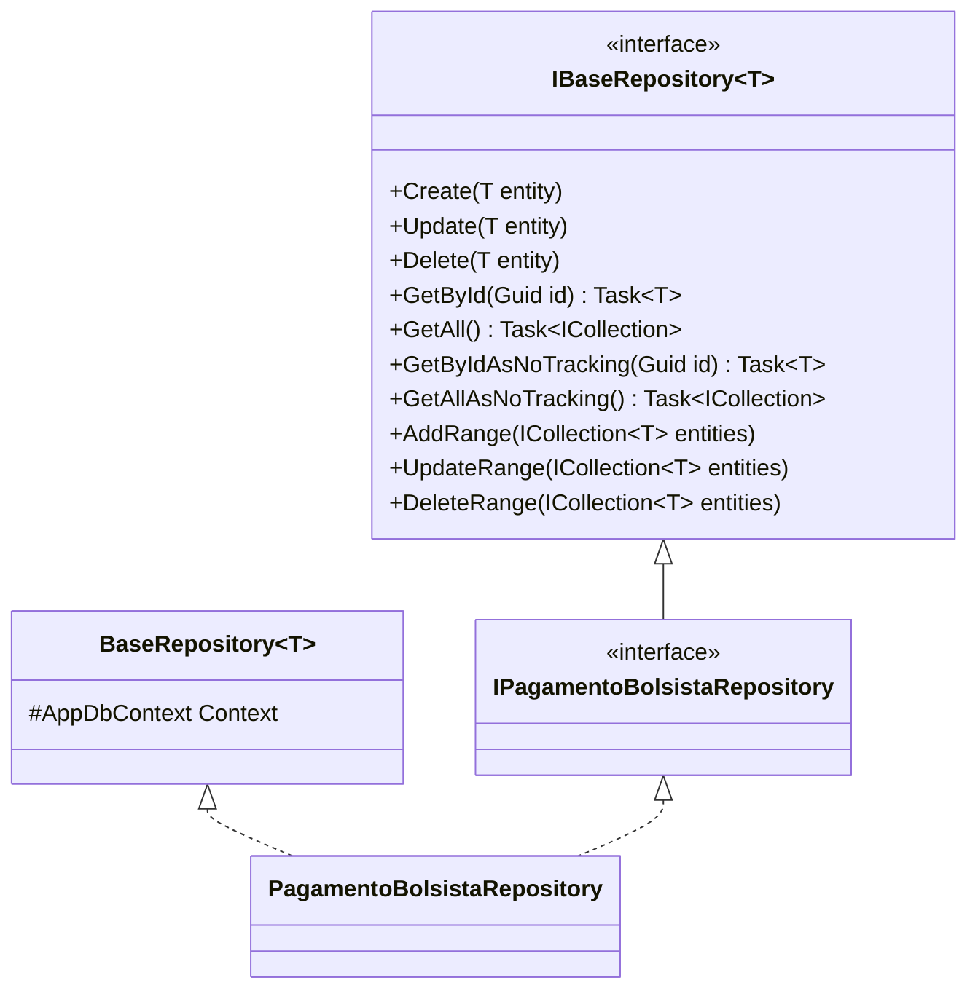
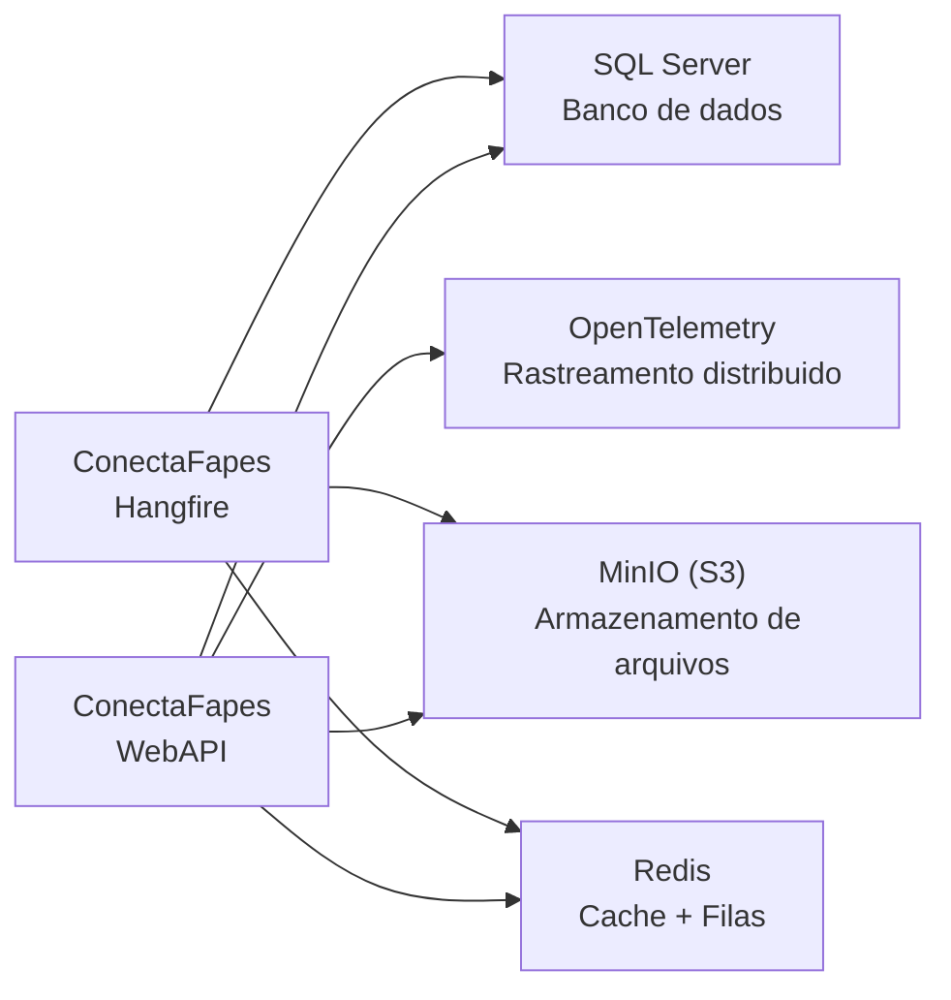

# Arquitetura — ConectaFapes Backend

## Indice

- [1. Visao Geral](#1-visao-geral)
- [2. Estrutura de Projetos](#2-estrutura-de-projetos)
- [3. Camadas da Arquitetura](#3-camadas-da-arquitetura)
- [4. Fluxo de Dados](#4-fluxo-de-dados)
- [5. Padroes Arquiteturais](#5-padroes-arquiteturais)
- [6. Injecao de Dependencias](#6-injecao-de-dependencias)
- [7. Servicos Externos](#7-servicos-externos)
- [8. Preocupacoes Transversais](#8-preocupacoes-transversais)

---

## 1. Visao Geral

O backend do **ConectaFapes — Pagamento Bolsistas** segue uma arquitetura em camadas baseada em **Clean Architecture**, combinada com os padroes **CQRS** (Command Query Responsibility Segregation) e **MediatR** para orquestracao de comandos e consultas.

### Diagrama de Camadas



---

## 2. Estrutura de Projetos

A solucao e composta por **8 projetos**, cada um com uma responsabilidade especifica:

```
src/ConectaFapes/
├── ConectaFapes.WebAPI/              # Camada de apresentacao (API REST)
├── ConectaFapes.Application/         # Logica de aplicacao e orquestracao
├── ConectaFapes.Domain/              # Entidades e contratos de dominio
├── ConectaFapes.Infrastructure/      # Acesso a dados e integracoes externas
├── ConectaFapes.Hangfire/            # Servidor Hangfire (agendamento de jobs)
├── ConectaFapes.Job/                 # Definicoes de jobs em background
├── ConectaFapes.Application.Tests/   # Testes unitarios da aplicacao
├── ConectaFapes.Common/              # Abstracoes compartilhadas (DLL pre-compilada)
└── conectafapes-packages/            # Pacote compilado do Common
```

| Projeto | Responsabilidade |
|---|---|
| **WebAPI** | Controllers REST, configuracao de middleware, autenticacao JWT, Swagger |
| **Application** | Features (vertical slices), DTOs, Services, UseCases (CQRS), Mappers, Validators, Interfaces |
| **Domain** | Entidades de dominio, interfaces de repositorio, enums, validacoes de dominio |
| **Infrastructure** | Repositorios (EF Core), DbContext, migrations, servicos externos (Minio, Redis), queries |
| **Hangfire** | Servidor Hangfire com dashboard, agendamento de jobs recorrentes |
| **Job** | Implementacao dos jobs em background, servicos de suporte aos jobs |
| **Application.Tests** | Testes unitarios com NUnit, Moq e AutoFixture |
| **Common** | BaseEntity, BaseRepository, IUnitOfWork, Result/TResult, utilitarios |

### Dependencias entre Projetos



> **Regra fundamental:** as camadas internas (Domain, Common) nunca referenciam camadas externas (Infrastructure, WebAPI). O fluxo de dependencia aponta sempre para o centro. Todos os projetos referenciam `ConectaFapes.Common` como DLL externa.

---

## 3. Camadas da Arquitetura

### 3.1 WebAPI (Apresentacao)

Camada responsavel por receber requisicoes HTTP e delegar o processamento para a camada de aplicacao via MediatR.

**Estrutura:**

```
ConectaFapes.WebAPI/
├── Controllers/
│   └── Entities/                          # 18 controllers por entidade/feature
│       ├── AlocacaoBolsistaController.cs
│       ├── AreaTecnicaController.cs
│       ├── BancoController.cs
│       ├── BonusPagamentoController.cs
│       ├── CalendarioFolhaController.cs
│       ├── DocumentosController.cs
│       ├── EditalCompetenciaController.cs
│       ├── FolhaController.cs
│       ├── ModalidadeController.cs
│       ├── PagamentoBolsistaController.cs
│       ├── PlanoMensalController.cs
│       ├── ProcessarRetornoRemessa.cs
│       ├── ProcessoRemessaController.cs
│       ├── ProjetoController.cs
│       ├── RemessaCadastroBolsistaController.cs
│       ├── RemessaPagamentoBolsistaController.cs
│       ├── RetornoRemessaController.cs
│       └── VersaoModalidade.cs
├── Extensions/
│   ├── ConfigureCorsPolicy.cs             # CORS (permissivo via env var)
│   ├── DataProtectionExtensions.cs        # ASP.NET Data Protection (SQL Server)
│   ├── JwtExtension.cs                    # JWT Bearer (cookie jwt-token)
│   ├── OpenTelemetryExtension.cs          # Metricas e tracing
│   ├── ProxyForwardedHeadersExtensions.cs # X-Forwarded-For/Proto
│   ├── SerilogExtension.cs               # Logging estruturado JSON
│   └── SwaggerExtension.cs               # Swagger/OpenAPI
├── Scripts/                               # Scripts SQL de migracao
├── Resources/
│   ├── Docs/                              # Documentos (guias, relacoes)
│   ├── Fonts/                             # Fontes (arial)
│   └── Images/                            # Imagens (logos FAPES)
├── Program.cs                             # Ponto de entrada e configuracao
├── Dockerfile
├── appsettings.json
└── appsettings.Development.json
```

**BaseController** (do pacote Common) fornece endpoints CRUD genericos:

| Metodo HTTP | Endpoint | Operacao |
|---|---|---|
| GET | `/api/{entidade}` | Listar todos |
| GET | `/api/{entidade}/{id}` | Buscar por ID |
| POST | `/api/{entidade}` | Criar |
| PUT | `/api/{entidade}` | Atualizar |
| DELETE | `/api/{entidade}/{id}` | Excluir |

Controllers que estendem `BaseCrudController`: `PlanoMensalController`, `EditalCompetenciaController`, `PagamentoBolsistaController`. Os demais herdam de `BaseController` com endpoints customizados.

### 3.2 Application (Aplicacao)

Camada que contem a logica de orquestracao, incluindo features organizadas como vertical slices, handlers CQRS, servicos de aplicacao, DTOs e validacoes.

**Estrutura:**

```
ConectaFapes.Application/
├── Configuration/
│   └── ServiceExtensions.cs               # Registro de DI da camada
├── DTOs/
│   └── Entities/
│       ├── Features/                       # DTOs de features (GuiaLiberacao)
│       ├── Request/                        # 20 Request DTOs
│       └── Response/                       # 19 Response DTOs
├── Features/                              # ~401 arquivos organizados por feature
│   ├── AlocacaoBolsistaFeatures/          # Cancel, GetCotas, ViewFolha
│   ├── BonusPagamentoFeatures/            # CRUD completo
│   ├── CalendarioFeatures/                # Filtro por ano, selecao de anos
│   ├── CrudFeatures/                      # Interfaces e servicos base CRUD
│   ├── EditalCompetenciaFeatures/         # Update, Views, Monitoramento
│   ├── EncaminharPagamentoFeatures/       # Encaminhamento Bandes
│   ├── FolhaFeatures/                     # Documents, Management, Views
│   │   ├── Documents/ExportarFolhaCsv/
│   │   ├── Management/                    # Authorize, Cancel, Generate
│   │   └── Views/                         # GetAll, GetById, Historico, Resume
│   ├── GestaoBolsistaFeatures/            # AdicionarCota, Listar, RegistrarPagamento
│   ├── GuiaLiberacao/                     # Bandes, Banestes, Utils
│   ├── PagamentoBolsistaFeatures/         # Extender, Suspender
│   ├── ProcessoRemessaFeatures/           # Download, List, Retry
│   ├── RelacaoFeatures/                   # Documentos, Bolsista, Edital
│   ├── RemessaFeatures/                   # Download, Generate, Process, Upload, View
│   ├── ViewFeatures/                      # Views de consulta (Bancos, Modalidade, etc.)
│   └── ViewValoresPagos/                  # Projetos pagos por folha
├── Interfaces/
│   └── Features/                          # Interfaces de servicos de feature
├── Mappers/
│   └── Entities/                          # 19 perfis AutoMapper
├── Services/
│   ├── Minio/IMinioService.cs             # Interface armazenamento S3
│   └── Redis/IRedisService.cs             # Interface cache distribuido
├── Shared/
│   ├── Behavior/ValidationBehavior.cs     # Pipeline MediatR (FluentValidation)
│   └── Tracing/TracingSources.cs          # OpenTelemetry activity sources
├── UseCase/
│   ├── BaseCase/                          # 5 handlers genericos (Create, Delete, GetAll, GetById, Update)
│   └── Entities/                          # ~100 handlers por entidade
│       ├── AlocacaoBolsistaCase/          # CRUD (5 use cases)
│       ├── AreaTecnicaCase/               # GetById
│       ├── EditalCompetenciaCase/         # CRUD + Bulk + Liberacao (10 use cases)
│       ├── PagamentoBolsistaCase/         # CRUD + Generate + Import (8 use cases)
│       └── PlanoMensalCase/               # CRUD + Bulk + Queries (13 use cases)
└── Validation/                            # Regras FluentValidation
```

**Handlers genericos (BaseCase):**

| Handler | Comando/Query | Descricao |
|---|---|---|
| `CreateHandler` | `CreateCommand` | Cria uma entidade |
| `UpdateHandler` | `UpdateCommand` | Atualiza uma entidade |
| `DeleteHandler` | `DeleteCommand` | Remove uma entidade |
| `GetAllHandler` | `GetAllQuery` | Lista todas as entidades |
| `GetByIdHandler` | `GetByIdQuery` | Busca entidade por ID |

### 3.3 Domain (Dominio)

Camada central que define as entidades de negocio e os contratos de repositorio. Nao possui dependencias de infraestrutura.

**Estrutura:**

```
ConectaFapes.Domain/
├── Entities/
│   ├── ImportacaoEditais/                 # 8 entidades (Pessoa, Banco, Coordenacao, etc.)
│   ├── PagamentoBolsistas/                # 27 entidades (Folha, Edital, Projeto, etc.)
│   └── RetornoRemessaPagamento/           # 5 entidades (DP9, Header, Detalhe, Trailer)
├── Enum/
│   └── EnumStatusProcessoRemessa.cs       # Status do processo de remessa
├── Interfaces/
│   └── Entities/
│       ├── ImportacaoEditais/             # 8 interfaces de repositorio
│       └── PagamentoBolsistas/            # 25 interfaces de repositorio
└── Validation/
    └── DomainExceptionValidation.cs       # Validacoes de dominio
```

> Para detalhes sobre as entidades, consulte [domain-entities.md](domain-entities.md).

### 3.4 Infrastructure (Infraestrutura)

Camada que implementa o acesso a dados e integracoes com servicos externos.

**Estrutura:**

```
ConectaFapes.Infrastructure/
├── Context/
│   ├── AppDbContext.cs                    # DbContext com 14 DbSets
│   └── AppDbContextFactory.cs            # Factory para design-time migrations
├── EntitiesConfiguration/                 # 40 configuracoes Fluent API
│   ├── ImportacaoEditais/                 # 6 configuracoes
│   └── PagamentoBolsistas/                # 34 configuracoes
├── Repositories/
│   ├── Entities/
│   │   ├── ImportacaoEditais/             # 8 repositorios
│   │   └── PagamentoBolsistas/            # 27 repositorios
│   └── UnitOfWork.cs                      # Implementacao do Unit of Work
├── ExternalServices/
│   ├── MinioService/MinioService.cs       # Armazenamento de objetos (S3)
│   └── RedisService/RedisService.cs       # Cache distribuido
├── Queries/
│   ├── AlocacaoBolsistaQueries.cs         # Queries complexas de alocacao
│   └── ProjetoQueries.cs                  # Queries complexas de projeto
├── Migrations/                            # 13 migrations (V1 a V13)
├── Scripts/                               # 10 scripts SQL complementares
└── ServiceExtensions.cs                   # Registro de DI da camada
```

**AppDbContext — DbSets principais:**

| DbSet | Entidade |
|---|---|
| `Edital` | Editais de bolsas |
| `Projeto` | Projetos vinculados a editais |
| `Pessoa` | Dados pessoais dos bolsistas |
| `AlocacaoBolsista` | Alocacoes de bolsistas em projetos |
| `PagamentoBolsista` | Pagamentos individuais |
| `PlanoMensal` | Planos mensais de pagamento |
| `Folha` | Folhas de pagamento |
| `EditalCompetencia` | Competencias por edital |
| `DecisaoLiberacao` | Decisoes de liberacao de pagamento |
| `DecisaoFolha` | Decisoes sobre folhas |
| `AreaTecnica` | Areas tecnicas |
| `VersaoNivel` | Versoes e niveis de bolsa |
| `RemessaCadastro` | Remessas de cadastro bancario |
| `DataProtectionKeys` | Chaves de protecao de dados |

### 3.5 Hangfire (Agendamento de Jobs)

Aplicacao ASP.NET Core que hospeda o servidor Hangfire para processamento de jobs em background.

**Estrutura:**

```
ConectaFapes.Hangfire/
├── Extensions/
│   ├── ConsoleJobExceptionFilter.cs       # Log de excecoes com timezone Brasilia
│   ├── CustomAuthorizationFilter.cs       # Autorizacao do dashboard
│   └── HangfireJobExtension.cs            # Configuracao dos jobs recorrentes
├── Program.cs                             # Configuracao do servidor Hangfire
├── Dockerfile
└── appsettings.json
```

**Jobs recorrentes configurados:**

| Job | Frequencia | Descricao |
|---|---|---|
| `gerar-editais-competencia` | A cada 10 min | Gera competencias de editais para o plano mensal vigente |
| `definir-plano-mensal` | Mensal | Define o plano mensal atual (ativa/desativa) |
| `cancelar-cotas-com-alocacao-cancelada` | A cada 2 min | Cancela cotas quando alocacoes sao canceladas |
| `finalizar-alocacoes-bolsas-passadas` | A cada 2 min | Finaliza bolsas com prazo expirado |
| `processar-cancelamento-alocacao` | A cada 5 min | Processa cancelamentos de alocacao |
| `processar-retorno-remessa-cadastro` | A cada 3 min | Processa retornos de remessa de cadastro (fila Redis) |
| `processar-retorno-remessa-pagamento` | A cada 3 min | Processa retornos de remessa de pagamento (fila Redis) |

### 3.6 Job (Definicoes de Jobs)

Biblioteca de classes que contem a implementacao dos jobs e servicos de suporte.

**Estrutura:**

```
ConectaFapes.Job/
├── Configuration/
│   └── JobExtension.cs                    # Registro de DI dos jobs
├── Context/
│   ├── HangfireDbContext.cs               # DbContext para dados do Hangfire
│   └── Configuration/ServiceExtensions.cs # Config de banco do Hangfire
├── Jobs/
│   ├── GenerateEditalCompetenciaJob.cs
│   ├── DefinePlanoMensalAtual.cs
│   ├── UpdateCotasCanceladas.cs
│   ├── FinalizarBolsasPassadas.cs
│   ├── ProcessarCancelamentoAlocacao.cs
│   ├── ProcessarRemessaCadastroJob.cs     # Consome fila Redis + MinIO
│   ├── ProcessarRemessaPagamentoJob.cs    # Consome fila Redis + MinIO
│   └── Interfaces/                        # 7 interfaces de jobs
├── Services/
│   ├── PlanoMensalServiceJob.cs           # Gerencia calendario mensal
│   ├── EditalServiceJob.cs                # Consulta editais com pagamentos
│   └── Interfaces/                        # 2 interfaces de servicos
└── ConectaFapes.Job.csproj
```

**Fluxo de processamento de remessas (Cadastro/Pagamento):**



### 3.7 Application.Tests (Testes)

Projeto de testes unitarios da camada Application.

**Estrutura:**

```
ConectaFapes.Application.Tests/
└── Services/Feature/
    ├── BonusPagamentoServices/            # Create, Delete, Update
    ├── EncaminharPagamentoServices/        # Bandes
    ├── FolhaServices/                     # Authorize, Cancel, Generate, GetAll, etc.
    ├── GestaoBolsistaServices/            # AdicionarCota, RegistrarPagamentoExterno
    ├── PagamentoBolsistaServices/         # SuspenderCota
    └── RemessaServices/                   # Generate, Process
```

**Tecnologias:** NUnit 3.14.0, Moq 4.20.72, AutoFixture 4.18.1, coverlet.collector 6.0.0

### 3.8 Common (Compartilhado)

Biblioteca pre-compilada (DLL) que fornece abstracoes base reutilizaveis:

| Componente | Descricao |
|---|---|
| `BaseEntity` | Classe base com Id, DateCreated, DateUpdated, DateDeleted |
| `IBaseRepository<T>` | Contrato base com Create, Update, Delete, GetById, GetAll, AddRange, etc. |
| `BaseRepository<T>` | Implementacao base do repositorio sobre EF Core |
| `IUnitOfWork` | Contrato para commit transacional (`Task Commit()`) |
| `Result` / `TResult<T>` | Tipos de resultado padronizados para operacoes |
| `Error` / `ResultType` | Tipos de erro e enum de resultado |
| `PaginationResponse` | Resposta padronizada para paginacao |
| `ApiResponse` | Resposta padronizada da API |
| `BaseController` | Controller base com metodos ApiOkResult, ApiBadRequestResult, ApiCreateResult |
| `BaseCrudController` | Controller generico com CRUD completo via MediatR |
| `LoggedUserService` | Servico para obter dados do usuario autenticado |

---

## 4. Fluxo de Dados

### 4.1 Fluxo de uma Requisicao (Exemplo: Criar Pagamento Bolsista)



### 4.2 Pipeline do MediatR

Toda requisicao passa pelo pipeline do MediatR antes de chegar ao handler:



O `ValidationBehavior` intercepta a requisicao e executa os validators registrados. Se a validacao falhar, o pipeline retorna um `TResult` com erro antes de atingir o handler.

### 4.3 Fluxo de Job em Background (Exemplo: Processar Remessa)



---

## 5. Padroes Arquiteturais

### 5.1 CQRS com MediatR

Comandos e queries sao modelados como records que implementam `IRequest<TResult<DTO>>`:

```
// Comando (escrita)
CreatePagamentoBolsistaCommand : IRequest<TResult<PagamentoBolsistaResponseDto>>

// Handler
CreatePagamentoBolsistaHandler : CreateHandler<CreatePagamentoBolsistaCommand, ...>
```

Os handlers genericos em `BaseCase/` fornecem implementacoes CRUD padronizadas. Handlers especificos herdam dos genericos e podem sobrescrever comportamentos.

### 5.2 Feature Slices

A camada Application organiza logica de negocio complexa em **Features** (vertical slices), cada uma contendo seus proprios DTOs, interfaces, servicos e use cases:

```
Features/FolhaFeatures/
├── Documents/ExportarFolhaCsv/
├── Management/
│   ├── Dtos/
│   ├── Interfaces/
│   ├── Services/
│   └── UseCases/ (Authorize, Cancel, Generate)
└── Views/
    ├── Dtos/
    ├── Interfaces/
    ├── Services/
    └── UseCases/ (GetAll, GetById, Historico, Resume)
```

### 5.3 Repository Pattern

O padrao Repository abstrai o acesso a dados:



- **Domain** define `IXxxRepository : IBaseRepository<Entity>`
- **Infrastructure** implementa `XxxRepository : BaseRepository<Entity>, IXxxRepository`

### 5.4 Unit of Work

O padrao Unit of Work garante consistencia transacional:

- `IUnitOfWork` define `Task Commit()`
- `UnitOfWork` encapsula `AppDbContext.SaveChangesAsync()`
- Handlers chamam `Commit()` apos todas as operacoes do repositorio

### 5.5 Classes Base Genericas

O sistema utiliza genericos extensivamente para evitar codigo repetitivo:

| Classe Base | Tipo Generico | Descricao |
|---|---|---|
| `BaseEntity` | — | Id, timestamps de auditoria |
| `BaseRepository<T>` | Entidade | Operacoes CRUD sobre DbContext |
| `BaseService<R, Resp, E, TR>` | Request, Response, Entity, Repository | Logica CRUD de servico |
| `BaseController<...>` | Multiplos | Metodos auxiliares de resposta HTTP |
| `BaseCrudController<...>` | Multiplos | Endpoints REST CRUD completos |
| `CreateHandler<...>` | Multiplos | Handler generico de criacao |
| `UpdateHandler<...>` | Multiplos | Handler generico de atualizacao |
| `DeleteHandler<...>` | Multiplos | Handler generico de exclusao |
| `GetAllHandler<...>` | Multiplos | Handler generico de listagem |
| `GetByIdHandler<...>` | Multiplos | Handler generico de busca por ID |

---

## 6. Injecao de Dependencias

O registro de dependencias e dividido entre as camadas, centralizado em metodos de extensao:

### Program.cs (WebAPI)

```
builder.Services.ConfigurePersistenceApp(configuration)   // EF Core + Repositorios
builder.Services.ConfigureApplicationApp()                // Services + MediatR + Validators
builder.Services.ConfigureCorsPolicy()                    // Politica CORS
builder.Services.ConfigureSwagger()                       // Swagger/OpenAPI
builder.Services.ConfigureJwtLocal()                      // Autenticacao JWT
builder.Services.ConfigureSerilog(environment)            // Logging estruturado
builder.ConfigureOpenTelemetry(environment, endpoint)     // Rastreamento e metricas
builder.Services.ConfigurarDataProtection("ConectaFapes") // Protecao de dados
```

### Application — ServiceExtensions.cs

- AutoMapper (escaneamento por assembly)
- MediatR com descoberta automatica de handlers
- FluentValidation com descoberta automatica de validators
- `ValidationBehavior` como pipeline behavior do MediatR
- Services de aplicacao (Scoped) — auto-registrados por sufixo "Service"

### Infrastructure — ServiceExtensions.cs

- `AppDbContext` (Scoped, SQL Server via env `SQLSERVER`)
- Repositorios (Scoped, auto-registrados por sufixo "Repository")
- Servicos externos (Scoped, auto-registrados por sufixo "Service")
- `UnitOfWork` (Scoped)
- Redis `IConnectionMultiplexer` (Singleton, opcional via env `REDIS`)
- Redis `IRedisService` (Singleton)

### Hangfire — Program.cs

- Hangfire com SQL Server storage (env `SQL_HANGFIRE_SERVER`)
- Dashboard em `/hangfire`
- Servidor com heartbeat de 30 segundos
- Escuta na porta 8080 em producao

### Job — JobExtension.cs

- 7 implementacoes de jobs (Scoped)
- 2 servicos de job (Scoped)
- Repositorios, Redis, MinIO
- Servicos de processamento de remessa
- UnitOfWork

---

## 7. Servicos Externos



| Servico | Tipo | Descricao |
|---|---|---|
| **SQL Server** | Banco de dados | Persistencia principal via EF Core |
| **MinIO** | Armazenamento | Armazenamento de arquivos compativel com S3 (guias, remessas, relacoes) |
| **Redis** | Cache + Filas | Cache distribuido (opcional) e filas para processamento de remessas |
| **OpenTelemetry** | Observabilidade | Rastreamento distribuido e metricas (env `OTEL_EXPORTER_OTLP_ENDPOINT`) |
| **Elasticsearch** | Logging | Armazenamento de logs (configuravel) |
| **SendGrid/MailKit** | Email | Notificacoes por email |

**Filas Redis:**

| Fila | Descricao |
|---|---|
| `pagamentobolsista.remessa.cadastro` | Retornos de remessa de cadastro |
| `pagamentobolsista.remessa.pagamento` | Retornos de remessa de pagamento |
| `pagamentobolsista.remessa.cadastro.dlq` | Dead-letter queue de cadastro |
| `pagamentobolsista.remessa.pagamento.dlq` | Dead-letter queue de pagamento |

**Buckets MinIO:**

| Bucket (env var) | Descricao |
|---|---|
| `BUCKET_GUIAS` | Guias de liberacao |
| `BUCKET_REMESSAS` | Arquivos de remessa |
| `BUCKET_RELACOES` | Relacoes e relatorios |

---

## 8. Preocupacoes Transversais

| Preocupacao | Implementacao | Localizacao |
|---|---|---|
| **Validacao** | FluentValidation via MediatR `ValidationBehavior` | `Application/Shared/Behavior/` |
| **Autenticacao** | JWT Bearer tokens (cookie `jwt-token` ou header Authorization) | `WebAPI/Extensions/JwtExtension.cs` |
| **Autorizacao** | Atributo `[Authorize]` nos controllers | Controllers |
| **Logging** | Serilog com JSON, enrichers (MachineName, CorrelationId) | `WebAPI/Extensions/SerilogExtension.cs` |
| **Rastreamento** | OpenTelemetry (ASP.NET Core, SQL Client, HTTP Client, metricas runtime) | `WebAPI/Extensions/OpenTelemetryExtension.cs` |
| **Health Check** | Endpoint `/health` | `Program.cs` |
| **Protecao de Dados** | ASP.NET DataProtection com chaves persistidas em SQL Server | `WebAPI/Extensions/DataProtectionExtensions.cs` |
| **Cache** | Redis (conexao opcional e nao-bloqueante) | `Infrastructure/ExternalServices/RedisService/` |
| **Soft Delete** | `DateDeleted` em `BaseEntity` | `Common/Domain/BaseEntities/` |
| **Proxy Headers** | X-Forwarded-For e X-Forwarded-Proto (producao) | `WebAPI/Extensions/ProxyForwardedHeadersExtensions.cs` |
| **Swagger** | OpenAPI com autenticacao JWT Bearer | `WebAPI/Extensions/SwaggerExtension.cs` |
| **Jobs Background** | Hangfire com SQL Server storage e dashboard | `ConectaFapes.Hangfire/` |
| **Validacao de Dominio** | `DomainExceptionValidation` | `Domain/Validation/` |

---

## Dominios Funcionais

O sistema e organizado em dominios funcionais que permeiam todas as camadas:

| Dominio | Descricao |
|---|---|
| **ImportacaoEditais** | Dados importados de pessoas, bancos, coordenacoes, documentos e enderecos |
| **PagamentoBolsistas** | Nucleo do sistema: editais, projetos, alocacoes, pagamentos, folhas, remessas, planos mensais |
| **RetornoRemessaPagamento** | Processamento de retornos bancarios (DP9, header, detalhe, trailer) |

### Controllers por Dominio

| Dominio Funcional | Controllers |
|---|---|
| **Gestao de Bolsistas** | AlocacaoBolsistaController, PagamentoBolsistaController |
| **Folha de Pagamento** | FolhaController, PlanoMensalController, CalendarioFolhaController |
| **Editais e Projetos** | EditalCompetenciaController, ProjetoController |
| **Remessas Bancarias** | ProcessoRemessaController, RemessaCadastroBolsistaController, RemessaPagamentoBolsistaController, ProcessarRetornoRemessa, RetornoRemessaController |
| **Documentos e Relatorios** | DocumentosController |
| **Dados de Referencia** | AreaTecnicaController, BancoController, ModalidadeController, VersaoModalidade |
| **Bonus** | BonusPagamentoController |
