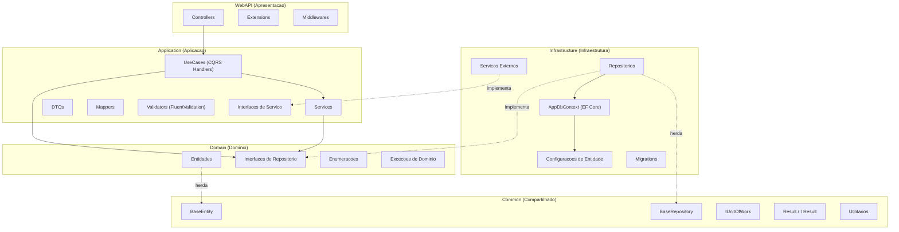
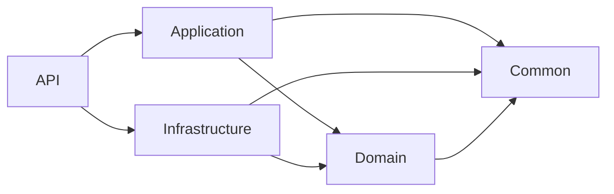
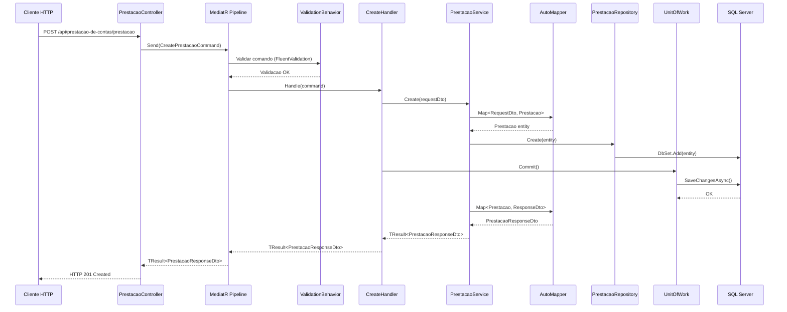
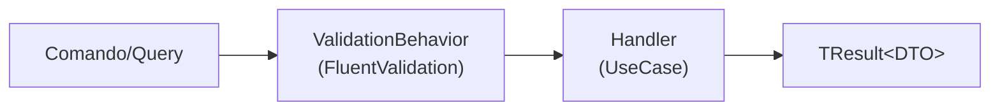
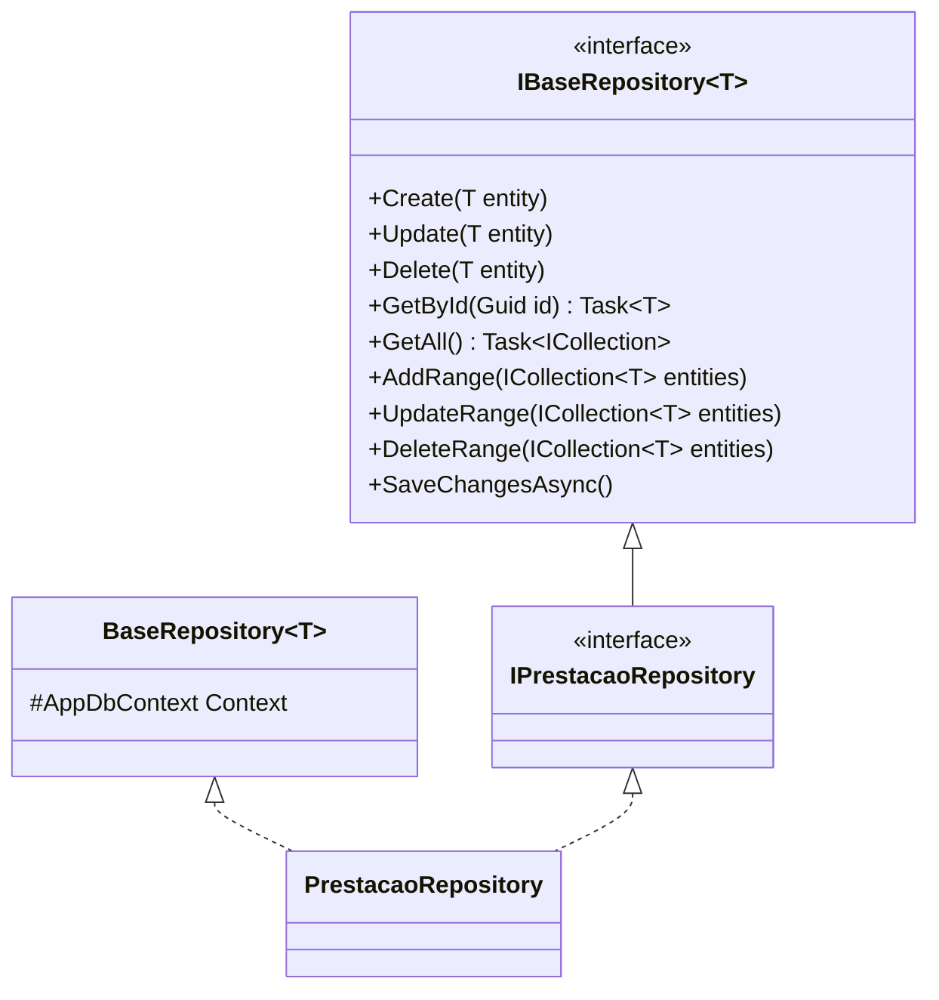
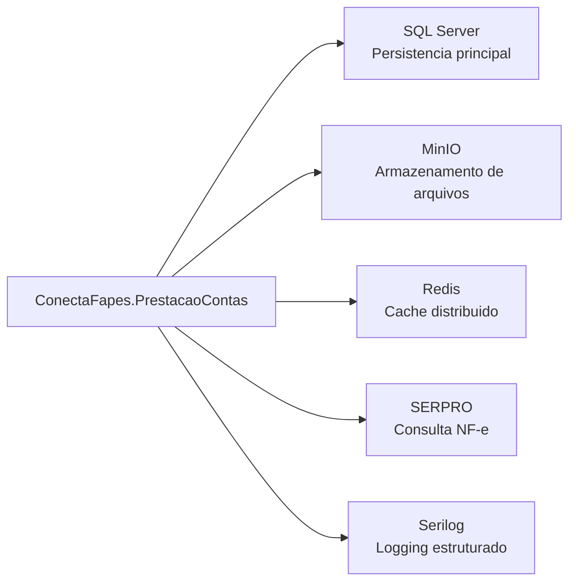

# Arquitetura — ConectaFapes Prestacao de Contas Backend

## Indice

- [1. Visao Geral](#1-visao-geral)
- [2. Estrutura de Projetos](#2-estrutura-de-projetos)
- [3. Camadas da Arquitetura](#3-camadas-da-arquitetura)
- [4. Fluxo de Dados](#4-fluxo-de-dados)
- [5. Padroes Arquiteturais](#5-padroes-arquiteturais)
- [6. Injecao de Dependencias](#6-injecao-de-dependencias)
- [7. Servicos Externos](#7-servicos-externos)
- [8. Preocupacoes Transversais](#8-preocupacoes-transversais)

---

## 1. Visao Geral

O backend do **ConectaFapes** segue uma arquitetura em camadas baseada em **Clean Architecture (Onion)**, combinada com os padroes **CQRS** e **MediatR Pipeline** para orquestracao de comandos e consultas.

### Diagrama de Camadas



---

## 2. Estrutura de Projetos

A solucao e composta por **5 projetos**, cada um com uma responsabilidade especifica:

```
src/
├── API/                                # Camada de apresentacao (API REST)
├── Application/                        # Logica de aplicacao e orquestracao
├── Domain/                             # Entidades e contratos de dominio
├── Infrastructure/                     # Acesso a dados e integracoes externas
├── Common/                             # Abstracoes compartilhadas
└── conectafapes-packages/              # Pacotes compartilhados do ecossistema ConectaFapes
```

| Projeto | Responsabilidade |
|---|---|
| **API** | Controllers REST, configuracao de middleware, autenticacao JWT, Swagger |
| **Application** | DTOs, Services, UseCases (CQRS), Mappers, Validators, Interfaces |
| **Domain** | Entidades de dominio, interfaces de repositorio, enumeracoes, excecoes de dominio |
| **Infrastructure** | Repositorios (EF Core), AppDbContext, migrations, servicos externos (SERPRO, MinIO) |
| **Common** | BaseEntity, BaseRepository, IUnitOfWork, Result/TResult, PaginationResponse, ApiResponse |

### Dependencias entre Projetos



> **Regra fundamental:** as camadas internas (Domain, Common) nunca referenciam camadas externas (Infrastructure, API). O fluxo de dependencia aponta sempre para o centro.

---

## 3. Camadas da Arquitetura

### 3.1 WebAPI (Apresentacao)

Camada responsavel por receber requisicoes HTTP e delegar o processamento para a camada de aplicacao via MediatR.

**Estrutura:**

```
API/
├── Controllers/
│   ├── BaseController/
│   │   └── BaseController.cs            # BaseController generico com CRUD
│   ├── Utils/
│   │   └── ApiRequestResult.cs          # Metodos auxiliares de resposta
│   ├── ContaBancariaController.cs
│   ├── ContaContabilController.cs
│   ├── DocumentoFiscalController.cs
│   ├── ItemDocumentoFiscalController.cs
│   ├── JustificativaDespesaController.cs
│   ├── JustificativaDiariaController.cs
│   ├── JustificativaInvoiceController.cs
│   ├── JustificativaNFController.cs
│   ├── OrcamentoController.cs
│   ├── OrcamentoFornecedorController.cs
│   ├── PrestacaoController.cs
│   └── TransacaoFinanceiraController.cs
├── Extensions/
│   ├── CorsPolicyExtension.cs
│   ├── DataProtectionExtension.cs
│   ├── EnvironmentExtension.cs
│   ├── JwtExtension.cs
│   ├── ProxyForwardedHeadersExtension.cs
│   └── SwaggerExtension.cs
├── Middleware/
│   ├── AuditMiddleware.cs
│   ├── ExceptionHandlingMiddleware.cs
│   └── PerformanceMonitoringMiddleware.cs
└── Program.cs
```

**BaseController** fornece endpoints CRUD genericos:

| Metodo HTTP | Endpoint | Operacao |
|---|---|---|
| GET | `/api/prestacao-de-contas/{entidade}` | Listar todos |
| GET | `/api/prestacao-de-contas/{entidade}/{id}` | Buscar por ID |
| POST | `/api/prestacao-de-contas/{entidade}` | Criar |
| PUT | `/api/prestacao-de-contas/{entidade}/{id}` | Atualizar |
| DELETE | `/api/prestacao-de-contas/{entidade}/{id}` | Excluir |

### 3.2 Application (Aplicacao)

**Estrutura:**

```
Application/
├── Configuration/
│   └── ServiceExtensions.cs
├── DTOs/
│   ├── ContaBancaria/
│   ├── ContaContabil/
│   ├── DocumentoFiscal/
│   ├── ItemDocumentoFiscal/
│   ├── JustificativaDespesa/
│   ├── JustificativaDiaria/
│   ├── JustificativaInvoice/
│   ├── JustificativaNF/
│   ├── Orcamento/
│   ├── OrcamentoFornecedor/
│   ├── Prestacao/
│   ├── TransacaoFinanceira/
│   └── Shared/
├── Interfaces/
│   ├── BaseServicesInterfaces/
│   ├── ExternalServices/
│   └── Pagination/
├── Mappers/
├── Services/
│   ├── BaseServices/
│   ├── CrudServices/
│   ├── ExternalServices/
│   ├── ExtractorServices/
│   └── PaginationServices/
├── Shared/
│   ├── Behavior/
│   │   └── ValidationBehavior.cs
│   └── Formatters/
└── UseCases/
    ├── BaseCases/
    ├── ContaBancariaCases/
    ├── ContaContabilCases/
    ├── DocumentoFiscalCases/
    ├── ItemDocumentoFiscalCases/
    ├── JustificativaDespesaCases/
    ├── JustificativaDiariaCases/
    ├── JustificativaInvoiceCases/
    ├── JustificativaNFCases/
    ├── OrcamentoCases/
    ├── OrcamentoFornecedorCases/
    ├── PrestacaoCases/
    └── TransacaoFinanceiraCases/
```

**Handlers genericos (BaseCases):**

| Handler | Comando/Query | Descricao |
|---|---|---|
| `CreateHandler` | `CreateCommand` | Cria uma entidade |
| `UpdateHandler` | `UpdateCommand` | Atualiza uma entidade |
| `DeleteHandler` | `DeleteCommand` | Remove uma entidade (soft delete) |
| `GetAllHandler` | `GetAllQuery` | Lista todas as entidades |
| `GetByIdHandler` | `GetByIdQuery` | Busca entidade por ID |

### 3.3 Domain (Dominio)

```
Domain/
├── Entities/
│   ├── PrestacaoContas/
│   │   ├── Prestacao.cs
│   │   ├── TransacaoFinanceira.cs
│   │   ├── ContaBancaria.cs
│   │   ├── Orcamento.cs
│   │   ├── ContaContabil.cs
│   │   ├── JustificativaDespesa.cs
│   │   ├── JustificativaNF.cs
│   │   ├── JustificativaDiaria.cs
│   │   ├── JustificativaInvoice.cs
│   │   ├── DocumentoFiscal.cs
│   │   ├── ItemDocumentoFiscal.cs
│   │   └── OrcamentoFornecedor.cs
│   └── ImportacaoEditais/
│       ├── ProjetoRef.cs
│       └── AlocacaoBolsistaRef.cs
├── Enums/
│   ├── StatusPrestacao.cs
│   ├── StatusTransacao.cs
│   ├── TipoOperacao.cs
│   ├── TipoNota.cs
│   ├── TipoMoeda.cs
│   ├── TipoJustificativa.cs
│   ├── TipoArquivoNfe.cs
│   └── TipoDocumentoFiscal.cs
├── Exceptions/
│   ├── DomainException.cs
│   ├── EntityNotFoundException.cs
│   ├── ValidationException.cs
│   ├── BusinessRuleViolationException.cs
│   └── ConcurrencyException.cs
└── Interfaces/
    ├── IPrestacaoRepository.cs
    ├── ITransacaoFinanceiraRepository.cs
    ├── IContaBancariaRepository.cs
    ├── IOrcamentoRepository.cs
    ├── IContaContabilRepository.cs
    ├── IJustificativaDespesaRepository.cs
    ├── IJustificativaNFRepository.cs
    ├── IJustificativaDiariaRepository.cs
    ├── IJustificativaInvoiceRepository.cs
    ├── IDocumentoFiscalRepository.cs
    ├── IItemDocumentoFiscalRepository.cs
    └── IOrcamentoFornecedorRepository.cs
```

> Para detalhes sobre as entidades, consulte [domain-entities.md](domain-entities.md).

### 3.4 Infrastructure (Infraestrutura)

```
Infrastructure/
├── Context/
│   ├── AppDbContext.cs
│   └── AppDbContextFactory.cs
├── Persistence/
│   └── Configurations/
│       ├── AlocacaoBolsistaRefConfiguration.cs
│       ├── ContaBancariaConfiguration.cs
│       ├── ContaContabilConfiguration.cs
│       ├── DocumentoFiscalConfiguration.cs
│       ├── ItemDocumentoFiscalConfiguration.cs
│       ├── JustificativaDespesaConfiguration.cs
│       ├── JustificativaDiariaConfiguration.cs
│       ├── JustificativaInvoiceConfiguration.cs
│       ├── JustificativaNFConfiguration.cs
│       ├── OrcamentoConfiguration.cs
│       ├── OrcamentoFornecedorConfiguration.cs
│       ├── PrestacaoConfiguration.cs
│       ├── ProjetoRefConfiguration.cs
│       └── TransacaoFinanceiraConfiguration.cs
├── Repositories/
│   ├── Common/
│   │   ├── BaseRepository.cs
│   │   └── UnitOfWork.cs
│   ├── ContaBancariaRepository.cs
│   ├── ContaContabilRepository.cs
│   ├── DocumentoFiscalRepository.cs
│   ├── ItemDocumentoFiscalRepository.cs
│   ├── JustificativaDespesaRepository.cs
│   ├── JustificativaDiariaRepository.cs
│   ├── JustificativaInvoiceRepository.cs
│   ├── JustificativaNFRepository.cs
│   ├── OrcamentoRepository.cs
│   ├── OrcamentoFornecedorRepository.cs
│   ├── PrestacaoRepository.cs
│   └── TransacaoFinanceiraRepository.cs
├── Services/
│   └── ExternalServices/
│       └── MinioService.cs
├── Migrations/
└── ServiceExtension.cs
```

### 3.5 Common (Compartilhado)

| Componente | Descricao |
|---|---|
| `BaseEntity` | Classe base com Id (Guid), DateCreated, DateUpdated, DateDeleted. Metodos `Update()` e `Delete()` (soft delete) |
| `IBaseRepository<T>` | Contrato base com Create, Update, Delete, GetById, GetAll, AddRange, UpdateRange, DeleteRange, SaveChangesAsync |
| `BaseRepository<T>` | Implementacao base do repositorio sobre EF Core |
| `IUnitOfWork` | Contrato para commit transacional (`Task Commit(CancellationToken)`) |
| `Result` | Tipo de resultado com IsSuccess, IsFailure, Errors, SetBadRequest(), SetNotFound() |
| `TResult<T>` | Resultado generico com Value, Success(), Created() |
| `Error` | Record com propriedade `Mensagem` |
| `ResultType` | Enum: CREATED, NOT_FOUND, BAD_REQUEST |
| `PaginationResponse<T>` | Resposta padronizada para paginacao (TotalRecords, TotalPages, PageNumber, PageSize, Items) |
| `ApiResponse` | Resposta padronizada da API (StatusCode, Message, Body, Uri, Errors) |
| `LoggedUserService` | Servico que extrai informacoes do usuario autenticado do HttpContext |

---

## 4. Fluxo de Dados

### 4.1 Fluxo de uma Requisicao (Exemplo: Criar Prestacao)



### 4.2 Pipeline do MediatR



O `ValidationBehavior` intercepta todas as requisicoes, executa os validators em paralelo (`Task.WhenAll`), e retorna erros no formato `{PropertyName}: {ErrorMessage}` caso a validacao falhe.

---

## 5. Padroes Arquiteturais

### 5.1 CQRS com MediatR

```
// Comando (escrita)
CreatePrestacaoCommand : IRequest<TResult<PrestacaoResponseDto>>

// Handler
CreatePrestacaoHandler : CreateHandler<CreatePrestacaoCommand, ...>
```

### 5.2 Repository Pattern



### 5.3 Unit of Work

- `IUnitOfWork` define `Task Commit(CancellationToken)`
- `UnitOfWork` encapsula `AppDbContext.SaveChangesAsync()`
- Handlers chamam `Commit()` apos todas as operacoes do repositorio

### 5.4 Classes Base Genericas

| Classe Base | Descricao |
|---|---|
| `BaseEntity` | Id (Guid), timestamps de auditoria, soft delete |
| `BaseRepository<T>` | Operacoes CRUD sobre DbContext |
| `BaseService<R, Resp, E, TR>` | Logica CRUD de servico com AutoMapper |
| `BaseController<...>` | Endpoints REST CRUD com autenticacao JWT |
| `CreateHandler<...>` | Handler generico de criacao |
| `UpdateHandler<...>` | Handler generico de atualizacao |
| `DeleteHandler<...>` | Handler generico de exclusao (soft delete) |
| `GetAllHandler<...>` | Handler generico de listagem |
| `GetByIdHandler<...>` | Handler generico de busca por ID |

---

## 6. Injecao de Dependencias

### Program.cs

```
builder.Services.ConfigurePersistenceApp(configuration)   // EF Core + Repositorios + Servicos Externos
builder.Services.ConfigureApplicationApp()                // Services + MediatR + Validators
builder.Services.ConfigureJwt()                           // Autenticacao JWT Bearer
builder.Services.ConfigureCorsPolicy()                    // Politica CORS
builder.Services.ConfigureSwagger()                       // Swagger/OpenAPI
```

### Application — ServiceExtensions.cs

- AutoMapper (escaneamento por assembly)
- MediatR com descoberta automatica de handlers
- FluentValidation com descoberta automatica de validators
- `ValidationBehavior<,>` como `IPipelineBehavior` (Transient)
- Services de aplicacao (Scoped):
  - CRUD: ContaBancariaService, ContaContabilService, DocumentoFiscalService, ItemDocumentoFiscalService, JustificativaDespesaService, JustificativaDiariaService, JustificativaInvoiceService, JustificativaNFService, OrcamentoFornecedorService, OrcamentoService, PrestacaoService, TransacaoFinanceiraService
  - Autenticacao: BaseAuthenticationService
  - Extratores: ChaveAcessoExtractorService, TipoArquivoIdentifierService, NotaFiscalIdentifierService, NfseExtractorService
  - Paginacao: TransacaoFinanceiraPaginationService, PrestacaoPaginationService

### Infrastructure — ServiceExtension.cs

- `AppDbContext` (Scoped, SQL Server via connection string de ambiente)
- Redis (Singleton IConnectionMultiplexer + Scoped RedisService — condicional, ativado por `REDIS_URL`)
- `UnitOfWork` (Scoped)
- Repositorios (todos Scoped): ContaBancariaRepository, ContaContabilRepository, DocumentoFiscalRepository, ItemDocumentoFiscalRepository, JustificativaDespesaRepository, JustificativaDiariaRepository, JustificativaInvoiceRepository, JustificativaNFRepository, OrcamentoFornecedorRepository, OrcamentoRepository, PrestacaoRepository, TransacaoFinanceiraRepository
- SERPRO: SerproTokenService e SerproNfeService (HttpClient)
- MinIO: MinioService (Scoped)

---

## 7. Servicos Externos



| Servico | Tipo | Descricao |
|---|---|---|
| **SQL Server** | Banco de dados | Persistencia principal via EF Core. Migrations gerenciados pelo assembly `Conectafapes.PrestacaoContas.Infrastructure` |
| **MinIO** | Armazenamento | Armazenamento de objetos para PDFs de orcamento de fornecedor e arquivos de justificativa. Suporta pre-signed URLs para upload direto do cliente |
| **Redis** | Cache | Cache distribuido. Configuracao opcional — ativado quando a variavel de ambiente `REDIS_URL` esta definida |
| **SERPRO** | API externa | Consulta de NF-e (Nota Fiscal Eletronica) via API SERPRO. Autenticacao OAuth2 com cache de token via SerproTokenService |
| **Serilog** | Logging | Logging estruturado para console e arquivo. Arquivos com rolling diario em `logs/prestacao-contas-.txt` |

---

## 8. Preocupacoes Transversais

| Preocupacao | Implementacao | Localizacao |
|---|---|---|
| **Validacao** | FluentValidation via MediatR `ValidationBehavior`. Validators executados em paralelo com `Task.WhenAll()` | `Application/Shared/Behavior/ValidationBehavior.cs` |
| **Autenticacao** | JWT Bearer tokens com schema "JwtBearer" | `API/Extensions/JwtExtension.cs` |
| **Autorizacao** | Atributo `[Authorize(AuthenticationSchemes = "JwtBearer")]` no BaseController | `API/Controllers/BaseController/BaseController.cs` |
| **Logging** | Serilog com rolling diario e enriquecimento de contexto (Application: "PrestacaoContas") | `API/Program.cs` |
| **Tratamento de Excecoes** | ExceptionHandlingMiddleware retorna RFC 7807 ProblemDetails: EntityNotFoundException→404, ValidationException→400, BusinessRuleViolation→422, ConcurrencyException→409 | `API/Middleware/ExceptionHandlingMiddleware.cs` |
| **Health Check** | Endpoint `/health` com verificacao de banco de dados e API | `API/Program.cs` |
| **Soft Delete** | `DateDeleted` em `BaseEntity`. Metodo `Delete()` marca a data ao inves de remover fisicamente | `Common/Domain/BaseEntities/BaseEntity.cs` |
| **Cache** | Redis com conexao opcional e nao-bloqueante (depende de variavel de ambiente) | `Infrastructure/ServiceExtension.cs` |
| **Data Protection** | ASP.NET Core Data Protection configurado para ambientes de producao | `API/Extensions/DataProtectionExtension.cs` |

---

## Dominios Funcionais

| Dominio | Descricao |
|---|---|
| **Financeiro** | Gestao de contas bancarias, transacoes financeiras, orcamentos anuais e contas contabeis com estrutura hierarquica |
| **Comprovacao de Despesas** | Justificativas de despesa (NF, Diaria, Invoice), documentos fiscais com integracao SERPRO, itens de documento fiscal e orcamentos de fornecedor |
| **Prestacao de Contas** | Ciclo de vida da prestacao de contas com maquina de estados (RASCUNHO → EM_ANALISE → REVISAO/FINALIZADO/NEGADO), submissao e validacao |
| **Importacao de Editais** | Entidades de referencia (ProjetoRef, AlocacaoBolsistaRef) mapeadas a views de banco de dados de sistema externo |
