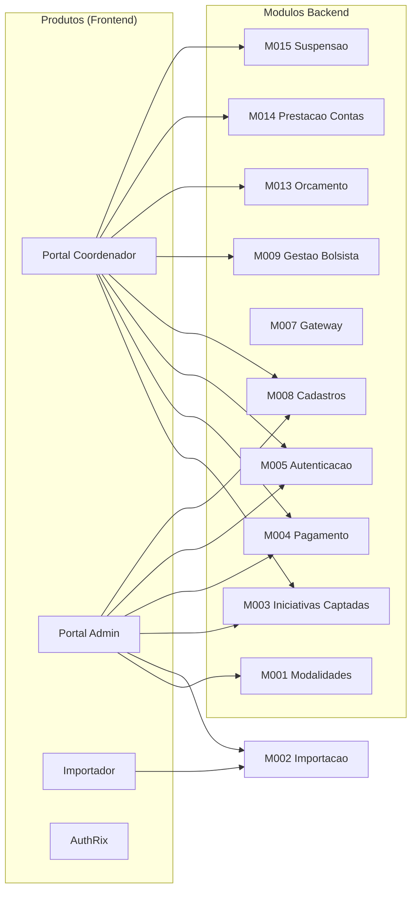

# Produtos — Conecta FAPES

Canais de entrega frontend que compoem funcionalidades de multiplos modulos backend.

[← Voltar a documentacao principal](../README.md)

---

## Conceito

A plataforma **Conecta FAPES** e composta por modulos backend (bounded contexts documentados em `implementation/modules/`) e **produtos** que sao aplicacoes frontend consumindo esses modulos. Cada produto atende a um perfil de usuario e agrega funcionalidades de varios modulos numa experiencia integrada.

## Indice de Produtos

| Produto | Descricao | Perfil principal | Stack | Status |
|---------|-----------|------------------|-------|--------|
| [Portal Coordenador](portal-coordenador/README.md) | Portal web do coordenador de projeto para gestao de equipe, bolsas, pagamentos e prestacao de contas | Coordenador de Projeto, Bolsista | Vue 3, Nuxt UI, Tailwind CSS v4 | Em producao |
| [Portal Admin](portal-admin/README.md) | Portal administrativo da agencia de fomento (back-office) | Operadores GEPOF, Diretores, Areas Tecnicas | Vue 3, Nuxt UI | Documentacao pendente |
| [Importador](importador/README.md) | Ferramenta de importacao de dados do sistema legado SIGFAPES | Equipe tecnica | Vue, Node | Documentacao pendente |
| [AuthRix](authrix/README.md) | Sistema interno de autorizacao (PDP) consumido pelos demais produtos | — (infra) | OpenFGA | Em desenvolvimento |

## Relacao com outros artefatos

| Artefato | Relacao |
|----------|---------|
| [management/roadmap.md](../management/roadmap.md) | Rastreia entregas por produto e trimestre |
| [management/releases-2026.csv](../management/releases-2026.csv) | Fonte de verdade de entregas — coluna "Produto" |
| `docs/implementation/modules/` | Modulos backend consumidos pelos produtos |
| [architecture/](../architecture/README.md) | Decisoes tecnicas transversais (backend, infra, seguranca) |
