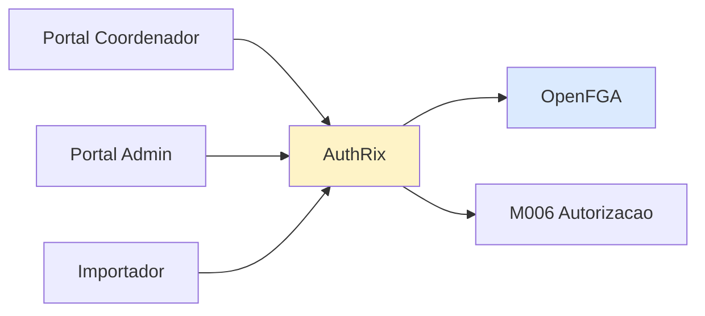

# AuthRix

Sistema interno de autorizacao da Conecta FAPES. Decide se uma pessoa pode ou nao usar um servico dentro dos produtos Front-office, Back-office e Importador.

[← Voltar aos Produtos](../README.md)

---

## Sobre o Produto

O AuthRix e o sistema responsavel por autorizar (ou negar) o acesso de pessoas a servicos/funcionalidades oferecidas pelos produtos da plataforma. Funciona como camada central de autorizacao, consumindo decisoes de politicas gerenciadas internamente com apoio do OpenFGA.

| Atributo | Valor |
|----------|-------|
| **Tipo** | Produto interno em desenvolvimento |
| **Responsaveis** | Joao Marcos, Arthur Cremasco |
| **Stack interna** | OpenFGA (motor de autorizacao) |
| **Status** | Em desenvolvimento (sem documentacao formal) |
| **Consumidores** | Portal Coordenador, Portal Admin, Importador |
| **Modulo backend relacionado** | [M006 — Autorizacao](../../implementation/modules/M006-autorizacao/README.md) |

---

## Funcao no Ecossistema

AuthRix atua como **PDP (Policy Decision Point)** centralizado:

- Produtos front-end consultam o AuthRix antes de liberar telas/acoes
- AuthRix avalia politicas (RBAC + ABAC) via OpenFGA
- Resposta: `ALLOW` ou `DENY` + motivo
- Complementa (nao substitui) as verificacoes de autorizacao feitas em cada modulo backend (Defense in Depth)

---

## Pendencias

| Item | Responsavel | Status |
|------|-------------|--------|
| Documentacao formal do produto (arquitetura, API, politicas) | Joao Marcos + Arthur Cremasco | A fazer |
| Levantamento de SDKs/bibliotecas para os 3 produtos | Joao Marcos + Arthur Cremasco | A fazer |
| EPIC de integracao Front-office ↔ AuthRix | A definir | A fazer |
| Contrato de API para consulta de autorizacao | A definir | A fazer |

---

## Referencias

- [ADR-007 — Autorizacao OpenFGA](../../architecture/adr/ADR-007-autorizacao-openfga.md) — Decisao arquitetural do motor de autorizacao
- [Arquitetura — Acesso e Seguranca](../../architecture/03-acesso-e-seguranca.md) — Modelo XACML (PAP/PIP/PDP/PEP)
- [M006 — Autorizacao](../../implementation/modules/M006-autorizacao/README.md) — Modulo backend relacionado
