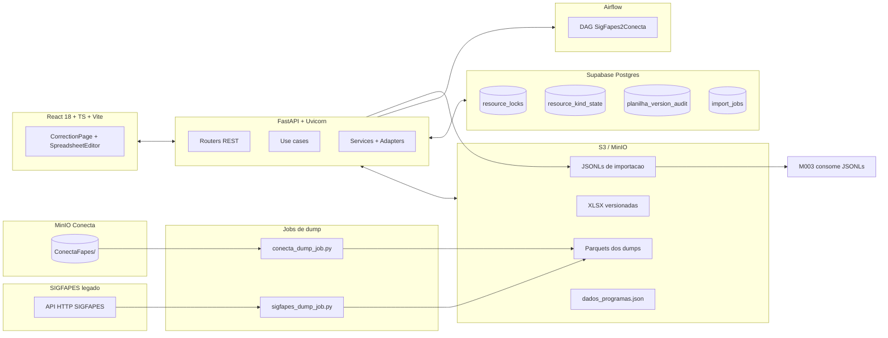

# Arquitetura do Importador SIGFAPES

[← Voltar ao Importador](README.md)

> Arquitetura ponta a ponta (frontend + backend + infraestrutura) do produto Importador SIGFAPES. Complementa [architecture/](../../architecture/README.md) e o [ADR-011 - Arquitetura do Importador SIGFAPES](../../architecture/adr/ADR-011-arquitetura-importador-sigfapes.md). Fonte: repositorio [`MateusLannes/importacao-conecta-backend`](https://github.com/MateusLannes/importacao-conecta-backend).

## Visao geral

O Importador e uma aplicacao web operada pela equipe tecnica que cobre o ciclo completo de correcao e importacao de editais do SIGFAPES para o ConectaFAPES. A arquitetura e organizada em quatro camadas integradas por S3 e Supabase:

1. **Producao de dados** — dois scripts Python publicam dumps no S3: `scripts/sigfapes_dump_job.py` consome a API HTTP do SIGFAPES (com `AdaptiveRateController` e autenticacao por token), e `scripts/conecta_dump_job.py` copia Parquets ja materializados no MinIO do Conecta. Orquestracao futura via DAG Airflow `SigFapes2Conecta`.
2. **Backend** — FastAPI em camadas (router → service → adapter → client), com use_cases em rollout opt-in, consome Parquets, gera planilhas XLSX pre-preenchidas, versiona uploads corrigidos, valida dados e produz JSONLs de importacao.
3. **Frontend** — React + TypeScript com virtual scroll para editar planilhas de 5000+ linhas com validacoes em tempo real.
4. **Persistencia auxiliar** — Supabase Postgres guarda locks, estado de tipo ativo, auditoria de versoes e fila de jobs.



---

## Arquitetura do backend em camadas

Estilo hexagonal/clean em migracao gradual via feature flags (`USE_CASES_ENABLED`, `ASYNC_JOBS_ENABLED`, `LOCKS_ENABLED`).

```
HTTP Request
   ↓
[app/factory.py]                 cria FastAPI, aplica middlewares e registra routers
   ↓
[app/middleware/request_context] injeta X-Request-ID + user_id em ContextVar, loga request_started/finished
   ↓
[app/security/jwt_auth]          valida JWT Supabase (JWKS cache 3600s) via cookie ou Bearer
   ↓
[app/routers/*]                  entrypoints HTTP (Pydantic DTOs)
   ↓
   ├─→ [app/use_cases/*]         quando USE_CASES_ENABLED=1 — orquestra regra de negocio e lanca DomainError
   │     ↓
   │  [app/services/*]           regra de dominio (locks, auditoria, planilhas, dumps)
   │     ↓
   │  [app/adapters/*]           S3Adapter, SupabaseDbAdapter, SupabaseAuthAdapter, AirflowAdapter
   │     ↓
   │  [app/clients/*]            boto3 e httpx crus
   │
   └─→ fallback legado inline    quando USE_CASES_ENABLED=0 — codigo antigo no router
         ↓
      [app/gateways/*]           bridge para scripts Python raiz (planilha_edital, geraArquivosImportacao)
```

### Mapa de pastas

```
app/
├── main.py                  # app = create_app()
├── factory.py               # monta FastAPI + middlewares + routers
├── settings.py              # envs globais (os.getenv direto)
├── core/
│   ├── settings.py          # AppSettings (Pydantic) com lru_cache
│   ├── providers.py         # singletons de adapters
│   ├── request_context.py   # ContextVars request_id e user_id
│   └── validation.py        # normalize_edital_id, current_month_year, ensure_internal_role
├── middleware/request_context.py
├── security/jwt_auth.py     # JWKS cache, cookie+Bearer, require_authenticated_user, require_internal_role
├── api/error_mapper.py      # DomainError -> HTTPException
├── domain/
│   ├── errors.py            # 7 subclasses (Validation/Unauthorized/Forbidden/NotFound/Conflict/Config/External)
│   └── types.py             # ResourceKind enum
├── routers/                 # auth, editais, importacao, internal, jobs, locks, planilhas, programas, status, upload
├── services/                # locks, editais, planilhas, planilha_audit_service, s3_audit_metadata, jobs, sigfapes_dump, conecta_dump, airflow_check, airflow_trigger, validacao_upload
├── use_cases/               # create_planilha_edital, upload, validate_upload, generate_jsonl, switch_resource_kind, job_executor, _legacy_bridge
├── adapters/                # s3_adapter, supabase_auth_adapter, supabase_db_adapter, airflow_adapter
├── gateways/                # legacy_planilhas (planilha_edital.py), legacy_importacao (geraArquivosImportacao.py)
└── clients/                 # s3 (boto3), supabase_auth (httpx), supabase_db (PostgREST)
```

### Feature flags

| Flag | Default | Efeito |
|------|---------|--------|
| `LOCKS_ENABLED` | `0` | Exige lock valido em todos os writes |
| `USE_CASES_ENABLED` | `0` | Roteia endpoints para camada de use_cases |
| `ASYNC_JOBS_ENABLED` | `0` | Habilita `?async=true` + worker |
| `AUDIT_DB_ENABLED` | `1` | Grava `planilha_version_audit` em toda escrita |
| `AUDIT_DB_STRICT` | `0` | Falha o write se auditoria falhar |
| `LOG_STRUCTURED` | `1` | Logs JSON estruturados |

### Hierarquia de erros

`DomainError` lancado pela camada de negocio → `app/api/error_mapper.py:raise_http_from_domain` → HTTPException com payload `{error, detail, meta}`.

| Subclasse | HTTP | Uso |
|-----------|------|-----|
| `ValidationError` | 400 | DTO malformado, regras de negocio |
| `UnauthorizedError` | 401 | Token ausente/invalido |
| `ForbiddenError` | 403 | Sem lock valido, sem role |
| `NotFoundError` | 404 | Dump/planilha inexistente |
| `ConflictError` | 409 | Versao desatualizada, troca de tipo |
| `ConfigError` | 500 | `S3_BUCKET` nao configurado, etc |
| `ExternalServiceError` | 502 | Falha S3/Supabase/Airflow |

---

## Frontend (`frontend/`)

```
frontend/src/
├── App.tsx                   # /login, /editais, /correcao/:editalId
├── main.tsx                  # BrowserRouter + AuthProvider
├── contexts/AuthContext.tsx  # token em sessionStorage
├── components/
│   ├── auth/ProtectedRoute.tsx
│   ├── layout/AppShell.tsx
│   ├── spreadsheet/SpreadsheetEditor.tsx  # virtual scroll 52px, overscan 5, 9 regras
│   └── correction/           # SheetSetupModal, ProgramConfigModal, KindSwitchModal, ValidationSidebar, PreviousMonthModal, BolsistaDumpModal
├── pages/
│   ├── LoginPage.tsx
│   ├── EditaisPage.tsx       # lista + grafico, filtros, polling de lock
│   └── CorrectionPage.tsx    # orquestra useLock + useSheetData + useUploadPlanilha + useProgramConfig
├── hooks/
│   ├── useLock.ts            # acquire/heartbeat 45s/release, grace 120s, 3 falhas -> libera
│   ├── useSheetData.ts       # GET /planilha-selecionada, parse base64
│   ├── useUploadPlanilha.ts  # validate + upload com base_version
│   ├── useProgramConfig.ts   # GET/POST /dados-programas
│   ├── usePreviousMonthSheets.ts
│   └── useCorrectionResource.ts
├── lib/
│   ├── api.ts                # cliente HTTP tipado, ApiError
│   ├── xlsx.ts               # parse base64 <-> Workbook (SheetJS)
│   ├── planilhaHelpers.ts
│   ├── planilhaValidation.ts
│   └── correctionPlanilha.ts
└── types/api.ts              # interfaces de todas as respostas
```

Detalhes em [frontend-structure.md](frontend-structure.md).

---

## Fluxos ponta a ponta

### 1. Geracao inicial da planilha (`POST /cria-planilha-edital`)

```
Operador → POST /cria-planilha-edital {edital_id, is_programa}
          → Router resolve claims JWT
          → (USE_CASES_ENABLED) CreatePlanilhaEditalUseCase
              → select_latest_complete_dump_prefix (marker dump_complete.json)
              → ensure_first_planilha_can_be_created (409 se ja existir neste mes)
              → planilha_edital.generate_planilha_edital_to_s3
                  - 4 fetches S3 paralelos (ThreadPoolExecutor)
                  - calcula effective_end e MESES_DE_ATIVIDADE vetorizadamente
                  - xlsxwriter monta XLSX com 5 niveis
              → put_object com x-amz-meta-* (audit metadata)
              → record_version_event (action=create_initial) em planilha_version_audit
              → set_active_resource_kind em resource_kind_state
          → 200 {ok, bucket, key}
          | OU, se ?async=true e ASYNC_JOBS_ENABLED=1:
          → create_job em import_jobs -> 202 {job_id}
          → worker consome e atualiza status
```

### 2. Edicao colaborativa com lock

```
Operador → POST /locks/acquire {edital_id, kind}
          → service insere linha em resource_locks com lock_token, expires_at (now + TTL)
          → indice unico parcial (WHERE released_at IS NULL) garante exclusividade
          → 200 com lock_token
          | ou 409 {locked_by, expires_at}

Frontend → setInterval(45_000) -> POST /locks/heartbeat
          → atualiza heartbeat_at + expires_at (lenient de 120s antes de expirar)

Operador corrige -> GET /planilha-selecionada (base64)
                 -> validacao inline (9 regras) em SpreadsheetEditor

POST /validate-upload-planilha (nao escreve, nao requer lock)
  -> geraArquivosImportacao.collect_all_planilha_validation_errors
  -> compute_planilha_diff (changed_cells, added, removed)
  -> sempre 200 com errors/warnings/diff

POST /upload-planilha-corrigida {lock_token, base_version}
  -> validate_write_lock (lock_token casa com dono)
  -> validate_base_version_or_raise (latest_version S3 == base_version, senao 409)
  -> valida layout e regras
  -> put_object com version = base_version + 1
  -> record_version_event (action=upload_corrigida)
  -> 200 com new_version

Operador sair -> POST /locks/release {reason}
```

### 3. Troca editais ↔ programas (`POST /recurso-kind/switch`)

```
1. resolve_historico_kind_and_keys (kind atual)
2. validate_write_lock no kind atual
3. clone_latest_historico_version_between_kinds no S3 (ultima versao -> novo kind)
4. set_active_resource_kind (resource_kind_state.active_kind = target_kind)
5. record_version_event (action=switch_clone)
6. linha em resource_kind_switch_log (from, to, cloned_source_key, cloned_target_key)
7. libera lock antigo, gera novo lock para a nova resource_key
```

Trade-off conhecido: janela entre release do lock antigo e acquire do novo — mitigada por unique index parcial no Postgres.

### 4. Jobs assincronos (`?async=true`)

```
Router -> create_job em import_jobs (status=pending, payload JSON)
       -> 202 {job_id}

scripts/job_worker.py:
  loop infinito
    -> claim_next_pending_job (UPDATE SET status=running WHERE status=pending LIMIT 1)
    -> execute_job_payload (despacha por job_type para o use case certo)
    -> complete_job(job_id, result) | fail_job(job_id, error_message)

GET /jobs/{job_id} (polling do frontend)
```

### 5. Auditoria

Tripla gravacao em cada write:

1. **S3 metadata** — headers `x-amz-meta-user-id`, `x-amz-meta-user-email`, `x-amz-meta-action`, `x-amz-meta-request-id` ([`s3_audit_metadata.py`](https://github.com/MateusLannes/importacao-conecta-backend/blob/main/app/services/s3_audit_metadata.py)).
2. **Banco** — linha em `planilha_version_audit` com `action ∈ {create_initial, upload_corrigida, switch_clone, legacy_backfill}`.
3. **Log estruturado** — eventos JSON com `request_id` e `user_id` correlacionados.

Backfill para planilhas anteriores ao sistema: `POST /internal/planilha-audit/backfill`.

---

## Modelo de dados (Supabase)

### `resource_locks`

```sql
id uuid PRIMARY KEY
resource_key text           -- MM_YYYY/kind/edital_id
month_year text CHECK ^\d{2}_\d{4}$
kind text CHECK IN ('editais','programas')
edital_id text CHECK ^\d+$
owner_user_id text          -- JWT sub
owner_email text
lock_token uuid
acquired_at, heartbeat_at, expires_at, released_at timestamptz
release_reason text

UNIQUE INDEX on (resource_key) WHERE released_at IS NULL
```

### `import_jobs`

```sql
id uuid PRIMARY KEY
job_type text               -- cria_planilha_edital | gerar_jsonl
status text CHECK IN ('pending','running','completed','failed')
payload jsonb
result jsonb
error text
attempts integer
created_by text             -- JWT sub
worker_id text              -- 'job-worker'
timestamps: created_at, updated_at, started_at, finished_at
```

### `resource_kind_state` + `resource_kind_switch_log`

```sql
resource_kind_state:
  (edital_id, month_year) UNIQUE
  active_kind text
  updated_by text

resource_kind_switch_log:
  from_kind, to_kind
  switched_by text
  cloned_source_key, cloned_target_key text
```

### `planilha_version_audit`

```sql
id uuid PRIMARY KEY
month_year, kind, edital_id text
version integer
s3_key text UNIQUE
action text CHECK IN ('create_initial','upload_corrigida','switch_clone','legacy_backfill')
actor_user_id, actor_email, request_id text
created_at timestamptz

UNIQUE (month_year, kind, edital_id, version)
```

---

## Autenticacao e autorizacao

| Aspecto | Implementacao |
|---------|---------------|
| Provedor | Supabase Auth (email/password) |
| Tokens | JWT Bearer + cookies HttpOnly (`sb-access-token`, `sb-refresh-token`) |
| Validacao | `app/security/jwt_auth.py` — cache JWKS TTL 1h, valida `iss`, `aud`, algoritmo (`ES256,RS256` default), leeway 30s |
| Perfil | Equipe tecnica da FAPES, provisionamento manual |
| Role | `role` no claim JWT; rotas `/internal/*` exigem `role ∈ INTERNAL_ALLOWED_ROLES` |
| Propagacao | `set_user_id` em ContextVar para logs correlacionados |

---

## Integracao com modulos

| Modulo | Papel | Relacao |
|--------|-------|---------|
| [M002](../../implementation/modules/M002-importacao-editais/README.md) | Backend do produto | Toda logica de correcao, locks e auditoria |
| M003 | Destino dos JSONLs | Consome `importacao/*.jsonl` |
| M008 | Destino indireto | Pessoas, Instituicoes, AreaTecnica via M003 |
| M001 | Referencia | Niveis de bolsa |

---

## Decisoes arquiteturais relevantes

- **Dump batch em vez de integracao online** com SIGFAPES ([ADR-011](../../architecture/adr/ADR-011-arquitetura-importador-sigfapes.md)). Dois scripts publicam Parquets diarios.
- **Versionamento manual no S3** com prefixo numerico `<N>_<DD_MM_YYYY>_....xlsx` em vez de S3 native versioning — evita custos e simplifica listagem.
- **Controle otimista por `base_version`** — requerido no upload; conflito responde 409 explicando a versao mais recente.
- **Lock explicito por recurso** com indice unico parcial (`WHERE released_at IS NULL`) e heartbeat 45s (grace 120s).
- **Calculos vetorizados** (`np.where`) em `planilha_edital.py` em vez de `df.apply()` — 100x mais rapido em editais de 5000+ linhas.
- **4 fetches S3 paralelos** com `ThreadPoolExecutor` antes de qualquer processamento.
- **Virtual scroll manual** sem bibliotecas (52px/linha, overscan 5).
- **Feature flags** (`USE_CASES_ENABLED`, `ASYNC_JOBS_ENABLED`, `LOCKS_ENABLED`) permitem rollout incremental — codigo novo convive com legado.
- **Tripla auditoria** (S3 meta + Postgres + logs JSON) com `X-Request-ID` propagado.
- **JWKS cache 1h** — reduz chamadas ao Supabase em quase 100%.
- **AdaptiveRateController** no dump SIGFAPES — RPM dinamica por fase (EDITAIS/PROJETOS/BOLSISTAS), ajusta por P95 e taxa de erro, janela de controle 60s.

## Trade-offs conhecidos

| Decisao | Contrapartida | Mitigacao |
|---------|---------------|-----------|
| Feature flags duplicam caminhos de codigo | Manutencao maior | Converger para use_cases quando estavel |
| S3 versioning manual por filename | Frageis a refactor de nomes | Regex centralizada (`VERSIONED_XLSX_RE`) |
| Endpoints sincronos pesados | Timeout Render free > 30s | `?async=true` + worker |
| Lock TTL + heartbeat | Janela de race no switch de kind | Indice unico parcial no Postgres |
| Scripts legados sem type hints completos | Dificil refactor | Gateways isolam chamada para planilha_edital.py |

## Diferencas em relacao aos portais ConectaFAPES

| Aspecto | Portais (Coordenador/Admin) | Importador |
|---------|----------------------------|------------|
| Usuarios | Centenas (coordenadores, operadores) | Equipe tecnica (<10 usuarios) |
| Uso | Continuo | Janelas mensais por competencia |
| Modulos consumidos | Multiplos (M001-M016) | Unico (M002) |
| Frontend | Vue 3 + Nuxt UI + Tailwind | React 18 + Vite + CSS puro |
| BFF | Planejado (ADR-005) | Nao aplicavel |
| Concorrencia | Audit + workflow | Lock exclusivo com heartbeat |

---

## Documentos relacionados

- [Tecnologia detalhada](technology.md) — versoes, bibliotecas e justificativas
- [Estrutura do backend](backend-structure.md) — routers, services, use cases em detalhe
- [Estrutura do frontend](frontend-structure.md) — paginas, hooks, componentes
- [Referencia de API](api-reference.md) — todos os endpoints
- [Setup local](setup.md) — como rodar em dev
- [Backlog de EPICs e US](backlog.md) — funcionalidades derivadas do codigo
- [ADR-011 - Arquitetura do Importador SIGFAPES](../../architecture/adr/ADR-011-arquitetura-importador-sigfapes.md)
