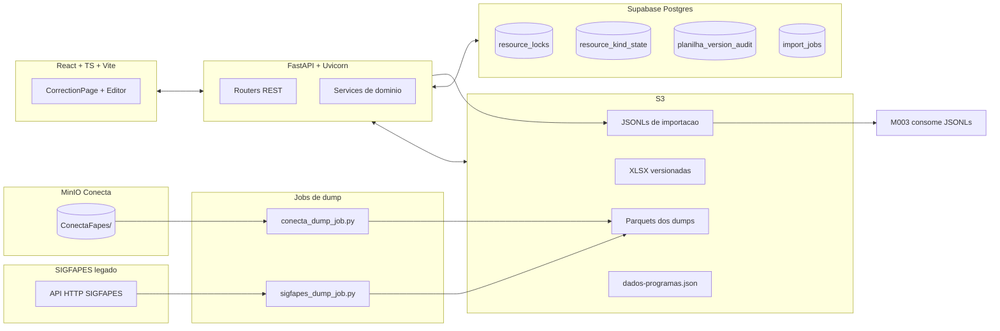

# Arquitetura do Importador SIGFAPES

[← Voltar ao Importador](README.md)

> Este documento descreve a arquitetura ponta a ponta (frontend + backend + infraestrutura) do produto Importador SIGFAPES. Para padroes arquiteturais gerais do ecossistema ConectaFAPES, consulte [architecture/](../../architecture/README.md) e o [ADR-011 - Arquitetura do Importador SIGFAPES](../../architecture/adr/ADR-011-arquitetura-importador-sigfapes.md).

## Visao geral

O Importador e uma aplicacao web operada pela equipe tecnica que cobre o ciclo completo de correcao e importacao de editais do SIGFAPES para o ConectaFAPES. A arquitetura e organizada em quatro camadas integradas por S3 e Supabase:

1. **Producao de dados** — dois scripts Python publicam dumps no S3: `scripts/sigfapes_dump_job.py` consome a API HTTP do SIGFAPES (com `AdaptiveRateController` e autenticacao por token), e `scripts/conecta_dump_job.py` copia Parquets ja materializados no MinIO do Conecta. Orquestracao futura via DAG Airflow `SigFapes2Conecta` — o trigger a partir do frontend esta pendente.
2. **Backend** - FastAPI le os Parquets, gera planilhas XLSX pre-preenchidas, versiona uploads corrigidos, valida dados e produz JSONLs de importacao.
3. **Frontend** - React + TypeScript com virtual scroll para editar planilhas de 5000+ linhas com validacoes em tempo real.
4. **Persistencia auxiliar** - Supabase Postgres guarda locks, estado de tipo ativo, auditoria de versoes e fila de jobs.

## Stack detalhada

### Backend (`app/`)

| Componente | Tecnologia | Responsabilidade |
|------------|-----------|------------------|
| API HTTP | FastAPI + Uvicorn | 26 endpoints REST agrupados em 9 recursos |
| Autenticacao | Supabase Auth (signInWithPassword) | Login + refresh via cookies HttpOnly |
| Autorizacao | JWT Bearer + middleware em `security/jwt_auth.py` | Protege rotas de escrita |
| Leitura Parquet | pandas 3.0 + pyarrow 23 | Selecao de colunas, sem carregar colunas desnecessarias |
| Geracao XLSX | xlsxwriter | Layout com 5 grupos de colunas de nivel |
| Storage | boto3 | S3 direto, sem SDK intermediario |
| Banco auxiliar | Supabase REST + SQL | Locks, auditoria e jobs |
| Airflow trigger | `airflow_trigger.py` e `airflow_check.py` | Disparar/acompanhar DAGs (rotas backend prontas; botao no frontend pendente) |

### Frontend (`frontend/`)

| Componente | Tecnologia | Responsabilidade |
|------------|-----------|------------------|
| Build tool | Vite | Dev server porta 5173, HMR |
| Framework | React 18 | Componentes funcionais + hooks |
| Tipagem | TypeScript estrito | Interfaces em `types/api.ts` |
| Estado | Context API | `AuthContext` para sessao |
| HTTP | Cliente custom em `lib/api.ts` | Bearer nos headers, endpoints centralizados |
| XLSX | biblioteca `xlsx` | Parse/serialize no navegador |
| Datas | `react-datepicker` | Campo de data na celula |
| Virtual scroll | Implementacao manual | 52px/linha, overscan 5 linhas |
| Estilos | CSS puro modular em `src/styles/` | `base.css`, `components.css`, `responsive.css` e `features/{correction,editais,import-sidebar,login,modals,programas,spreadsheet}.css`; tokens de design, sem Tailwind |

### Infraestrutura

- **S3**: bucket unico com prefixos para dumps, planilhas e JSONLs.
- **Supabase**: instancia compartilhada com Auth + Postgres. Tabelas: `resource_locks`, `resource_kind_state`, `resource_kind_switch_log`, `planilha_version_audit`, `import_jobs`.
- **Airflow**: externo, mantido pela equipe de dados; orquestrara a DAG `SigFapes2Conecta` (ainda em desenvolvimento). Hoje os dois jobs de dump rodam como scripts Python em `scripts/`.
- **Deploy**: Render com `render.yaml`. Backend e frontend sobem como servicos separados.

## Fluxo operacional ponta a ponta

1. **Madrugada** - `scripts/sigfapes_dump_job.py` consome a API HTTP do SIGFAPES e publica `editais.parquet`, `projetos_por_edital.parquet`, `bolsistas_projeto.parquet` (e JSONs auxiliares) em `<SIGFAPES_DUMP_PREFIX>/<DD_MM_YYYY>/`; `scripts/conecta_dump_job.py` copia `editais.parquet`, `projetos.parquet`, `alocacoes_bolsistas.parquet` e tabelas de nivel/modalidade do MinIO do Conecta para `<CONNECTA_DUMP_PREFIX>/<DD_MM_YYYY>/`. Ambos gravam marker `dump_complete.json` para idempotencia.
2. **Manha** - Operador loga (Supabase Auth), acessa `/editais-latest`. Backend le Parquets, calcula contagens e flag `novo_este_mes` (60 dias), retorna lista.
3. **Selecao** - Operador clica em um edital, frontend solicita `POST /locks/acquire`. Backend cria lock exclusivo e retorna `lock_token`.
4. **Geracao** - Frontend chama `POST /cria-planilha-edital`. Backend faz 4 fetches S3 paralelos, vetoriza calculos (effective_end, meses_de_atividade, total_deve_receber), monta XLSX com `xlsxwriter` e persiste como `v1`.
5. **Edicao** - Frontend renderiza planilha com virtual scroll. Heartbeat a cada 45s renova o lock. Alteracoes ficam em estado dirty.
6. **Validacao** - Operador chama `POST /validate-upload-planilha`. Backend retorna errors/warnings/diff.
7. **Upload** - Se aprovado, `POST /upload-planilha-corrigida` grava `v{N+1}` e registra em `planilha_version_audit`.
8. **Programas** - Operador mapeia `projeto_id -> AreaTecnica` em `dados-programas.json` via `POST /dados-programas`.
9. **Geracao de JSONL** - `POST /gerar-jsonl` cria `import_jobs`, worker le planilha ativa, produz JSONLs por entidade e grava em `importacao/MM_YYYY/<edital_id>/*.jsonl`.
10. **Consumo** - M003 le os JSONLs e importa para o banco canonico.

## Autenticacao

| Aspecto | Implementacao |
|---------|---------------|
| Provedor | Supabase Auth (nao Acesso Cidadao) |
| Tokens | JWT Bearer + cookies HttpOnly (`sb-access-token`, `sb-refresh-token`) |
| Refresh | Middleware valida expires e chama Supabase refresh quando necessario |
| Perfil | Equipe tecnica da FAPES, usuarios provisionados manualmente |
| Autorizacao | Controle binario: usuario autenticado tem acesso total as rotas de escrita |

## Integracao com modulos

| Modulo | Papel | Relacao |
|--------|-------|---------|
| [M002](../../implementation/modules/M002-importacao-editais/README.md) | Backend do produto | Toda logica de correcao, locks e auditoria |
| M003 | Destino dos JSONLs | Consome `importacao/*.jsonl` para popular editais, projetos e alocacoes canonicos |
| M008 | Destino indireto | Pessoas, Instituicoes e AreaTecnica sao ingeridas via M003 |
| M001 | Referencia | Niveis de bolsa referenciados na planilha |

## Decisoes arquiteturais relevantes

- **Dump batch, nao integracao online** - removemos a ideia de consumir Web Services do SIGFAPES em tempo de request; dois scripts Python publicam Parquets diarios no S3 (um consome a API HTTP do SIGFAPES, outro copia do MinIO do Conecta). Ver [ADR-011](../../architecture/adr/ADR-011-arquitetura-importador-sigfapes.md).
- **Versionamento monotonico com auditoria** - cada versao e um arquivo S3 separado + linha em `planilha_version_audit`.
- **Lock explicito por recurso** - em vez de confiar em otimismo, cada `resource_key` tem no maximo um lock ativo, validado por indice unico parcial no Postgres.
- **Virtual scroll manual** - sem bibliotecas externas para manter o bundle enxuto; `SPREADSHEET_ROW_HEIGHT=52px` e `overscan=5` sao tunados para editais de 5000+ bolsistas.
- **Calculos vetorizados com NumPy** - `effective_end` e `MESES_DE_ATIVIDADE` sao calculados em series inteiras usando `np.where`; evita `apply()` row-a-row que seria 100x mais lento.

## Diferencas em relacao aos portais

| Aspecto | Portais (Coordenador/Admin) | Importador |
|---------|----------------------------|------------|
| Usuarios | Centenas (coordenadores, operadores) | Equipe tecnica (<10 usuarios) |
| Uso | Continuo (diario) | Janelas de importacao (mensal por competencia) |
| Modulos consumidos | Multiplos (M001-M016) | Unico (M002) |
| Stack | Vue 3 + Nuxt UI + Tailwind | React 18 + Vite + CSS puro |
| BFF | Planejado (ADR-005) | Nao aplicavel |
| Concorrencia | Controle via audit + workflow | Lock exclusivo com heartbeat 45s |
