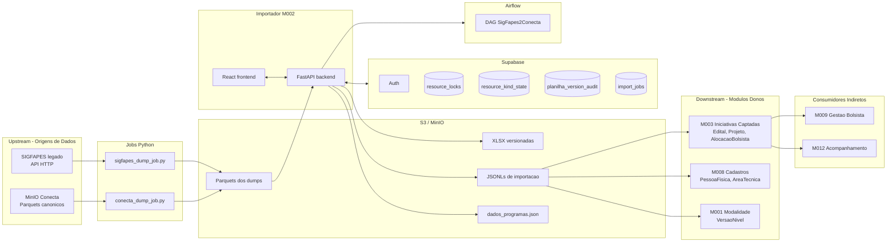
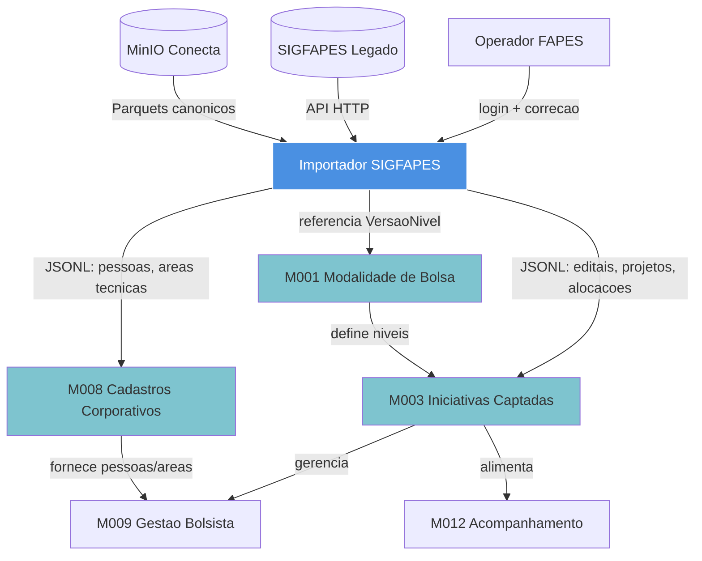

# Integracao com Modulos e Dominios

[← Voltar ao Importador](README.md)

> Este documento descreve como o Importador SIGFAPES se integra ao ecossistema do ConectaFAPES: seu papel como produto + modulo, os fluxos upstream/downstream, os dominios que consumem seus dados e as divergencias observadas entre a documentacao e o codigo real.

---

## 1. Posicao no ecossistema

O Importador tem tres faces complementares na documentacao:

| Face | Artefato | Papel |
|------|----------|-------|
| **Produto (frontend + operacao)** | [products/importador/](README.md) | Aplicacao React operada pela equipe tecnica da FAPES |
| **Modulo backend** | [M002-importacao-editais](../../implementation/modules/M002-importacao-editais/README.md) | Bounded context que expoe operacoes REST, versoes e auditoria |
| **Dominio funcional** | [Domain 07 — Importacao SIGFAPES](../../discovery/domains/07-importacao-sigfapes.md) | Capacidades de negocio (7.1 Dump, 7.2 Correcao, 7.3 Producao JSONL, 7.4 Governanca) |

**Relacao 1:1:** o M002 e o unico modulo que implementa o Domain 07. Nao ha outro modulo preenchendo as mesmas capacidades.

---

## 2. Mapa de integracao upstream / downstream

**Regra de ouro declarada na documentacao:** o M002 **nao e dono** das entidades de negocio. Ele apenas as move do SIGFAPES para os modulos donos. Ownership permanece em M003/M008/M001.

---

## 3. Integracao com dominios

| Domain | Forma de integracao | Observacao |
|--------|---------------------|------------|
| [Domain 07 — Importacao SIGFAPES](../../discovery/domains/07-importacao-sigfapes.md) | **Proprietario** — todas as 13 funcionalidades (7.1.x a 7.4.x) sao implementadas pelo M002 | 1:1 com o modulo |
| [Domain 03 — Fomento Pre-Award](../../discovery/domains/03-fomento-pre-award.md) | **Indireta via M003** — recebe Editais e Projetos dos JSONLs | Nao ha dependencia direta |
| [Domain 04 — Fomento Post-Award](../../discovery/domains/04-fomento-post-award.md) | **Indireta via M003 + M009** — recebe alocacoes de bolsistas ja importadas | — |
| [Domain 01 — Corporativo](../../discovery/domains/01-corporativo.md) | **Indireta via M008** — recebe PessoaFisica e AreaTecnica | — |
| Domains 02, 05, 06 | **Sem integracao** — dependem das entidades ja materializadas em M003/M008 | — |

---

## 4. Integracao com modulos backend

| Modulo | Natureza | Direcao | Evidencia |
|--------|----------|---------|-----------|
| **M002 Importador** | Produtor de JSONL | — | Produto em si |
| **M003 Iniciativas Captadas** | Consumidor primario | M002 → M003 | `M003/README.md`: "M002 pode importar e sincronizar dados legados, mas nao redefine o ownership" |
| **M008 Cadastros Corporativos** | Consumidor | M002 → M008 | Listado em `M002/contrato.md:Dependencias` como owner canonico de PessoaFisica/AreaTecnica |
| **M001 Modalidade de Bolsa** | Referencia | M001 → M002 | `VersaoNivel` referenciado pelos 5 niveis da planilha |
| **M009 Gestao Bolsista** | Indireto | via M003 | `M009/README.md`: "O modulo M002 apenas sincroniza dados legados quando necessario" |
| **M012 Acompanhamento Resultados** | Indireto | via M003 | Mesmo disclaimer do M009 |
| **M006 Autorizacao (AuthRix)** | Controle de acesso | M006 → todos os produtos | `M006/README.md`: "Portal Coordenador, Portal Admin e Importador consultam o AuthRix" — **no codigo atual o Importador usa Supabase Auth puro; integracao com AuthRix ainda nao foi implementada** |

### Entidades atravessadas

| Entidade | Origem (SIGFAPES) | JSONL de saida | Consumidor canonico |
|----------|-------------------|----------------|----------------------|
| Edital | `editais.parquet` + correcoes do operador | `editais.jsonl` | M003 |
| Projeto | `projetos_por_edital.parquet` + correcoes | `projetos.jsonl` | M003 |
| Bolsista (PessoaFisica) | `bolsistas_projeto.parquet` + `RelatorioBeneficiarioLimpo.json` + CSV Banestes | `pessoas.jsonl` | M008 |
| AlocacaoBolsista | composta na planilha com 5 niveis | `alocacoes.jsonl` | M003 |
| AreaTecnica | `dados_programas.json` (mapeamento operador) | embutido em JSONLs de projeto | M008 |
| VersaoNivel | referencia estatica | — | M001 |

---

## 5. Integracao com infraestrutura

| Componente | Papel | Configuracao |
|------------|-------|--------------|
| **S3 / MinIO** | Camada de troca de dados — Parquets (entrada), XLSX (trabalho), JSONL (saida) | `S3_BUCKET`, `SIGFAPES_DUMP_PREFIX`, `CONNECTA_DUMP_PREFIX`, `EDITAIS_CORRIGIDOS_PREFIX` |
| **Supabase Auth** | Autenticacao JWT (email/senha) | `SUPABASE_URL`, `SUPABASE_JWKS_URL`, `SUPABASE_JWT_ISSUER` |
| **Supabase Postgres** | 4 tabelas auxiliares (ver abaixo) | `SUPABASE_SERVICE_ROLE_KEY` |
| **Airflow** | DAG `SigFapes2Conecta` para orquestracao opcional | `AIRFLOW_BASE_URL`, `AIRFLOW_SIGFAPES_DAG_ID` |
| **Render** | Deploy do backend FastAPI | `render.yaml` |

### Tabelas Supabase (unicas a este modulo)

| Tabela | Papel | Migration |
|--------|-------|-----------|
| `resource_locks` | Lock exclusivo por `<MM_YYYY>/<kind>/<edital_id>` | `20260227_create_resource_locks.sql` |
| `import_jobs` | Fila de jobs assincronos (opt-in) | `20260402_create_import_jobs.sql` |
| `resource_kind_state` + `resource_kind_switch_log` | Estado ativo editais/programas + log de troca | `20260402_create_resource_kind_state.sql` |
| `planilha_version_audit` | Auditoria de toda versao de planilha | `20260406_create_planilha_version_audit.sql` |

Essas tabelas **nao sao compartilhadas** com outros modulos — sao artefatos tecnicos proprios do M002.

---

## 6. Matriz de entrada e saida

| Direcao | Fonte | Formato | Consumidor | Endpoint/artefato |
|---------|-------|---------|------------|-------------------|
| ENTRADA | SIGFAPES (API HTTP) | Parquets + JSON | `sigfapes_dump_job.py` | `scripts/sigfapes_dump_job.py` |
| ENTRADA | MinIO Conecta | Parquets | `conecta_dump_job.py` | `scripts/conecta_dump_job.py` |
| ENTRADA | Operador (via UI) | XLSX corrigido | `POST /upload-planilha-corrigida` | backend |
| ENTRADA | Operador | `dados_programas.json` | `POST /dados-programas` | backend |
| SAIDA | Backend | JSONL (editais, projetos, pessoas, alocacoes) | M003, M008, M001 | `importacao/<edital_id>/*.jsonl` |
| SAIDA | Backend | Trigger DAG | Airflow | `POST /internal/airflow/trigger-sigfapes` |
| BIDIRECIONAL | Backend ↔ Supabase | PostgREST | locks, jobs, auditoria | — |

---

## 7. Pontos de convergencia entre docs

A documentacao do produto (esta pasta) e a do modulo ([M002](../../implementation/modules/M002-importacao-editais/README.md)) **casam bem** em:

- **Arquitetura** — dump batch e nao integracao online ([ADR-011](../../architecture/adr/ADR-011-arquitetura-importador-sigfapes.md))
- **Tabelas Supabase** — 4 tabelas com as mesmas responsabilidades descritas
- **Operacoes** — cada operacao em `contrato.md` mapeia 1:1 para um endpoint em [api-reference.md](api-reference.md)
- **EPICs canonicos** — EPI-01/02/03 correspondem a EPIC-M002-001/002/003
- **Regras de negocio** — RN01 a RN10 e RNF01 a RNF05 do M002 estao cobertas pelos EPI-01 a EPI-18 deste produto

---

## 8. Gaps e inconsistencias identificadas

| # | Gap | Local | Proposta de correcao |
|---|-----|-------|----------------------|
| 1 | Stack do Importador listado como "Vue, Node" | [products/README.md](../README.md) (linha da tabela) | Atualizar para "React 18, TypeScript, Vite" |
| 2 | Status "Documentacao pendente" desatualizado | [products/README.md](../README.md) | Atualizar para "Em operacao, documentado" |
| 3 | Diagrama mostra `PA --> M002` (Portal Admin consome M002) | [products/README.md](../README.md) Mermaid | Confirmar com equipe se faz sentido; o Importador hoje e um produto dedicado |
| 4 | `products/README.md` omite M001 e M008 como consumidores de JSONL | Diagrama Mermaid | Adicionar arestas `IMP --> M001`, `IMP --> M008` |
| 5 | EPI-04 a EPI-18 nao tem contrapartida em `implementation/modules/M002-importacao-editais/epics/` | Modulo M002 | Avaliar se formalizar novos EPICs no modulo para espelhar capacidades do produto |
| 6 | AuthRix (M006) listado como integrado ao Importador | [M006/README.md](../../implementation/modules/M006-autorizacao/README.md) | Codigo real usa Supabase Auth puro; marcar AuthRix como "integracao futura" |
| 7 | DAG `SigFapes2Conecta` aparece como "orquestracao futura" no Domain 07 mas ja existe endpoint de trigger | [Domain 07 — 7.1.1](../../discovery/domains/07-importacao-sigfapes.md) | Clarificar: disparo manual via endpoint existe; scheduler automatico ainda nao |
| 8 | Rastreabilidade das RN06 e RN07 (upload bloqueante, mapeamento programa obrigatorio) | M002 | Adicionar coluna de RN rastreavel nos EPI-07 e EPI-08 |

---

## 9. Dependencias operacionais

Para o Importador funcionar end-to-end em producao, devem estar disponiveis:

1. **Bucket S3** com dump SIGFAPES completo (marker `dump_complete.json`) — [EPI-16](features/EPI-16-dump-adaptativo-sigfapes.md)
2. **Bucket S3** com dump Conecta (para metricas) — [EPI-17](features/EPI-17-dump-conecta.md)
3. **Projeto Supabase** com as 4 migrations aplicadas (ver tabela em §5)
4. **Airflow acessivel** com DAG `SigFapes2Conecta` (opcional — so para trigger via `/internal/airflow-*`)
5. **Credenciais S3 + Supabase** injetadas como env vars no Render
6. **Usuarios provisionados** no Supabase Auth com `role` quando necessario para `/internal/*`

---

## 10. Diagrama de contexto (nivel macro)

---

## 11. Resumo em uma frase

O Importador e **o unico caminho de entrada de dados legados do SIGFAPES no ConectaFAPES**: captura via dumps batch, corrige em UI colaborativa com lock, e entrega JSONLs consumidos por M003 (edital/projeto/alocacao), M008 (pessoa/area) e M001 (niveis). A integracao com dominios e indireta — so o Domain 07 e dominio proprio; todos os demais sao atingidos atraves dos modulos donos.

---

## Documentos relacionados

- [Arquitetura](architecture.md)
- [Tecnologia](technology.md)
- [Backend](backend-structure.md)
- [Frontend](frontend-structure.md)
- [Referencia de API](api-reference.md)
- [Backlog](backlog.md)
- [M002 — Importacao de Editais (modulo)](../../implementation/modules/M002-importacao-editais/README.md)
- [Domain 07 — Importacao SIGFAPES](../../discovery/domains/07-importacao-sigfapes.md)
- [ADR-011 — Arquitetura do Importador SIGFAPES](../../architecture/adr/ADR-011-arquitetura-importador-sigfapes.md)
