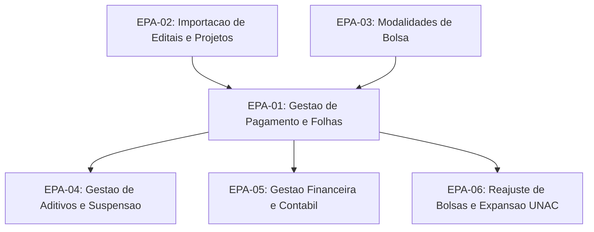

# Backlog de Epicos — Portal Admin

[← Voltar ao Portal Admin](README.md) | [Roadmap](../../management/roadmap.md) | [Releases 2026](../../management/releases-2026.csv)

> Versao: 2026-04-14

| ID | Titulo | Detalhes | Modulos backend | Status |
|----|--------|----------|-----------------|--------|
| EPA-01 | Gestao de Pagamento e Folhas | [EPA-01](features/EPA-01-gestao-pagamento-folhas.md) | M004 | Em producao |
| EPA-02 | Importacao de Editais e Projetos | [EPA-02](features/EPA-02-importacao-editais-projetos.md) | M002, M003 | Em producao |
| EPA-03 | Modalidades de Bolsa | [EPA-03](features/EPA-03-modalidades-bolsa.md) | M001 | Em producao |
| EPA-04 | Gestao de Aditivos e Suspensao | [EPA-04](features/EPA-04-gestao-aditivos-suspensao.md) | M009, M015 | Planejado (Q2) |
| EPA-05 | Gestao Financeira e Contabil | [EPA-05](features/EPA-05-gestao-financeira-contabil.md) | M016 | Planejado (Q2) |
| EPA-06 | Reajuste de Bolsas e Expansao UNAC | [EPA-06](features/EPA-06-reajuste-bolsas-unac.md) | M004 | Planejado (Q2) |

## Grafo de Dependencias

## Modulos Backend Consumidos

| Modulo | Funcionalidades | EPICs |
|--------|----------------|-------|
| [M001](../../implementation/modules/M001-modalidade-bolsa/README.md) | Resolucoes, modalidades, versoes e niveis de bolsa | 3 EPICs (Done) |
| [M002](../../implementation/modules/M002-importacao-editais/README.md) | Importacao do SIGFAPES | 3 EPICs (Done) |
| [M003](../../implementation/modules/M003-gerenciar-editais/README.md) | Visualizacao operacional de editais e projetos | 5 EPICs (Done) |
| [M004](../../implementation/modules/M004-pagamento-bolsista/README.md) | Folhas, remessas, retornos, guias, relatorios | 12 EPICs (Done) |
| [M005](../../implementation/modules/M005-autenticacao/README.md) | Autenticacao via Acesso Cidadao | A definir |
| [M008](../../implementation/modules/M008-cadastros-corporativos/README.md) | Pessoas, instituicoes, areas tecnicas | 3 EPICs (In Progress) |
| [M009](../../implementation/modules/M009-gestao-bolsista/README.md) | Gestao de aditivos (admin) | 2 In Progress, 2 To Do |
| [M015](../../implementation/modules/M015-suspensao-finalizacao/README.md) | Suspensao de bolsas | 2 EPICs (To Do) |
| [M016](../../implementation/modules/M016-contabilidade-financeiro/README.md) | Gestao financeira e contabil | 3 EPICs (To Do) |

## Relacao com Roadmap

Features do Portal Admin sao rastreadas em [releases-2026.csv](../../management/releases-2026.csv) como produto "PORTAL FAPES - ADMIN".
