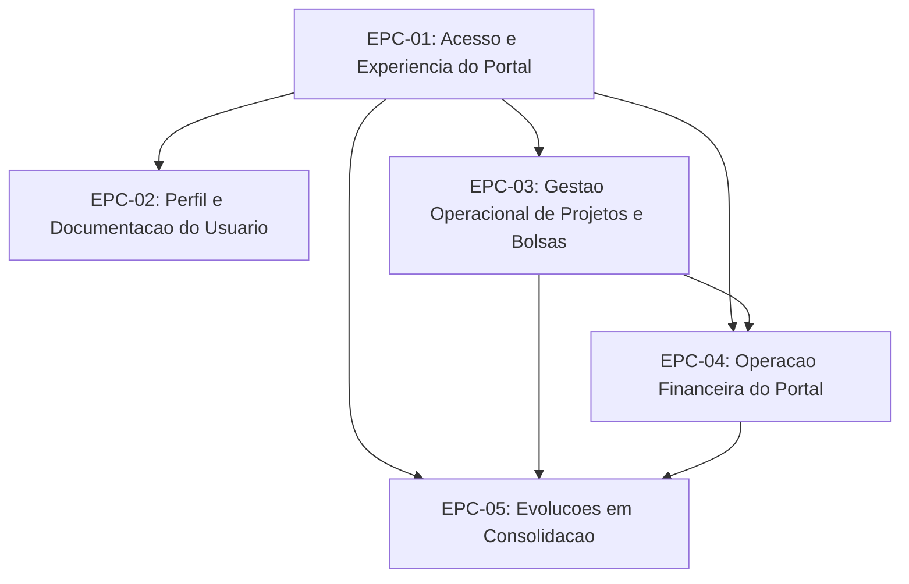

# Backlog de Epicos — Portal Coordenador

[← Voltar ao Portal Coordenador](README.md) | [Roadmap](../../management/roadmap.md) | [Releases 2026](../../management/releases-2026.csv)

> Versao: 2026-04-14

| ID | Titulo | Detalhes | Modulos backend | Status |
|----|--------|----------|-----------------|--------|
| EPC-01 | Acesso e Experiencia do Portal | [EP-01](features/EP-01-autenticacao-acesso-cidadao.md), [EP-02](features/EP-02-shell-portal-contexto-projeto.md), [EP-03](features/EP-03-pagina-inicial-portal.md) | M005, M003, M007, M009 | Partial |
| EPC-02 | Perfil e Documentacao do Usuario | [EP-04](features/EP-04-gestao-perfil-usuario.md), [EP-05](features/EP-05-gestao-documentos-usuario.md) | M008, M009 | Done |
| EPC-03 | Gestao Operacional de Projetos e Bolsas | [EP-06](features/EP-06-meu-projeto.md), [EP-07](features/EP-07-minha-equipe-acompanhamento-bolsas.md), [EP-08](features/EP-08-cadastro-edicao-bolsista.md) | M003, M009 | Done |
| EPC-04 | Operacao Financeira do Portal | [EP-09](features/EP-09-pagamentos-bolsa.md), [EP-10](features/EP-10-remanejamento-bolsas.md), [EP-11](features/EP-11-prestacao-financeira.md) | M004, M013, M014 | Partial |
| EPC-05 | Evolucoes em Consolidacao | [EP-12](features/EP-12-aditivo-bolsa.md) | M009, M015 | Prototype |

## Grafo de Dependencias

## Regra de agrupamento

- Cada linha representa um epico de produto.
- O campo `Detalhes` relaciona diretamente os arquivos de feature que pertencem ao epico.
- Os arquivos em `features/` contem os cenarios Gherkin detalhados.
- A coluna `Modulos backend` indica quais bounded contexts o epico consome.
