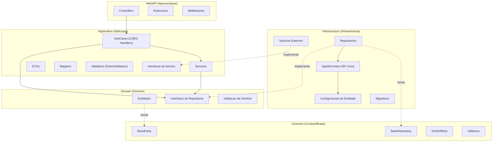
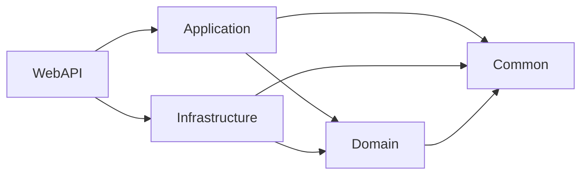
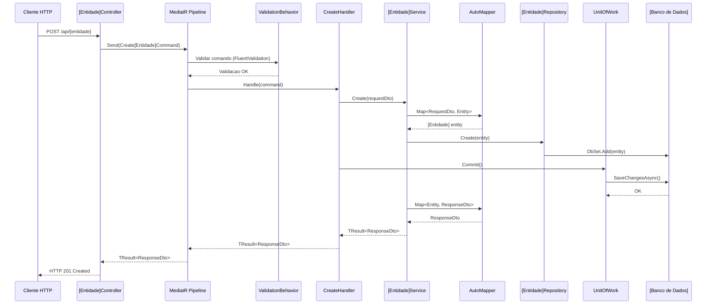
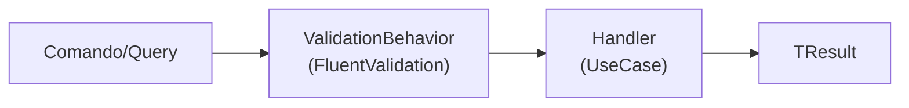
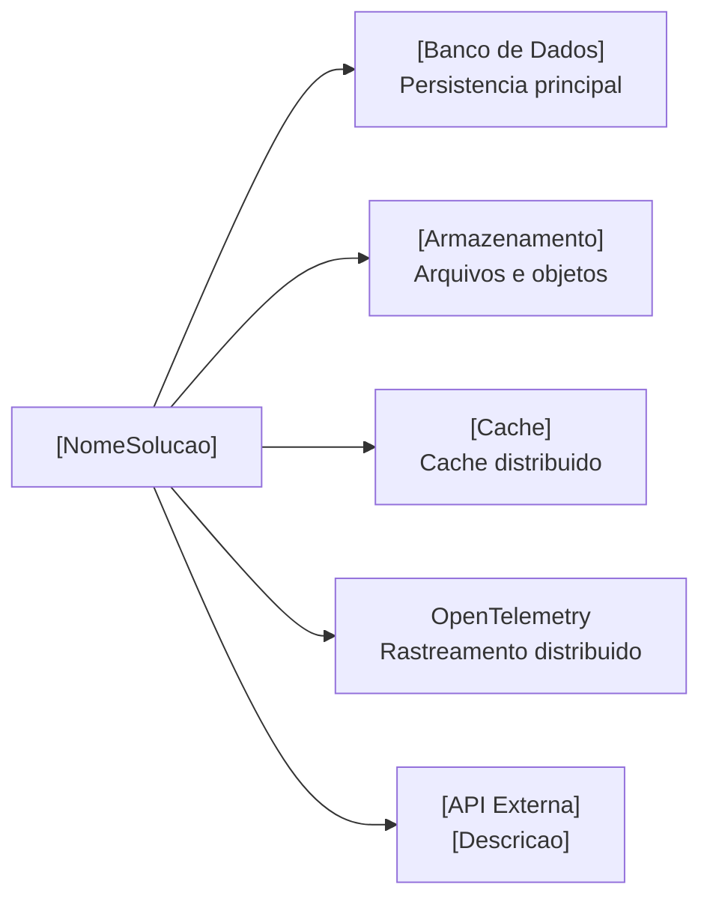

# Arquitetura — [Nome do Projeto] Backend

## Indice

- [1. Visao Geral](#1-visao-geral)
- [2. Estrutura de Projetos](#2-estrutura-de-projetos)
- [3. Camadas da Arquitetura](#3-camadas-da-arquitetura)
- [4. Fluxo de Dados](#4-fluxo-de-dados)
- [5. Padroes Arquiteturais](#5-padroes-arquiteturais)
- [6. Injecao de Dependencias](#6-injecao-de-dependencias)
- [7. Servicos Externos](#7-servicos-externos)
- [8. Preocupacoes Transversais](#8-preocupacoes-transversais)

---

## 1. Visao Geral

O backend do **[Nome do Sistema]** segue uma arquitetura em camadas baseada em **[Estilo Arquitetural]**, combinada com os padroes **[Padrao1]** e **[Padrao2]** para orquestracao de comandos e consultas.

### Diagrama de Camadas



---

## 2. Estrutura de Projetos

A solucao e composta por **[N] projetos**, cada um com uma responsabilidade especifica:

```
src/[NomeSolucao]/
├── [NomeSolucao].WebAPI/              # Camada de apresentacao (API REST)
├── [NomeSolucao].Application/         # Logica de aplicacao e orquestracao
├── [NomeSolucao].Domain/              # Entidades e contratos de dominio
├── [NomeSolucao].Infrastructure/      # Acesso a dados e integracoes externas
├── [NomeSolucao].Common/              # Abstracoes compartilhadas
└── [NomeSolucao].Test/                # Testes unitarios
```

| Projeto | Responsabilidade |
|---|---|
| **WebAPI** | Controllers REST, configuracao de middleware, autenticacao JWT, OData |
| **Application** | DTOs, Services, UseCases (CQRS), Mappers, Validators, Interfaces |
| **Domain** | Entidades de dominio, interfaces de repositorio, validacoes de dominio |
| **Infrastructure** | Repositorios (EF Core), DbContext, migrations, servicos externos |
| **Common** | BaseEntity, BaseRepository, IUnitOfWork, Result/TResult, utilitarios |
| **Test** | Testes unitarios da aplicacao |

### Dependencias entre Projetos



> **Regra fundamental:** as camadas internas (Domain, Common) nunca referenciam camadas externas (Infrastructure, WebAPI). O fluxo de dependencia aponta sempre para o centro.

---

## 3. Camadas da Arquitetura

### 3.1 WebAPI (Apresentacao)

Camada responsavel por receber requisicoes HTTP e delegar o processamento para a camada de aplicacao via MediatR.

**Estrutura:**

```
[NomeSolucao].WebAPI/
├── Controllers/
│   ├── BaseControllers/              # BaseController generico com CRUD
│   └── [Dominio]/                    # Controllers por dominio funcional
├── Extensions/
│   ├── JwtExtension.cs
│   ├── CorsPolicyExtension.cs
│   ├── ODataExtension.cs
│   ├── OpenTelemetryExtension.cs
│   └── EnvironmentExtensions.cs
├── Program.cs
└── Resources/
```

**BaseController** fornece endpoints CRUD genericos:

| Metodo HTTP | Endpoint | Operacao |
|---|---|---|
| GET | `/api/{entidade}` | Listar todos |
| GET | `/api/{entidade}/{id}` | Buscar por ID |
| POST | `/api/{entidade}` | Criar |
| PUT | `/api/{entidade}` | Atualizar |
| DELETE | `/api/{entidade}/{id}` | Excluir |

### 3.2 Application (Aplicacao)

**Estrutura:**

```
[NomeSolucao].Application/
├── Configuration/
│   └── ServiceExtensions.cs
├── DTOs/
│   └── [Dominio]/                    # Request/Response DTOs
├── Interfaces/
│   ├── BaseServiceInterfaces/
│   ├── [Dominio]/
│   └── ExternalServices/
├── Mappers/
├── Services/
│   ├── BaseServices/
│   └── [Dominio]/
├── Shared/
│   ├── Behavior/                     # Pipeline behaviors do MediatR
│   └── Tracing/
├── UseCases/
│   ├── BaseCases/                    # Handlers genericos (CRUD)
│   └── [Dominio]/                    # Handlers especificos
└── Validation/
```

**Handlers genericos (BaseCases):**

| Handler | Comando/Query | Descricao |
|---|---|---|
| `CreateHandler` | `CreateCommand` | Cria uma entidade |
| `UpdateHandler` | `UpdateCommand` | Atualiza uma entidade |
| `DeleteHandler` | `DeleteCommand` | Remove uma entidade |
| `GetAllHandler` | `GetAllQuery` | Lista todas as entidades |
| `GetByIdHandler` | `GetByIdQuery` | Busca entidade por ID |

### 3.3 Domain (Dominio)

```
[NomeSolucao].Domain/
├── Entities/
│   └── [Dominio]/
├── Interfaces/
│   └── [Dominio]/
├── Shared/
└── Validation/
```

> Para detalhes sobre as entidades, consulte [domain-entities.md](domain-entities.md).

### 3.4 Infrastructure (Infraestrutura)

```
[NomeSolucao].Infrastructure/
├── Context/
│   └── AppDbContext.cs
├── EntitiesConfiguration/
│   └── [Dominio]/
├── Repositories/
│   └── [Dominio]/
├── ExternalServices/
│   ├── [ServicoExterno1]/
│   └── [ServicoExterno2]/
├── Migrations/
└── ServiceExtensions.cs
```

### 3.5 Common (Compartilhado)

| Componente | Descricao |
|---|---|
| `BaseEntity` | Classe base com Id, DateCreated, DateUpdated, DateDeleted |
| `IBaseRepository<T>` | Contrato base com Create, Update, Delete, GetById, GetAll, etc. |
| `BaseRepository<T>` | Implementacao base do repositorio sobre EF Core |
| `IUnitOfWork` | Contrato para commit transacional (`Task Commit()`) |
| `Result` / `TResult<T>` | Tipos de resultado padronizados para operacoes |
| `Error` / `ResultType` | Tipos de erro e enum de resultado |
| `PaginationResponse` | Resposta padronizada para paginacao |
| `ApiResponse` | Resposta padronizada da API |

---

## 4. Fluxo de Dados

### 4.1 Fluxo de uma Requisicao (Exemplo: Criar [Entidade])



### 4.2 Pipeline do MediatR



---

## 5. Padroes Arquiteturais

### 5.1 CQRS com MediatR

```
// Comando (escrita)
Create[Entidade]Command : IRequest<TResult<[Entidade]ResponseDto>>

// Handler
Create[Entidade]Handler : CreateHandler<Create[Entidade]Command, ...>
```

### 5.2 Repository Pattern

```mermaid
classDiagram
    class IBaseRepository~T~ {
        <<interface>>
        +Create(T entity)
        +Update(T entity)
        +Delete(T entity)
        +GetById(Guid id) Task~T~
        +GetAll() Task~ICollection~
        +AddRange(ICollection~T~ entities)
        +UpdateRange(ICollection~T~ entities)
        +DeleteRange(ICollection~T~ entities)
    }

    class I[Entidade]Repository {
        <<interface>>
    }

    class BaseRepository~T~ {
        #AppDbContext Context
    }

    class [Entidade]Repository

    IBaseRepository~T~ <|-- I[Entidade]Repository
    BaseRepository~T~ <|.. [Entidade]Repository
    I[Entidade]Repository <|.. [Entidade]Repository
```

### 5.3 Unit of Work

- `IUnitOfWork` define `Task Commit()`
- `UnitOfWork` encapsula `AppDbContext.SaveChangesAsync()`
- Handlers chamam `Commit()` apos todas as operacoes do repositorio

### 5.4 Classes Base Genericas

| Classe Base | Descricao |
|---|---|
| `BaseEntity` | Id, timestamps de auditoria |
| `BaseRepository<T>` | Operacoes CRUD sobre DbContext |
| `BaseService<R, Resp, E, TR>` | Logica CRUD de servico |
| `BaseController<...>` | Endpoints REST CRUD |
| `CreateHandler<...>` | Handler generico de criacao |
| `UpdateHandler<...>` | Handler generico de atualizacao |
| `DeleteHandler<...>` | Handler generico de exclusao |
| `GetAllHandler<...>` | Handler generico de listagem |
| `GetByIdHandler<...>` | Handler generico de busca por ID |

---

## 6. Injecao de Dependencias

### Program.cs

```
builder.Services.ConfigurePersistenceApp(configuration)   // EF Core + Repositorios
builder.Services.ConfigureApplicationApp()                // Services + MediatR + Validators
builder.Services.ConfigureJwt()                           // Autenticacao JWT
builder.Services.ConfigureCorsPolicy()                    // Politica CORS
builder.Services.ODataConfiguration()                     // OData
builder.ConfigureOpenTelemetry(env, endpoint)             // Rastreamento
```

### Application — ServiceExtensions.cs

- AutoMapper (escaneamento por assembly)
- MediatR com descoberta automatica de handlers
- FluentValidation com descoberta automatica de validators
- Services de aplicacao (Scoped) — organizados por feature

### Infrastructure — ServiceExtensions.cs

- `AppDbContext` (Scoped, [Banco de Dados])
- Repositorios (todos Scoped)
- `UnitOfWork` (Scoped)
- [ServicoExterno1] (Singleton/Scoped)
- [ServicoExterno2] (Singleton/Scoped)

---

## 7. Servicos Externos



| Servico | Tipo | Descricao |
|---|---|---|
| **[Banco de Dados]** | Banco de dados | Persistencia principal via EF Core |
| **[Armazenamento]** | Armazenamento | [Descricao] |
| **[Cache]** | Cache | Cache distribuido (opcional, configuravel) |
| **[API Externa]** | API externa | [Descricao] |
| **OpenTelemetry** | Observabilidade | Rastreamento distribuido |

---

## 8. Preocupacoes Transversais

| Preocupacao | Implementacao | Localizacao |
|---|---|---|
| **Validacao** | FluentValidation via MediatR `ValidationBehavior` | `Application/Shared/Behavior/` |
| **Autenticacao** | JWT Bearer tokens | `WebAPI/Extensions/JwtExtension.cs` |
| **Autorizacao** | Atributo `[Authorize]` nos controllers | Controllers |
| **Logging** | `ILogger<T>` injetado nos controllers | Controllers |
| **Rastreamento** | OpenTelemetry com configuracao por ambiente | `WebAPI/Extensions/OpenTelemetryExtension.cs` |
| **Health Check** | Endpoint `/health` com verificacao de banco | `Infrastructure/Integrations/HealthCheck/` |
| **Soft Delete** | `DateDeleted` em `BaseEntity` | `Common/Domain/BaseEntities/` |
| **Cache** | [Tecnologia] (conexao opcional e nao-bloqueante) | `Infrastructure/ExternalServices/[Cache]/` |
| **OData** | Composicao de queries via OData | `WebAPI/Extensions/ODataExtension.cs` |
| **[Outra]** | [Implementacao] | [Localizacao] |

---

## Dominios Funcionais

| Dominio | Descricao |
|---|---|
| **[DominioA]** | [Descricao do dominio A] |
| **[DominioB]** | [Descricao do dominio B] |
| **[DominioC]** | [Descricao do dominio C] |
| **[DominioD]** | [Descricao do dominio D] |
