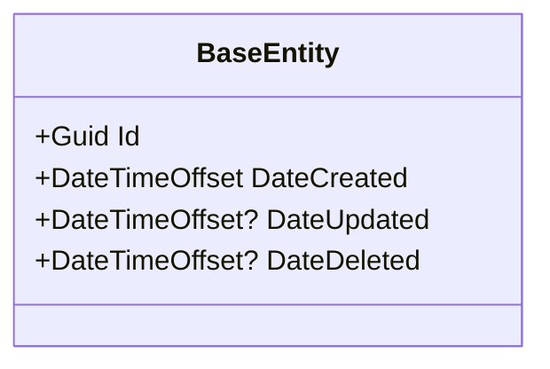

# Entidades de Dominio — [Nome do Projeto]

## Indice

- [1. Visao Geral](#1-visao-geral)
- [2. Classe Base — BaseEntity](#2-classe-base--baseentity)
- [3. [Modulo A]](#3-modulo-a)
- [4. [Modulo B]](#4-modulo-b)
- [5. [Modulo C]](#5-modulo-c)
- [6. Enumeracoes Referenciadas](#6-enumeracoes-referenciadas)

---

## 1. Visao Geral

As entidades de dominio do sistema **[Nome do Sistema]** estao organizadas em [N] modulos principais dentro de `[Namespace].Domain/Entities`:

- **[ModuloA]** — [Descricao breve do modulo A].
- **[ModuloB]** — [Descricao breve do modulo B].
- **[ModuloC]** — [Descricao breve do modulo C].

Todas as entidades herdam de `BaseEntity`, que fornece campos de identificacao e auditoria.

### Diagrama de Visao Geral

```mermaid
classDiagram
    direction TB

    BaseEntity <|-- [Entidade1]
    BaseEntity <|-- [Entidade2]
    BaseEntity <|-- [Entidade3]

    [Entidade1] "1" --> "*" [Entidade2]
    [Entidade2] "1" --> "*" [Entidade3]
```

---

## 2. Classe Base — BaseEntity

Todas as entidades herdam de `BaseEntity` (`[Namespace].Common.Domain.BaseEntities`), que fornece os seguintes campos:



| Propriedade | Tipo | Nullable | Descricao |
|---|---|---|---|
| Id | Guid | Nao | Identificador unico da entidade |
| DateCreated | DateTimeOffset | Nao | Data de criacao do registro |
| DateUpdated | DateTimeOffset? | Sim | Data da ultima atualizacao |
| DateDeleted | DateTimeOffset? | Sim | Data de exclusao logica (soft delete) |

---

## 3. [Modulo A]

### 3.1 Diagrama de Classes

```mermaid
classDiagram
    class [EntidadeA1] {
        +[Tipo] [Propriedade1]
        +[Tipo] [Propriedade2]
    }

    class [EntidadeA2] {
        +[Tipo] [Propriedade1]
        +Guid [EntidadeA2EntidadeA1Id]
    }

    [EntidadeA1] "1" --> "*" [EntidadeA2] : [navegacao]
```

### 3.2 Dicionario de Dados

> Todas as entidades herdam as propriedades de [BaseEntity](#2-classe-base--baseentity).

#### [EntidadeA1]

| Propriedade | Tipo | Nullable | Descricao |
|---|---|---|---|
| [Propriedade1] | [Tipo] | Nao | [Descricao] |
| [Propriedade2] | [Tipo] | Sim | [Descricao] |

#### [EntidadeA2]

| Propriedade | Tipo | Nullable | Descricao |
|---|---|---|---|
| [Propriedade1] | [Tipo] | Nao | [Descricao] |
| [EntidadeA2EntidadeA1Id] | Guid | Nao | FK para [EntidadeA1] |

---

## 4. [Modulo B]

### 4.1 Diagrama de Classes

```mermaid
classDiagram
    class [EntidadeB1] {
        +[Tipo] [Propriedade1]
        +[Tipo] [Propriedade2]
    }

    class [EntidadeB2] {
        +[Tipo] [Propriedade1]
        +Guid [EntidadeB2EntidadeB1Id]
    }

    [EntidadeB1] "1" --> "*" [EntidadeB2] : [navegacao]
```

### 4.2 Dicionario de Dados

> Todas as entidades herdam as propriedades de [BaseEntity](#2-classe-base--baseentity).

#### [EntidadeB1]

| Propriedade | Tipo | Nullable | Descricao |
|---|---|---|---|
| [Propriedade1] | [Tipo] | Nao | [Descricao] |
| [Propriedade2] | [Tipo] | Sim | [Descricao] |

#### [EntidadeB2]

| Propriedade | Tipo | Nullable | Descricao |
|---|---|---|---|
| [Propriedade1] | [Tipo] | Nao | [Descricao] |
| [EntidadeB2EntidadeB1Id] | Guid | Nao | FK para [EntidadeB1] |

---

## 5. [Modulo C]

### 5.1 Diagrama de Classes

```mermaid
classDiagram
    class [EntidadeC1] {
        +[Tipo] [Propriedade1]
        +[Tipo] [Propriedade2]
    }

    class [EntidadeC2] {
        +[Tipo] [Propriedade1]
        +Guid [EntidadeC2EntidadeC1Id]
    }

    [EntidadeC1] "1" --> "*" [EntidadeC2] : [navegacao]
```

### 5.2 Dicionario de Dados

> Todas as entidades herdam as propriedades de [BaseEntity](#2-classe-base--baseentity).

#### [EntidadeC1]

| Propriedade | Tipo | Nullable | Descricao |
|---|---|---|---|
| [Propriedade1] | [Tipo] | Nao | [Descricao] |
| [Propriedade2] | [Tipo] | Sim | [Descricao] |

#### [EntidadeC2]

| Propriedade | Tipo | Nullable | Descricao |
|---|---|---|---|
| [Propriedade1] | [Tipo] | Nao | [Descricao] |
| [EntidadeC2EntidadeC1Id] | Guid | Nao | FK para [EntidadeC1] |

---

## 6. Enumeracoes Referenciadas

Enumeracoes definidas em `[Namespace].Common.Domain.Enums`.

| Enum | Entidade(s) | Valores Conhecidos |
|---|---|---|
| [EnumA] | [Entidade] | [VALOR1, VALOR2, VALOR3] |
| [EnumB] | [Entidade] | [VALOR1, VALOR2] |
| [EnumC] | [Entidade] | *(definido em Common.dll)* |
