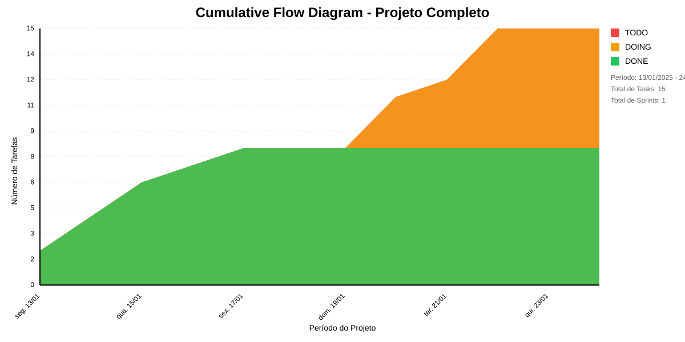

# 📊 Visão Geral do Projeto 

Modulo responsável por realizar os pagamentos de bolsistas
* Data de Início: 06/01/2025
* Data de Planejado: 28/02/2025
* Data de Finalização: -

Modulo responsável por realizar os pagamentos de bolsistas
## Métricas Consolidadas

| Sprint | Período | Duração | Total Tasks | Concluídas | Em Progresso | Pendentes | Velocidade | Eficiência |
|--------|---------|----------|-------------|------------|--------------|-----------|------------|------------|
| Sprint I | 12/01 - 23/01 | 11 dias | 15 | 8 (53.3%) | 7 | 0 | 0.73/dia | 53.3% |

## Análise Geral

- **Total de Sprints:** 1
- **Total de Tasks:** 15
- **Taxa de Conclusão:** 53.3%

### Notas
- Período Total: 12/01 - 23/01
- Média de Duração das Sprints: 11 dias

*Última atualização: janeiro de 2025*

## Cumulative Flow 

 ## Previsão do Projeto 

## 🎯 Conclusão Principal

### ⚠️ RISCO MODERADO DE ATRASO NO PROJETO

- **Probabilidade de conclusão no prazo**: 79.5%
- **Data mais provável de conclusão**: sex., 24/01/2025
- **Dias em relação ao planejado**: 1 dias
- **Status**: ⚠️ Pequeno Atraso

### 📊 Métricas do Projeto

| Métrica | Valor | Status |
|---------|--------|--------|
| Velocidade Atual | 1.6 tarefas/dia | ❌ |
| Velocidade Necessária | 1.8 tarefas/dia | - |
| Dias Restantes | 4 dias | - |
| Tarefas Restantes | 7 tarefas | - |

### 📅 Previsões de Data de Conclusão

| Data | Probabilidade | Status | Observação |
|------|---------------|---------|------------|
| qua., 22/01/2025 | 12.6% | ✅ Antes do Prazo | 🎯 Dentro do prazo |
| qui., 23/01/2025 | 31.9% | ✅ No Prazo | 🎯 Dentro do prazo |
| sex., 24/01/2025 | 35.0% | ⚠️ Pequeno Atraso | 📍 Data mais provável |
| seg., 27/01/2025 | 16.1% | ⚠️ Pequeno Atraso |  |
| ter., 28/01/2025 | 4.5% | ⚠️ Pequeno Atraso |  |

## 💡 Recomendações

1. ⚠️ Aumentar velocidade para 1.8 tarefas/dia
2. ⚠️ Priorizar tarefas críticas
3. ⚠️ Remover impedimentos imediatamente

## ℹ️ Informações do Projeto

- **Total de Sprints**: 1
- **Início**: seg., 13/01/2025
- **Término Planejado**: sex., 24/01/2025
- **Total de Tarefas**: 15
- **Simulações Realizadas**: 10,000

---
*Relatório gerado em 20/01/2025, 10:55:16*