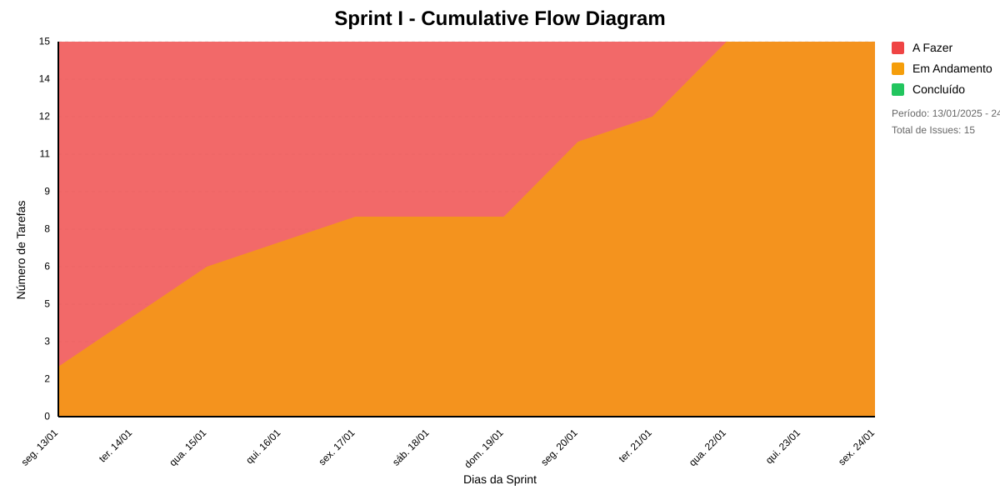

# SPRINT I
Integração dos módulos

## Dados do Sprint
* **Goal**:  Integração dos módulos
* **Data Início**: 13/01/2025
* **Data Fim**: 24/01/2025
* **Status**: IN_PROGRESS
## Sprint Backlog

|Nome |Resposável |Data de Inicío | Data Planejada | Status|
|:----|:--------  |:-------:       | :----------:  | :---: |
|Adaptar a autenticação do job de importação|Bruno Caxias|20/01/2025|17/01/2025|DOING|
|Deploy do Job Importação|Bruno Caxias|21/01/2025|21/01/2025|DOING|
|Documentar a arquitetura do hangfire|Bruno Caxias|13/01/2025|14/01/2025|DONE|
|Deploy da API Pagamento Bolsista I|Vinícius Estevam|20/01/2025|21/01/2025|DOING|
|Criar rotas customizadas para o módulo Pagamento Bolsista I|Vinícius Estevam|15/01/2025|17/01/2025|DONE|
|Integrar as telas do módulo Pagamento Bolsista I com as novas rotas|Gustavo Caetano|17/01/2025|22/01/2025|DONE|
|Implementar a tela de Monitorar Remessa|Gustavo Caetano|14/01/2025|17/01/2025|DONE|
|Implementar a tela de Solicitar Rescurso|Harian Adami |22/01/2025|24/01/2025|DOING|
|Reunião sobre o processo de gerar arquivo de remessa|Vinícius Estevam|16/01/2025|16/01/2025|DONE|
|Reunião para tratar sobre o @EDI do baneste|Vinícius Estevam|14/01/2025|14/01/2025|DONE|
|Criar seção de regra de negócios para especificação Pagto II|Jennifer Amaral|13/01/2025|15/01/2025|DONE|
|Resumir as regras de remessa e retorno do Banestes|Jennifer Amaral|15/01/2025|17/01/2025|DONE|
|Adequar os diagramas de projetos|Jennifer Amaral|20/01/2025|21/01/2025|DOING|
|Gerar Arquivo de Remessa de Pagamento|Vinícius Estevam|22/01/2025|24/01/2025|DOING|
|Gerar Arquivo de Remessa de Cadastro Bolsista|Bruno Caxias|22/01/2025|24/01/2025|DOING|

# Análise de Dependências do Sprint

Análise gerada em: 20/01/2025, 10:55:16

## 🔍 Grafo de Dependências

```mermaid
graph BT
    classDef sprint fill:#a8e6cf,stroke:#333,stroke-width:2px;
    classDef done fill:#98fb98,stroke:#333,stroke-width:2px;
    classDef external fill:#ffd3b6,stroke:#333,stroke-width:1px;
    s001.autenticacao["📝 Tarefa: Adaptar a autenticação do job de importação<br>📊 Estado: DOING<br>👤 Responsável: Bruno Caxias"]:::sprint
    s001.deploy_jb_importacao["📝 Tarefa: Deploy do Job Importação<br>📊 Estado: DOING<br>👤 Responsável: Bruno Caxias"]:::sprint
    s001.documentation["📝 Tarefa: Documentar a arquitetura do hangfire<br>📊 Estado: DONE<br>👤 Responsável: Bruno Caxias"]:::done
    s002.deploy_api_pg1["📝 Tarefa: Deploy da API Pagamento Bolsista I<br>📊 Estado: DOING<br>👤 Responsável: Vinícius Estevam"]:::sprint
    s003.remover_pagination_api["📝 Tarefa: Criar rotas customizadas para o módulo Pagamento Bolsista I<br>📊 Estado: DONE<br>👤 Responsável: Vinícius Estevam"]:::done
    s003.integration_pagination_api["📝 Tarefa: Integrar as telas do módulo Pagamento Bolsista I com as novas rotas<br>📊 Estado: DONE<br>👤 Responsável: Gustavo Caetano"]:::done
    s005.tela_monitorar_remessa["📝 Tarefa: Implementar a tela de Monitorar Remessa<br>📊 Estado: DONE<br>👤 Responsável: Gustavo Caetano"]:::done
    s005.tela_solicitar_recurso["📝 Tarefa: Implementar a tela de Solicitar Rescurso<br>📊 Estado: DOING<br>👤 Responsável: Harian Adami "]:::sprint
    s006.meet_batch["📝 Tarefa: Reunião sobre o processo de gerar arquivo de remessa<br>📊 Estado: DONE<br>👤 Responsável: Vinícius Estevam"]:::done
    s006.meet_edi["📝 Tarefa: Reunião para tratar sobre o @EDI do baneste<br>📊 Estado: DONE<br>👤 Responsável: Vinícius Estevam"]:::done
    s007.especificacao_arq_remessa["📝 Tarefa: Criar seção de regra de negócios para especificação Pagto II<br>📊 Estado: DONE<br>👤 Responsável: Jennifer Amaral"]:::done
    s007.especificacao_arq_regra_remessa["📝 Tarefa: Resumir as regras de remessa e retorno do Banestes<br>📊 Estado: DONE<br>👤 Responsável: Jennifer Amaral"]:::done
    s007.especificacao_diagrama["📝 Tarefa: Adequar os diagramas de projetos<br>📊 Estado: DOING<br>👤 Responsável: Jennifer Amaral"]:::sprint
    s008.gerar_arq_remessa_pgt["📝 Tarefa: Gerar Arquivo de Remessa de Pagamento<br>📊 Estado: DOING<br>👤 Responsável: Vinícius Estevam"]:::sprint
    s008.gerar_arq_remessa_cad["📝 Tarefa: Gerar Arquivo de Remessa de Cadastro Bolsista<br>📊 Estado: DOING<br>👤 Responsável: Bruno Caxias"]:::sprint
```

**Legenda:**
- 🟢 Verde Claro: Issues no sprint
- 🟢 Verde Escuro: Issues concluídas
- 🟡 Laranja: Dependências externas ao sprint
- ➡️ Linha sólida: Dependência no sprint
- ➡️ Linha pontilhada: Dependência externa

## 📋 Sugestão de Execução das Issues

| # | Título | Status | Responsável | Dependências |
|---|--------|--------|-------------|---------------|
| 1 |Adaptar a autenticação do job de importação | DOING | Bruno Caxias | 🆓 |
| 2 |Deploy do Job Importação | DOING | Bruno Caxias | 🆓 |
| 3 |Documentar a arquitetura do hangfire | DONE | Bruno Caxias | 🆓 |
| 4 |Deploy da API Pagamento Bolsista I | DOING | Vinícius Estevam | 🆓 |
| 5 |Criar rotas customizadas para o módulo Pagamento Bolsista I | DONE | Vinícius Estevam | 🆓 |
| 6 |Integrar as telas do módulo Pagamento Bolsista I com as novas rotas | DONE | Gustavo Caetano | 🆓 |
| 7 |Implementar a tela de Monitorar Remessa | DONE | Gustavo Caetano | 🆓 |
| 8 |Implementar a tela de Solicitar Rescurso | DOING | Harian Adami  | 🆓 |
| 9 |Reunião sobre o processo de gerar arquivo de remessa | DONE | Vinícius Estevam | 🆓 |
| 10 |Reunião para tratar sobre o @EDI do baneste | DONE | Vinícius Estevam | 🆓 |
| 11 |Criar seção de regra de negócios para especificação Pagto II | DONE | Jennifer Amaral | 🆓 |
| 12 |Resumir as regras de remessa e retorno do Banestes | DONE | Jennifer Amaral | 🆓 |
| 13 |Adequar os diagramas de projetos | DOING | Jennifer Amaral | 🆓 |
| 14 |Gerar Arquivo de Remessa de Pagamento | DOING | Vinícius Estevam | 🆓 |
| 15 |Gerar Arquivo de Remessa de Cadastro Bolsista | DOING | Bruno Caxias | 🆓 |

**Legenda das Dependências:**
- 🆓 Sem dependências
- ✅ Issue concluída
- ⚠️ Dependência externa ao sprint

## Cumulative Flow

# Previsão da Sprint

## ✅ SPRINT PROVAVELMENTE SERÁ CONCLUÍDA NO PRAZO

- **Probabilidade de conclusão no prazo**: 91.4%
- **Data mais provável de conclusão**: qui., 23/01/2025
- **Dias em relação ao planejado**: 0 dias
- **Status**: ✅ No Prazo

### 📊 Métricas Críticas

| Métrica | Valor | Status |
|---------|--------|--------|
| Velocidade Atual | 1.6 tarefas/dia | ❌ |
| Velocidade Necessária | 1.8 tarefas/dia | - |
| Dias Restantes | 4 dias | - |
| Tarefas Restantes | 7 tarefas | - |

### 📅 Previsões de Data de Conclusão

| Data | Probabilidade | Status | Observação |
|------|---------------|---------|------------|
| qui., 23/01/2025 | 47.6% | ✅ No Prazo | 📍 Data mais provável |
| sex., 24/01/2025 | 43.8% | ⚠️ Pequeno Atraso |  |
| seg., 27/01/2025 | 8.2% | ⚠️ Atraso Moderado |  |
| ter., 28/01/2025 | 0.4% | ⚠️ Atraso Moderado |  |

### 📋 Status das Tarefas

| Status | Quantidade | Porcentagem |
|--------|------------|-------------|
| Concluído | 8 | 53.3% |
| Em Andamento | 7 | 46.7% |
| A Fazer | 0 | 0.0% |

## 💡 Recomendações

1. ✅ Mantenha o ritmo atual de 1.6 tarefas/dia
2. ✅ Continue monitorando impedimentos
3. ✅ Prepare-se para a próxima sprint

## ℹ️ Informações da Sprint

- **Sprint**: Sprint I
- **Início**: seg., 13/01/2025
- **Término Planejado**: sex., 24/01/2025
- **Total de Tarefas**: 15
- **Simulações Realizadas**: 10,000

---
*Relatório gerado em 20/01/2025, 10:55:16*
