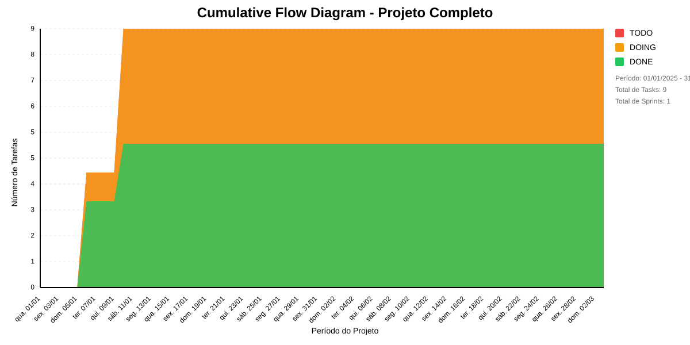

# 📊 Visão Geral do Projeto 

Autorização e logging do Conecta Fapes.
* Data de Início: 01/12/2024
* Data de Planejado: 31/12/2025
* Data de Finalização: -

Autorização e logging do Conecta Fapes.
## Métricas Consolidadas

| Sprint | Período | Duração | Total Tasks | Concluídas | Em Progresso | Pendentes | Velocidade | Eficiência |
|--------|---------|----------|-------------|------------|--------------|-----------|------------|------------|
| Sprint 001 - Janeiro/2025 | 31/12 - 02/03 | 61 dias | 9 | 5 (55.6%) | 4 | 0 | 0.08/dia | 55.6% |

## Análise Geral

- **Total de Sprints:** 1
- **Total de Tasks:** 9
- **Taxa de Conclusão:** 55.6%

### Notas
- Período Total: 31/12 - 02/03
- Média de Duração das Sprints: 61 dias

*Última atualização: janeiro de 2025*

## Cumulative Flow 

 ## Previsão do Projeto 

## 🎯 Conclusão Principal

### ✅ PROJETO PROVAVELMENTE SERÁ CONCLUÍDO NO PRAZO

- **Probabilidade de conclusão no prazo**: 100.0%
- **Data mais provável de conclusão**: sex., 17/01/2025
- **Dias em relação ao planejado**: -44 dias
- **Status**: ✅ Antes do Prazo

### 📊 Métricas do Projeto

| Métrica | Valor | Status |
|---------|--------|--------|
| Velocidade Atual | 2.5 tarefas/dia | ✅ |
| Velocidade Necessária | 0.1 tarefas/dia | - |
| Dias Restantes | 46 dias | - |
| Tarefas Restantes | 4 tarefas | - |

### 📅 Previsões de Data de Conclusão

| Data | Probabilidade | Status | Observação |
|------|---------------|---------|------------|
| sex., 17/01/2025 | 100.0% | ✅ Antes do Prazo | 📍 Data mais provável |

## 💡 Recomendações

1. ✅ Manter o ritmo atual de 2.5 tarefas/dia
2. ✅ Continuar monitorando impedimentos
3. ✅ Planejar próximas sprints com antecedência

## ℹ️ Informações do Projeto

- **Total de Sprints**: 1
- **Início**: qua., 01/01/2025
- **Término Planejado**: seg., 03/03/2025
- **Total de Tarefas**: 9
- **Simulações Realizadas**: 10,000

---
*Relatório gerado em 16/01/2025, 10:44:19*