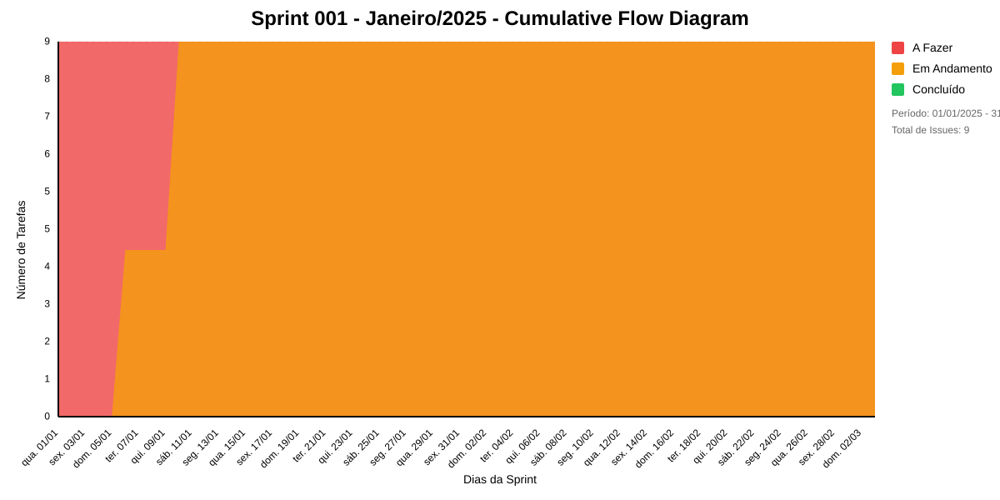

# SPRINT 001 - JANEIRO/2025
Entrega de versão estável para posterior deploy na prodest

## Dados do Sprint
* **Goal**:  Entrega de versão estável para posterior deploy na prodest
* **Data Início**: 01/01/2025
* **Data Fim**: 31/02/2025
* **Status**: IN_PROGRESS
## Sprint Backlog

|Nome |Resposável |Data de Inicío | Data Planejada | Status|
|:----|:--------  |:-------:       | :----------:  | :---: |
|Documentar as políticas implementadas|João Marcos|06/01/2025|20/01/2025|DOING|
|Testar as políticas implementadas|Arthur Cremasco|06/01/2025|10/01/2025|DONE|
|Desenvolver módulo de verificação de endpoint utilizando informações do JWT|João Marcos|06/01/2025|10/01/2025|DONE|
|Fazer benchmark do sistema utilizando com a autorização de rotas implementada|Gian Paneto|10/01/2025|16/01/2025|DOING|
|Testar autorização de rotas com o JWT|Gian Paneto|10/01/2025|14/01/2025|DONE|
|Fazer deploy do sistema implementado para o nosso servidor|Heitor Lima|10/01/2025|14/01/2025|DONE|
|Documentar gateway e criar apresentação para o time|João Marcos|10/01/2025|16/01/2025|DOING|
|Desenvolver tela de definição de permissões por rota|Arthur Cremasco|06/01/2025|10/01/2025|DONE|
|Fazer deploy do sistema implementado para o nosso servidor|Heitor Lima|10/01/2025|14/01/2025|DOING|

# Análise de Dependências do Sprint

Análise gerada em: 16/01/2025, 10:44:19

## 🔍 Grafo de Dependências

```mermaid
graph BT
    classDef sprint fill:#a8e6cf,stroke:#333,stroke-width:2px;
    classDef done fill:#98fb98,stroke:#333,stroke-width:2px;
    classDef external fill:#ffd3b6,stroke:#333,stroke-width:1px;
    s001.documentation["📝 Tarefa: Documentar as políticas implementadas<br>📊 Estado: DOING<br>👤 Responsável: João Marcos"]:::sprint
    s001.testing["📝 Tarefa: Testar as políticas implementadas<br>📊 Estado: DONE<br>👤 Responsável: Arthur Cremasco"]:::done
    s002.jwt_development["📝 Tarefa: Desenvolver módulo de verificação de endpoint utilizando informações do JWT<br>📊 Estado: DONE<br>👤 Responsável: João Marcos"]:::done
    s002.jwt_benchmark["📝 Tarefa: Fazer benchmark do sistema utilizando com a autorização de rotas implementada<br>📊 Estado: DOING<br>👤 Responsável: Gian Paneto"]:::sprint
    s002.jwt_test["📝 Tarefa: Testar autorização de rotas com o JWT<br>📊 Estado: DONE<br>👤 Responsável: Gian Paneto"]:::done
    s002.deploy["📝 Tarefa: Fazer deploy do sistema implementado para o nosso servidor<br>📊 Estado: DONE<br>👤 Responsável: Heitor Lima"]:::done
    s002.documentation["📝 Tarefa: Documentar gateway e criar apresentação para o time<br>📊 Estado: DOING<br>👤 Responsável: João Marcos"]:::sprint
    s003.route_front["📝 Tarefa: Desenvolver tela de definição de permissões por rota<br>📊 Estado: DONE<br>👤 Responsável: Arthur Cremasco"]:::done
    s003.deploy["📝 Tarefa: Fazer deploy do sistema implementado para o nosso servidor<br>📊 Estado: DOING<br>👤 Responsável: Heitor Lima"]:::sprint
```

**Legenda:**
- 🟢 Verde Claro: Issues no sprint
- 🟢 Verde Escuro: Issues concluídas
- 🟡 Laranja: Dependências externas ao sprint
- ➡️ Linha sólida: Dependência no sprint
- ➡️ Linha pontilhada: Dependência externa

## 📋 Sugestão de Execução das Issues

| # | Título | Status | Responsável | Dependências |
|---|--------|--------|-------------|---------------|
| 1 |Documentar as políticas implementadas | DOING | João Marcos | 🆓 |
| 2 |Testar as políticas implementadas | DONE | Arthur Cremasco | 🆓 |
| 3 |Desenvolver módulo de verificação de endpoint utilizando informações do JWT | DONE | João Marcos | 🆓 |
| 4 |Fazer benchmark do sistema utilizando com a autorização de rotas implementada | DOING | Gian Paneto | 🆓 |
| 5 |Testar autorização de rotas com o JWT | DONE | Gian Paneto | 🆓 |
| 6 |Fazer deploy do sistema implementado para o nosso servidor | DONE | Heitor Lima | 🆓 |
| 7 |Documentar gateway e criar apresentação para o time | DOING | João Marcos | 🆓 |
| 8 |Desenvolver tela de definição de permissões por rota | DONE | Arthur Cremasco | 🆓 |
| 9 |Fazer deploy do sistema implementado para o nosso servidor | DOING | Heitor Lima | 🆓 |

**Legenda das Dependências:**
- 🆓 Sem dependências
- ✅ Issue concluída
- ⚠️ Dependência externa ao sprint

## Cumulative Flow

# Previsão da Sprint

## ✅ SPRINT PROVAVELMENTE SERÁ CONCLUÍDA NO PRAZO

- **Probabilidade de conclusão no prazo**: 100.0%
- **Data mais provável de conclusão**: sex., 17/01/2025
- **Dias em relação ao planejado**: -44 dias
- **Status**: ✅ Antes do Prazo

### 📊 Métricas Críticas

| Métrica | Valor | Status |
|---------|--------|--------|
| Velocidade Atual | 2.5 tarefas/dia | ✅ |
| Velocidade Necessária | 0.1 tarefas/dia | - |
| Dias Restantes | 46 dias | - |
| Tarefas Restantes | 4 tarefas | - |

### 📅 Previsões de Data de Conclusão

| Data | Probabilidade | Status | Observação |
|------|---------------|---------|------------|
| sex., 17/01/2025 | 100.0% | ✅ Antes do Prazo | 📍 Data mais provável |

### 📋 Status das Tarefas

| Status | Quantidade | Porcentagem |
|--------|------------|-------------|
| Concluído | 5 | 55.6% |
| Em Andamento | 4 | 44.4% |
| A Fazer | 0 | 0.0% |

## 💡 Recomendações

1. ✅ Mantenha o ritmo atual de 2.5 tarefas/dia
2. ✅ Continue monitorando impedimentos
3. ✅ Prepare-se para a próxima sprint

## ℹ️ Informações da Sprint

- **Sprint**: Sprint 001 - Janeiro/2025
- **Início**: qua., 01/01/2025
- **Término Planejado**: seg., 03/03/2025
- **Total de Tarefas**: 9
- **Simulações Realizadas**: 10,000

---
*Relatório gerado em 16/01/2025, 10:44:19*
