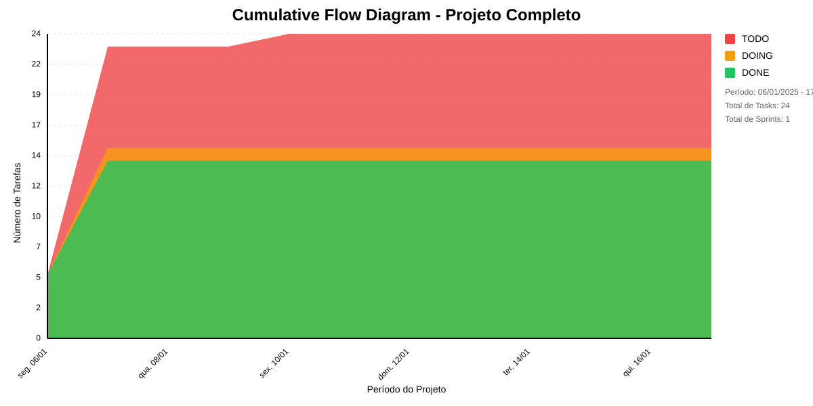

# 📊 Visão Geral do Projeto 

Dashboards para auxiliar nas tomadas de decisão das Áreas Técnicas da FAPES sobre os Editais e Projetos
* Data de Início: 03/11/2024
* Data de Planejado: 01/02/2025
* Data de Finalização: -

Dashboards para auxiliar nas tomadas de decisão das Áreas Técnicas da FAPES sobre os Editais e Projetos
## Métricas Consolidadas

| Sprint | Período | Duração | Total Tasks | Concluídas | Em Progresso | Pendentes | Velocidade | Eficiência |
|--------|---------|----------|-------------|------------|--------------|-----------|------------|------------|
| Sprint pós recesso | 05/01 - 16/01 | 11 dias | 24 | 14 (58.3%) | 10 | 0 | 1.27/dia | 58.3% |

## Análise Geral

- **Total de Sprints:** 1
- **Total de Tasks:** 24
- **Taxa de Conclusão:** 58.3%

### Notas
- Período Total: 05/01 - 16/01
- Média de Duração das Sprints: 11 dias

*Última atualização: janeiro de 2025*

## Cumulative Flow 

 ## Previsão do Projeto 

## 🎯 Conclusão Principal

### ✅ PROJETO PROVAVELMENTE SERÁ CONCLUÍDO NO PRAZO

- **Probabilidade de conclusão no prazo**: 100.0%
- **Data mais provável de conclusão**: ter., 14/01/2025
- **Dias em relação ao planejado**: -2 dias
- **Status**: ✅ Antes do Prazo

### 📊 Métricas do Projeto

| Métrica | Valor | Status |
|---------|--------|--------|
| Velocidade Atual | 4.7 tarefas/dia | ✅ |
| Velocidade Necessária | 1.4 tarefas/dia | - |
| Dias Restantes | 7 dias | - |
| Tarefas Restantes | 10 tarefas | - |

### 📅 Previsões de Data de Conclusão

| Data | Probabilidade | Status | Observação |
|------|---------------|---------|------------|
| seg., 13/01/2025 | 43.3% | ✅ Antes do Prazo | 🎯 Dentro do prazo |
| ter., 14/01/2025 | 56.8% | ✅ Antes do Prazo | 📍 Data mais provável |

## 💡 Recomendações

1. ✅ Manter o ritmo atual de 4.7 tarefas/dia
2. ✅ Continuar monitorando impedimentos
3. ✅ Planejar próximas sprints com antecedência

## ℹ️ Informações do Projeto

- **Total de Sprints**: 1
- **Início**: seg., 06/01/2025
- **Término Planejado**: sex., 17/01/2025
- **Total de Tarefas**: 24
- **Simulações Realizadas**: 10,000

---
*Relatório gerado em 10/01/2025, 15:19:57*