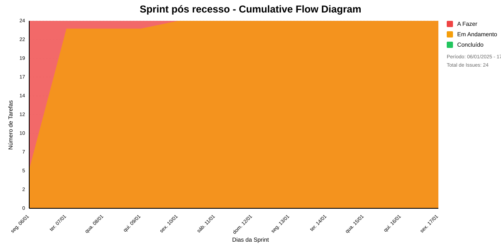

# SPRINT PÓS RECESSO
Planejar e organizar as atividades para continuar o desenvolvimento

## Dados do Sprint
* **Goal**:  Planejar e organizar as atividades para continuar o desenvolvimento
* **Data Início**: 06/01/2025
* **Data Fim**: 17/01/2025
* **Status**: IN_PROGRESS
## Sprint Backlog

|Nome |Resposável |Data de Inicío | Data Planejada | Status|
|:----|:--------  |:-------:       | :----------:  | :---: |
|Adicionar e atualizar as tarefas na planning|Manoel Rodrigues Loureiro|06/01/2025|08/01/2025|DONE|
|Criar grupo com a NUPEX|Manoel Rodrigues Loureiro|06/01/2025|06/01/2025|DONE|
|Criar grupo com a GEPED|Manoel Rodrigues Loureiro|06/01/2025|06/01/2025|DONE|
|Criar grupo com a GECAP|Manoel Rodrigues Loureiro|06/01/2025|06/01/2025|DONE|
|Tirar dúvidas sobre salvamento de dados do Dashboard|Manoel Rodrigues Loureiro|06/01/2025|06/01/2025|DONE|
|Reunião para discutir próximos passos do Dashboard|Manoel Rodrigues Loureiro|07/01/2025|07/01/2025|DONE|
|Reunião para discutir próximos passos do Dashboard|João Pedro Zamborlini Barcellos|07/01/2025|07/01/2025|DONE|
|Reunião para discutir próximos passos do Dashboard|Marcela Starling|07/01/2025|07/01/2025|DONE|
|Reunião para discutir próximos passos do Dashboard|Marcos Vinícius Souza dos Santos|07/01/2025|07/01/2025|DONE|
|Reunião para discutir próximos passos do Dashboard|Isabela Oliveira da Silva|07/01/2025|07/01/2025|DONE|
|Marcar uma renião com a GEINOV|Manoel Rodrigues Loureiro|07/01/2025|17/01/2025|DOING|
|Revisar e Planejar os Endpoints|João Pedro Zamborlini Barcellos|07/01/2025|08/01/2025|DONE|
|Revisar e Planejar os Endpoints|Manoel Rodrigues Loureiro|07/01/2025|08/01/2025|DONE|
|Revisar e Planejar os Endpoints|Marcela Starling|07/01/2025|08/01/2025|DONE|
|Revisar e Planejar os Endpoints|Marcos Vinícius Souza dos Santos|07/01/2025|08/01/2025|DONE|
|Adicionar os Coordenadores|João Pedro Zamborlini Barcellos|07/01/2025|17/01/2025|TODO|
|Adicionar os Coordenadores|Manoel Rodrigues Loureiro|07/01/2025|17/01/2025|TODO|
|Adicionar os Coordenadores|Marcela Starling|07/01/2025|17/01/2025|TODO|
|Adicionar os Coordenadores|Marcos Vinícius Souza dos Santos|07/01/2025|17/01/2025|TODO|
|Adicionar informações de saldos de cotas no Dashboard|João Pedro Zamborlini Barcellos|07/01/2025|17/01/2025|TODO|
|Adicionar informações de saldos de cotas no Dashboard|Manoel Rodrigues Loureiro|07/01/2025|17/01/2025|TODO|
|Adicionar informações de saldos de cotas no Dashboard|Marcela Starling|07/01/2025|17/01/2025|TODO|
|Adicionar informações de saldos de cotas no Dashboard|Marcos Vinícius Souza dos Santos|07/01/2025|17/01/2025|TODO|
|Reunião com Vinícius para checagem de tudo|Manoel Rodrigues Loureiro|10/01/2025|10/01/2025|TODO|

# Análise de Dependências do Sprint

Análise gerada em: 10/01/2025, 15:19:57

## 🔍 Grafo de Dependências

```mermaid
graph BT
    classDef sprint fill:#a8e6cf,stroke:#333,stroke-width:2px;
    classDef done fill:#98fb98,stroke:#333,stroke-width:2px;
    classDef external fill:#ffd3b6,stroke:#333,stroke-width:1px;
    updateplanning.updateaddtasks["📝 Tarefa: Adicionar e atualizar as tarefas na planning<br>📊 Estado: DONE<br>👤 Responsável: Manoel Rodrigues Loureiro"]:::done
    criargruposwpp.gruponupex["📝 Tarefa: Criar grupo com a NUPEX<br>📊 Estado: DONE<br>👤 Responsável: Manoel Rodrigues Loureiro"]:::done
    criargruposwpp.grupogeped["📝 Tarefa: Criar grupo com a GEPED<br>📊 Estado: DONE<br>👤 Responsável: Manoel Rodrigues Loureiro"]:::done
    criargruposwpp.grupogecap["📝 Tarefa: Criar grupo com a GECAP<br>📊 Estado: DONE<br>👤 Responsável: Manoel Rodrigues Loureiro"]:::done
    reunioes.duvidajson["📝 Tarefa: Tirar dúvidas sobre salvamento de dados do Dashboard<br>📊 Estado: DONE<br>👤 Responsável: Manoel Rodrigues Loureiro"]:::done
    reunioes.proxpassosdash["📝 Tarefa: Reunião para discutir próximos passos do Dashboard<br>📊 Estado: DONE<br>👤 Responsável: Isabela Oliveira da Silva"]:::done
    reunioes.priorizacaogeinov["📝 Tarefa: Marcar uma renião com a GEINOV<br>📊 Estado: DOING<br>👤 Responsável: Manoel Rodrigues Loureiro"]:::sprint
    reunioes.revisarendpoints["📝 Tarefa: Revisar e Planejar os Endpoints<br>📊 Estado: DONE<br>👤 Responsável: Marcos Vinícius Souza dos Santos"]:::done
    reunioes.addcoordenadores["📝 Tarefa: Adicionar os Coordenadores<br>📊 Estado: TODO<br>👤 Responsável: Marcos Vinícius Souza dos Santos"]:::sprint
    reunioes.addsaldocotas["📝 Tarefa: Adicionar informações de saldos de cotas no Dashboard<br>📊 Estado: TODO<br>👤 Responsável: Marcos Vinícius Souza dos Santos"]:::sprint
    reunioes.reuniaochecagem["📝 Tarefa: Reunião com Vinícius para checagem de tudo<br>📊 Estado: TODO<br>👤 Responsável: Manoel Rodrigues Loureiro"]:::sprint
```

**Legenda:**
- 🟢 Verde Claro: Issues no sprint
- 🟢 Verde Escuro: Issues concluídas
- 🟡 Laranja: Dependências externas ao sprint
- ➡️ Linha sólida: Dependência no sprint
- ➡️ Linha pontilhada: Dependência externa

## 📋 Sugestão de Execução das Issues

| # | Título | Status | Responsável | Dependências |
|---|--------|--------|-------------|---------------|
| 1 |Adicionar e atualizar as tarefas na planning | DONE | Manoel Rodrigues Loureiro | 🆓 |
| 2 |Criar grupo com a NUPEX | DONE | Manoel Rodrigues Loureiro | 🆓 |
| 3 |Criar grupo com a GEPED | DONE | Manoel Rodrigues Loureiro | 🆓 |
| 4 |Criar grupo com a GECAP | DONE | Manoel Rodrigues Loureiro | 🆓 |
| 5 |Tirar dúvidas sobre salvamento de dados do Dashboard | DONE | Manoel Rodrigues Loureiro | 🆓 |
| 6 |Reunião para discutir próximos passos do Dashboard | DONE | Isabela Oliveira da Silva | 🆓 |
| 7 |Marcar uma renião com a GEINOV | DOING | Manoel Rodrigues Loureiro | 🆓 |
| 8 |Revisar e Planejar os Endpoints | DONE | Marcos Vinícius Souza dos Santos | 🆓 |
| 9 |Adicionar os Coordenadores | TODO | Marcos Vinícius Souza dos Santos | 🆓 |
| 10 |Adicionar informações de saldos de cotas no Dashboard | TODO | Marcos Vinícius Souza dos Santos | 🆓 |
| 11 |Reunião com Vinícius para checagem de tudo | TODO | Manoel Rodrigues Loureiro | 🆓 |

**Legenda das Dependências:**
- 🆓 Sem dependências
- ✅ Issue concluída
- ⚠️ Dependência externa ao sprint

## Cumulative Flow

# Previsão da Sprint

## ✅ SPRINT PROVAVELMENTE SERÁ CONCLUÍDA NO PRAZO

- **Probabilidade de conclusão no prazo**: 100.0%
- **Data mais provável de conclusão**: seg., 13/01/2025
- **Dias em relação ao planejado**: -3 dias
- **Status**: ✅ Antes do Prazo

### 📊 Métricas Críticas

| Métrica | Valor | Status |
|---------|--------|--------|
| Velocidade Atual | 7.0 tarefas/dia | ✅ |
| Velocidade Necessária | 1.4 tarefas/dia | - |
| Dias Restantes | 7 dias | - |
| Tarefas Restantes | 10 tarefas | - |

### 📅 Previsões de Data de Conclusão

| Data | Probabilidade | Status | Observação |
|------|---------------|---------|------------|
| seg., 13/01/2025 | 100.0% | ✅ Antes do Prazo | 📍 Data mais provável |

### 📋 Status das Tarefas

| Status | Quantidade | Porcentagem |
|--------|------------|-------------|
| Concluído | 14 | 58.3% |
| Em Andamento | 1 | 4.2% |
| A Fazer | 9 | 37.5% |

## 💡 Recomendações

1. ✅ Mantenha o ritmo atual de 7.0 tarefas/dia
2. ✅ Continue monitorando impedimentos
3. ✅ Prepare-se para a próxima sprint

## ℹ️ Informações da Sprint

- **Sprint**: Sprint pós recesso
- **Início**: seg., 06/01/2025
- **Término Planejado**: sex., 17/01/2025
- **Total de Tarefas**: 24
- **Simulações Realizadas**: 10,000

---
*Relatório gerado em 10/01/2025, 15:19:57*
